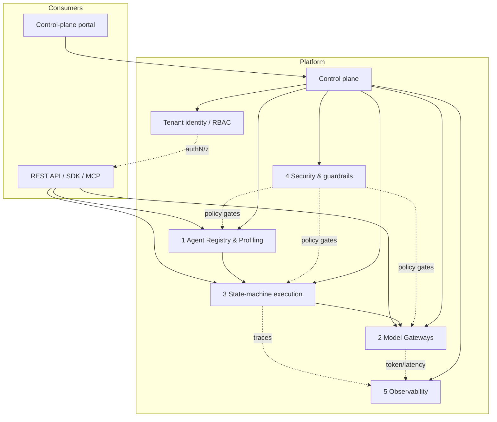

# Architecture — agent-orchestrator

> Source-of-truth architecture doc for the AI-agent-orchestration service
> control plane. Canonical source is **EPIC-00** (GitHub issue #4); the design
> transcript is issue #3. Agents start at [`../AGENTS.md`](../AGENTS.md).
> Parallel dispatch contract: [`EXECUTION-PLAN.md`](EXECUTION-PLAN.md).

## 1. Product

`agent-orchestrator` is a **multi-tenant SaaS control plane** that **organizes,
governs, and manages commercial AI agents** (Claude, DeepSeek, Copilot, Gemini,
local Ollama, …) for enterprises:

- A tenant defines its **agent org**: roles, SME personas, capabilities,
  boundaries.
- The platform owns agent **identity, profiles, model routing/gateways,
  guardrails/DLP, budgets/FinOps, memory, execution state, audit,
  observability**.
- Consumers integrate via **REST API + SDK + MCP**; admins use a
  **control-plane portal**.

## 2. Five pillars (canonical architecture)

1. **Agent Registry & Profiling** — declarative schemas for system prompts,
   tools, constraints; org/persona/capability/boundary definitions.
   Phase 1 · `registry/`.
2. **Model Gateways** — decoupled multi-provider proxy/router; routing,
   fallback, key handling, quotas. Phase 2 · `gateway/`.
3. **State-machine execution** — durable orchestration engine; execution
   state, retries, sagas. Phase 3 · `engine/`.
4. **Security & guardrails** — DLP filters, prompt-injection defense, policy
   gates, budgets/FinOps enforcement. Phase 4 · `guardrails/`.
5. **Observability** — full-trace token/latency, audit, FinOps metering.
   Phase 5 · `telemetry/`.

### Cross-cutting planes

- **Tenant identity & RBAC** — tenancy, orgs, roles, policies, session auth.
  Phase 6 · `identity/`.
- **Control plane / portal** — management/control surface for admins.
  Phase 7 · `control-plane/` + `portal/`.
- **Autonomous ops & governance** — self-operating control loop, policy as
  code, board automation. Phase 8.

## 3. Directory ↔ pillar map

| Path             | Pillar / phase | Owning lane (see EXECUTION-PLAN) |
|------------------|----------------|----------------------------------|
| `registry/`      | Pillar 1 · phase 1 | registry |
| `gateway/`       | Pillar 2 · phase 2 | gateway |
| `engine/`        | Pillar 3 · phase 3 | engine |
| `guardrails/`    | Pillar 4 · phase 4 | guardrails |
| `telemetry/`     | Pillar 5 · phase 5 | telemetry |
| `identity/`      | Cross-cutting · phase 6 | identity |
| `control-plane/` | Cross-cutting · phase 7 | control-plane |
| `portal/`        | Cross-cutting · phase 7 | portal |
| `infra/`         | IaC · cross-cutting | infra |
| `docs/`          | Cross-cutting | foundation / architecture |
| `scripts/`       | Cross-cutting | foundation (tooling/gates) |

Each pillar dir currently holds a tracked `README.md` placeholder stating its
purpose and what will land there; later phase issues fill the dirs.

## 4. Rollout & operating doctrine

- **Flag-gated OFF by default (IaC mandate, GR-5).** Every new surface ships
  behind a feature flag defaulting to OFF; nothing is tenant-visible until
  deliberately enabled.
- **No-false-green gates (fleet doctrine).** The repo gate (`make verify`) is
  honest — every check can genuinely fail; formalities are rejected.
- **Verify before done (GR-12).** Changes merge only with green verification
  evidence.
- **IaC over console (GR-5).** All infra is declared in Terraform / Cloud
  Build; no manual console clicks.
- **No secrets in repo (GR-6).** Env/secret manager only.

## 5. Definition of done (EPIC-00)

All phases 0–8 closed and the product live flag-gated: a new tenant can be
provisioned end-to-end — **signup → org → personas → agents → routed model
calls → audit + usage billing** — entirely agent-built and flag-gated. EPIC-00
(issue #4) closes last.

## 6. Cannibalization & provenance

Assets harvested from fleet/hub repos are tracked with provenance (repo, path,
license) in the cannibalization index (issue #8). `vendor/CMR` is the pinned
read-only hub submodule; `.research/` holds local clones (gitignored).

## References

- [EPIC-00 — issue #4](https://github.com/kushin77/agent-orchestrator/issues/4)
- [Design transcript — issue #3](https://github.com/kushin77/agent-orchestrator/issues/3)
- [`../AGENTS.md`](../AGENTS.md) — canonical doctrine
- [`EXECUTION-PLAN.md`](EXECUTION-PLAN.md) — dispatch contract & phase map
- [`GOVERNANCE.md`](GOVERNANCE.md) — branch/provenance/session-label conventions
