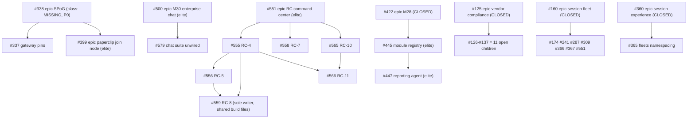

# Board attack plan (milestone → epic → class)

> **Type:** program-management artifact (PMO lane — coordination only; no product
> code).
> **Supersedes:** the classification embedded in issue #358 at filing time (board
> snapshot 2026-09-13: 57 open issues, 14 milestones) and the board-drain wave
> plan in #329. Section 2 records what has drained.
> **Measured:** 2026-09-14T17:08:29Z against `origin/master`.
> **Re-derive:** run the commands in section 7. Every count below comes from one
> of them; none is asserted from memory.

## 0. The rule this plan serves

Work is selected in **chronological, dependency-gated order**, never by board
scavenging (GR-20; [`AGENTS.md`](../AGENTS.md) rule 14,
[`EXECUTION-PLAN.md`](EXECUTION-PLAN.md) §5). Two mechanisms enforce it, and both
are authorities this document defers to:

- **The claim gate** — `governance/dispatch/cli.py` refuses a claim that is
  neither the frontier of the active milestone, a child of an issue the agent
  holds, nor the successor of one it advanced. It reads the epic relation from
  the issue body's `Parent:` / `Part-of:` / `Blocked-by:` lines, exactly as
  `governance/dispatch/snapshot.py` parses them, and it refuses a snapshot past
  its staleness threshold rather than answering from stale data.
- **The declaration gate** — `scripts/check-chronological-dispatch.sh` asserts
  the rule is *declared* in the contract docs. It is a declaration check, not
  behavioural enforcement of an agent's issue choice.

This plan's job is the one thing neither mechanism does: describe the board's
**milestone → epic → class** shape so the next required item is visible, and say
which parts of that shape are broken.

## 1. Board shape (the measured instant)

37 open issues, 2026-09-14T17:08:29Z.

| Quantity | Value |
|---|---|
| Open issues | **37** |
| Milestones: total / holding ≥1 open issue / holding none | 18 / 3 / **15** |
| Open epics (label `type:epic`) | **4** — #338, #399, #500, #551 |
| Open issues declaring a `Parent:` or `Part-of:` line | 30 |
| Open issues declaring a `Blocked-by:` line | 8 |
| Open issues with either chain edge | 30 |
| Open issues with **no** declared parent | 7 |
| Open issues whose declared parent is **closed** | **21** |
| Open issues whose declared parent is **open** | 9 |
| Open issues carrying **no** milestone | **32** |
| Conformance scope (open **and** milestoned) | **5** |
| Dependency-ready (no open blocker) | 33 |
| Blocked (≥1 open blocker) | 4 — #447, #556, #559, #566 |

Label coverage across those 37 open issues — the four fields the conformance
policy makes mandatory (`class`, `type`, `priority`, `area`), plus the two the
per-class expectations add (`pillar`, `gdc`):

| Field | Declared | Missing |
|---|---|---|
| `class:` | elite 11, enterprise 4 (15) | **22** |
| `type:` | task 8, epic 4, governance 4, feature 2 (18) | **19** |
| `priority:` | P1 13, P2 3, P0 1 (17) | **20** |
| `area:` | fleet 13, board 2, agent-profiles 1, standards 1 (17) | **20** |
| `pillar:` | control-plane 8, autonomous-ops 5, governance 3 (16) | 21 |
| `gdc:` | enterprise 13 | 24 |

The policy that grades these is printed by `governance/conformance/cli.py policy`:
required is `class`, `type`, `priority`, `area`; `elite` additionally expects
`gdc` and `pillar`; `enterprise` expects `gdc`; `infra/` is a cross-cutting
mandate.

## 2. What has drained since this plan was filed

The filing-time classification is now historical, not merely ageing:

| Then (2026-09-13, issue #358 body) | Now (2026-09-14T17:08:29Z) |
|---|---|
| 57 open issues | 37 open issues |
| 14 milestones | 18 milestones |
| 4 spine milestones with open children (M24, M25, M26, SPoG) + 10 legacy | 3 milestones with open issues |
| 14 issues with no epic | 7 issues with no parent, 21 pointing at a **closed** parent |

- **M24** (epic #138), **M25** (epic #144) and **M26** (epic #160) now hold **zero
  open issues** — all three epics are closed. Ordering steps 1–12 of the
  filing-time plan are complete.
- Four milestones were added (M27, M28, M29, M30), but only **M28** and **M30**
  hold open work; M27 and M29 are drained.
- Two filing-time consolidation targets are void because their issues closed
  individually: the `fleet-state` fold (#323 + #331 + #332 + #333) and the
  `gateway-providers` fold of #337 into #349. Section 6 records what survives.

## 3. Milestone → epic → class (the spine)

| Milestone | Open | Open epic | Open issues, by class |
|---|---|---|---|
| **M28** — Peer-module integration (paperclip / hermes / deepseek / ollama) | 2 | *(none — the epic, #422, is **closed**)* | #445 `elite`, #447 `elite` |
| **M30** — Enterprise chat in the Single Pane of Glass | 1 | **#500** `elite` | #500 (epic), #579 `(none)` |
| **Agent Single Pane of Glass (e2e)** | 2 | **#338** `(none)` — see F1, **#399** `elite` | #338 (epic), #399 (epic) |
| *(no milestone)* | 32 | **#551** `elite` (its own parent, #160, is closed) | #126–#137 `(none)`, #174 `enterprise`, #241 `(none)`, #287 `(none)`, #309 `(none)`, #329 `(none)`, #337 `(none)`, #358 `(none)`, #365 `(none)`, #366 `(none)`, #367 `(none)`, #488 `enterprise`, #516 `enterprise`, #551 (epic), #555–#559 `elite`, #565–#566 `elite`, #578 `enterprise`, #579 `(none)` |

Epic tree, from the declared `Parent:` / `Blocked-by:` edges:



## 4. The finding that breaks the spine

**The epic layer has been drained out from under its children.** 21 of the 37
open issues declare a parent that is already **closed**:

| Closed parent | Open children | Count |
|---|---|---|
| #125 — EPIC: CMR vendor compliance remediation backlog | #126, #127, #128, #129, #131, #132, #133, #134, #135, #136, #137 | 11 |
| #160 — EPIC: Session Fleet Operating Model | #174, #241, #287, #309, #366, #367, #551 | 7 |
| #422 — EPIC: Peer-module integration | #445, #447 | 2 |
| #360 — EPIC: Session experience | #365 | 1 |

Consequences a reader should draw, all of them measured rather than assumed:

1. **The milestone → epic → class spine exists for only 9 of 37 open issues** —
   the 8 remaining children of the live epic #551, plus #337 and #399 (children
   of #338) and #579 (child of #500). For the other 21 the epic link is a pointer
   into a closed issue, and 7 issues declare no parent at all.
2. **Closing an epic does not close its children.** #160 closed with 7 children
   still open and #125 with 11; both epics are the *declared relation of record*
   for work that is still live. An "epic is closed" reading of the board is
   therefore not evidence that its scope is finished.
3. **M28 is the active milestone with no open epic.** The claim gate's frontier
   is the #445 → #447 pair, whose only epic (#422) is closed.

## 5. Dependency-ordered attack order

### 5.1 The gate's own answer, first

`governance/dispatch/cli.py status` — the authority, not this document:

```
active milestone: M28 - Peer-module integration (paperclip / hermes / deepseek / ollama)
frontier: #445 Ecosystem module registry + state federation — one view of every module
live claims: 0
```

So the **claimable** item is **#445**. Everything below is the board *shape* that
explains what follows it; it is not an invitation to claim off the chain — the
claim gate refuses that, as it should.

### 5.2 The measured order

| Order | Item(s) | Class | Why here |
|---|---|---|---|
| 1 | **#445** | `elite` | The declared frontier of the active milestone M28. |
| 2 | **#447** | `elite` | `Blocked-by: #445`; the second half of M28. |
| 3 | **#555, #558, #565** | `elite` | The RC chain's frontier — three file-disjoint lanes. Their blockers (#552, #553, #554, #557, #563) are all closed. |
| 4 | **#556** (`Blocked-by: #555`), **#566** (`Blocked-by: #555, #565`), **#559** (`Blocked-by: #555, #556`) | `elite` | Strictly downstream of row 3. #559 is the chain's last item: it is the *sole writer* of the shared build files, so it cannot run in parallel with anything else. |
| 5 | **#579** | `(none)` | Consumes #500's chat surface; **needs a `class:` before it can be held to the ladder** — it is currently outside the conformance scope. |
| 6 | **#338**, then **#337** | `(none)`, `(none)` | The SPoG epic is P0 and its `class:` is missing (F1). #337 is its only open leaf. |
| 7 | **#399** | `elite` | An epic that is itself a child of #338; it declares no open children of its own. |
| 8 | **#174, #287, #309, #366, #367, #365, #241** | mixed | Stranded children of closed epics #160 / #360 — reachable only after those epics' link is repaired or the items are re-parented. |
| 9 | **#126–#137** | `(none)` | The 11 vendor-compliance gaps under closed #125. One homogeneous class; see section 6. |
| 10 | **#488, #516** | `enterprise` | Machine-hygiene findings; independent of the milestone spine. |
| 11 | **#329** | `(none)` | Superseded by #358 — close it when this issue closes, do not attack it. |

Of the 37 open issues, 33 are dependency-ready and 4 are blocked (#447, #556,
#559, #566). "Ready" is not "eligible": the claim gate admits only the frontier,
which is why row 1 is a single item and not 33.

## 6. Consolidation recommendations (only where the measurement supports one)

| Recommendation | Evidence | Verdict |
|---|---|---|
| **CONSOLIDATE #126–#137** into one class-solution sweep, re-parented off the closed epic #125 | 11 open issues, all `(none)` class, one identical remediation pattern, one closed parent | **Survives** from the filing-time plan, unexecuted. It is the largest single class on the board and the only one whose members share a closed parent *and* a null class. |
| **FOLD #309 into #287** | Both still open; both describe the same ticket-trailer test, #309 self-describing as the #287 follow-up | **Survives.** |
| **FOLD #337 into #349** | **#349 is closed** | **Dead.** #337 is now the only open child of #338 and should stand alone. |
| **CONSOLIDATE #323 + #331 + #332 + #333** (fleet-state web pane) | All four closed | **Retired.** |
| **FOLD #240 into #239; DEFER #241** | #240 is closed; #241 is still open and still says "later" | **Half retired.** Only the #241 defer survives. |
| **KEEP the #551 RC chain as-is** | 6 open children, all `elite`, all with real `Blocked-by` edges forming a DAG, distinct files | **No change.** It is the only class on the board with a genuine dependency graph, and it is already well-formed. |
| **KEEP SPoG #339–#351 separate** | All closed; #338/#399/#337 remain | **Retired** except #337 (see above). |

## 7. Reproduce every number

```bash
# 1. The open board, with labels, milestone and body (the epic relation lives in
#    the body's Parent:/Part-of:/Blocked-by: lines).
gh issue list --repo kushin77/agent-orchestrator --state open --limit 500 \
  --json number,title,labels,milestone,createdAt,url,body > /tmp/open.json

# 2. Parse the edges with the SAME regexes the repo uses
#    (governance/dispatch/snapshot.py: _PARENT_RE, _BLOCKED_RE), then count.

# 3. The milestone inventory.
gh api repos/kushin77/agent-orchestrator/milestones --paginate \
  --jq '.[] | "\(.number)\t\(.state)\topen=\(.open_issues)\t\(.title)"'

# 4. What the gate says it is enforcing.
python3 governance/conformance/cli.py policy

# 5. The board verdict — NOTE: this reads the COMMITTED .board/snapshot.json.
python3 governance/conformance/cli.py check

# 6. The live board. Refreshing is a measurement, not a commit:
#    never ship a board refresh inside a lane PR.
python3 governance/dispatch/cli.py snapshot --from-github
python3 governance/conformance/cli.py check
python3 governance/dispatch/cli.py status
git checkout -- .board/snapshot.json

# 7. The declaration gate.
bash scripts/check-chronological-dispatch.sh
```

The edge parser is deliberately the repo's own: an issue whose body writes
`Parent: #N` on any line has a parent; an issue that merely *mentions* an epic in
prose does not. `type:epic` — the label — is what makes an epic; a title saying
"EPIC" carries no weight. Both rules are the tooling's, not this document's.

## 8. Gate-honesty findings

**F1 — the live board fails the conformance gate.** The refreshed snapshot
reports:

```
conformance: FAIL (1 error(s), 1 warning(s))
scope: open+milestoned | scanned: 5 | classes: (none)=1, elite=4
  ERROR   class-missing     issue #338 declares no class; it cannot be held to any rung of the ladder
  WARNING scope-mismatch    32 open issue(s) carry no milestone and were not classified in this run
```

#338 is the **P0 SPoG epic** — the highest-priority open item on the board — and
it is the one in-scope issue that declares no class.

**F2 — and the gate of record does not see it.** `governance/conformance/checker.py`
reads `.board/snapshot.json`, a committed point-in-time artifact. Measured both
ways in the same worktree:

| Snapshot | Content | `conformance check` verdict |
|---|---|---|
| committed (`2026-09-13T21:24:51Z`) | 136 issues | `conformance: OK (11 item(s) conform, 2 deviation(s))`, rc **0** |
| refreshed (`2026-09-14T17:07:40Z`) | 318 issues | `conformance: FAIL (1 error, 1 warning)`, rc **1** |

So `make verify`'s conformance verdict is a function of an artifact refreshed
out of band, and today it is green on a board that is not the live one. This plan
states the finding; it does not fix it — the gate's data source is another lane's
file.

**F3 — most of the board is outside every gate's scope.** The conformance gate's
scope is *open + milestoned*. 32 of 37 open issues carry no milestone, so their
missing `class:` (22), `type:` (19), `priority:` (20) and `area:` (20) are
invisible: nothing fails, and nothing is reported either, beyond one
`scope-mismatch` warning that does not fail the gate.

**F4 — the board moves faster than this document.** During a single
**three-minute** measurement pass the open count fell **41 → 37**: #554, #557,
#563 and #567 all closed between two readings. Treat every count here as the
instant it was taken, and re-run section 7 before acting on it.

**F5 — #329 remains open.** It still presents itself as a board-wide plan while
being superseded. It is linked from #358 and left open by design; closing it is
the successor's call, not a side effect of writing this document.

## 9. Provenance and deviations

- **This document is a repo edit, and issue #358 says "no repo edits".** That
  instruction describes the PMO lane's remit, and it is the right default for a
  coordination artifact. It is not followed here, deliberately and in the open:
  the issue's own §6 instructs that the classification be *re-run when the board
  changes*, and a re-run needs somewhere versioned to land, or the next reader
  re-derives it by hand and gets a different answer. The plan is therefore
  committed, and this paragraph says so rather than leaving the conflict implicit.
  The issue body is left untouched as the historical record of the first
  classification.
- **This document is not `docs/EXECUTION-PLAN.md`.** That file is the *lane and
  phase* contract — which directory each lane owns, and which files no two lanes
  may share. It is static by design. This file is the *board shape* — milestones,
  epics, classes and dependency edges — which changes hourly. They cross-reference
  each other and neither duplicates the other. No similarly-named document
  existed, and none was extended.
- **The claim was refused, and that is disclosed.** `governance/dispatch/cli.py
  claim --issue 358` answered `no-chain-edge — no chain edge to the active work
  (kanban scavenging) and not the milestone frontier`. #358 is not on the M28
  chain and no brain directive authorises it, so the gate is right to refuse.
  The work was dispatched directly by the operator, and this is the lane's
  evidence that it did not quietly re-order the board to admit itself.
- **`.board/snapshot.json` was refreshed to measure and reverted before
  committing.** The refreshed file is evidence, not a deliverable.
- **No label was changed to make a gate green.** F1 is reported, not fixed: #338
  belongs to the SPoG lane.
