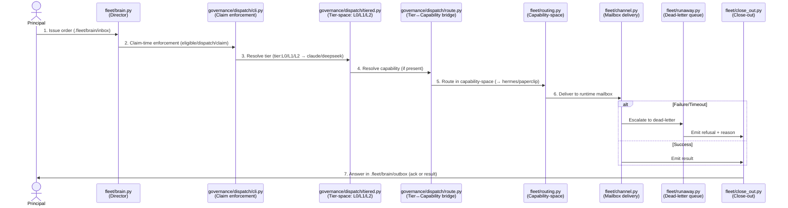

# Internal Dispatch Loop — `fleet/brain.py` + `governance/dispatch/`

## The seven-step flow

The dispatcher's internal contract (issue #1701, #1268): a claim from principal
→ tier-space resolution → capability-space routing → delivery layer
(mailbox/dead-letter/close-out).

## The layers

### 1. Director loop: `fleet/brain.py`

- Watches `.fleet/brain/inbox` for principal orders (never idles).
- Turns each order into a brain-signed directive for the dispatcher.
- Derives FinOps block from order (refuses tier/thinking outside contract's allowlist).
- Routes by capability through the routing policy (vendored orchestration contract, ADR-0012).
- Answers principal in `.fleet/brain/outbox` (ack or refusal with reason).
- Publishes `.fleet/brain.heartbeat.json` for liveness.
- Exits cleanly on SIGTERM/SIGINT; records sent-marker before dispatch (no re-dispatch on restart).

### 2. Claim enforcement: `governance/dispatch/cli.py`

- Tri-state exit contract (guardrails/honesty): 0 (OK) / 1 (NOT-OK) / 2 (CANNOT-ASSESS).
- Runs at claim-time before mutation (refusal cannot be sidestepped).
- Validates issue open, epic open, lane owns it, no other lane holds it.
- Proof over opinion: evidence cited for every check.

### 3. Tier-space dispatch: `governance/dispatch/tiered.py`

- L0 → L1 → L2 escalation on repeated failure.
- Tier label (`tier:L0/L1/L2`) → model mapping (config value `tier-policy.json`, not hardcoded).
- Reads tier definitions from `vendor/CMR/docs/MODEL-PROFILES.md`.
- Invokes through fleet's own mechanism (`claude -p --model <id>` for Claude aliases and DeepSeek BYOK).
- All network/host talk injected; all decisions pure functions.
- Records every attempt in dispatch audit trail (`.board/dispatch-audit.jsonl`).

### 4. Tier↔Capability bridge: `governance/dispatch/route.py`

- Adapter that translates between tier-space and capability-space vocabularies.
- A task carrying both `tier` and `capability` requirements flows through both routers, in order.
- Does not reimplement either router; translates routing decisions only.
- Transport (mailbox/dead-letter) is untouched; both routers already share it.
- Resolves #1701 (tier-space ↔ capability-space) and unblocks #1268 (e2e orchestration).

### 5. Capability-space routing: `fleet/routing.py`

- Routes in capability-space (capability:* → hermes/paperclip).
- Consumes routing policy from `routing.policy.json` (personas: [hermes, paperclip]).
- Hermes is flag-OFF by default (`gateway/providers/flags.py` hermes_enabled() fail-closed).
- Paperclip platform-activation defaults false; no Cloud Run deployed.
- Routing unifies with tier-space only through the bridge (route.py).

### 6. Mailbox delivery: `fleet/channel.py`

- Send contract: only brain-signed directives reach the dispatcher (trust by construction).
- Delivers task to runtime-specific mailbox.
- Runtime authorization checked: `control-plane/control/verbs.yaml` allowed_runtimes against `fleet/schema/message.schema.json`.

### 7. Dead-letter & close-out: `fleet/runaway.py` + `fleet/close_out.py`

- Failure/timeout → dead-letter escalation.
- Dead-letter emits refusal + reason (never silently lost).
- Close-out records final result and answers principal via outbox.

## Related decisions

- **ADR-0012:** Hermes/Paperclip boundary. Hermes is a provider, not the orchestrator.
- **ADR-0033:** The one orchestrator is `fleet/brain.py` + `governance/dispatch/`. Neither Paperclip nor Hermes is the top-level orchestrator.
- **Issue #1701:** Build tier-space ↔ capability-space adapter.
- **Issue #1268:** e2e orchestration (Claude → DeepSeek → Hermes → Paperclip and back).
- **Issue #1562:** Wire Hermes into dispatcher's claim/peer-check identity classification.
