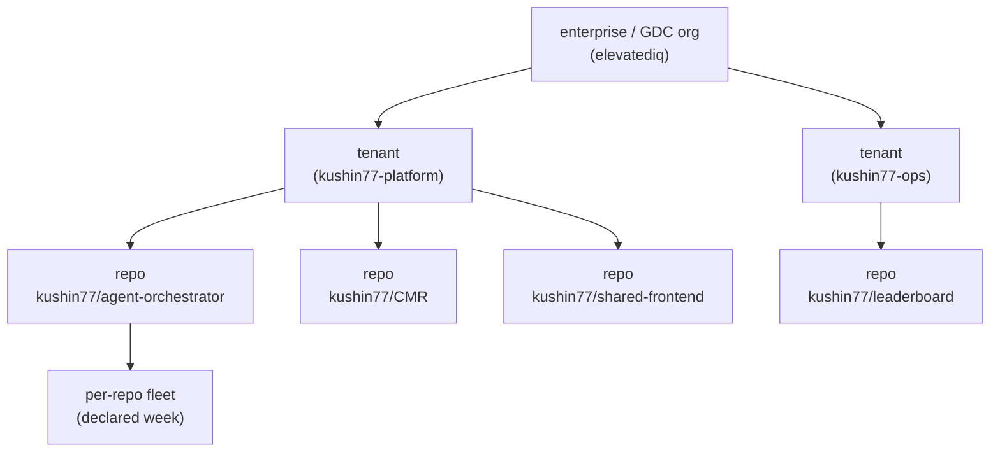

# Enterprise/GDC roll-up — tenant hierarchy and org aggregate view

**Issue:** [#151](https://github.com/kushin77/agent-orchestrator/issues/151)
(a child of EPIC [#144](https://github.com/kushin77/agent-orchestrator/issues/144))
**Lane:** `governance/rollup/` · **Gate:** `scripts/check-rollup.sh`

Every repo in the fleet runs its own per-repo fleet ("personal CTO engineering
team"). This document describes the layer above them: the view an enterprise/GDC
operator gets when they want one answer across all of it.

---

## 1. The hierarchy

Three levels, declared in two document kinds:

| Level | Declared in | Owns |
| --- | --- | --- |
| enterprise / GDC org | `governance/rollup/pilot/org.yaml` | tenants, the enterprise weekly ceiling |
| tenant | the same org file | a set of repos (`owner/name`), a tenant weekly ceiling |
| repo fleet | `governance/rollup/pilot/inventory/*.yaml` | its SMEs, spend, capacity, closure, drift for a window |

The hierarchy is a **tree**, not a graph: a repo belongs to exactly one tenant.
That is enforced, not assumed — a repo declared by two tenants is
`REPO_DUPLICATED`, is counted under its first tenant only, and the tenant that
lists it second is reported as unassessable rather than quietly short a repo.

`schema.yaml` is the contract for both documents (real JSON Schema, draft-07
subset). `governance/rollup/README.md` has the operator view of it.

---

## 2. The org aggregate view

For each scope — enterprise, tenant, repo — the projection reports the same
five facts, all computed from the declarations and none of them narrated:

| Fact | Rule | When it cannot be formed |
| --- | --- | --- |
| **SME inventory** | every SME, identified `repo#id`, grouped per repo | an empty fleet is `FLEET_EMPTY` |
| **utilisation** | engaged hours ÷ capacity hours | an SME with no capacity is excluded from both halves and named |
| **spend vs ceiling** | scope total, scope ceiling, the excess over it, plus the SMEs over *their own* ceilings | a missing repo makes the scope `assessed: false` |
| **closure rate** | closed ÷ dispatched | no dispatched work ⇒ `null`, `CLOSURE_UNASSESSABLE` |
| **drift** | drift findings ÷ drift checks | no checks ⇒ `null`, `DRIFT_UNASSESSABLE` |

Two overspends are distinguished on purpose, because conflating them would
misattribute a finding:

* **scope breach** — `excess_usd` / `over` on the tenant or enterprise:
  `max(0, total − ceiling)`. A tenant can be over while every SME inside it is
  under, and that is a ceiling problem, not an SME problem.
* **SME breach** — `smes_over_ceiling`: the SMEs past their *own*
  `weekly_spend_ceiling_usd`. `smes_at_ceiling` records the ones sitting exactly
  on their ceiling; that is within budget, produces **no** finding, and is
  reported as info telemetry so the margin is still visible.

Nothing is clamped. An SME $40 over a $100 ceiling is reported at $140.00 with a
`SPEND_OVER_CEILING` finding carrying the excess; utilisation above 100% is
reported as the ratio it is (with `UTILIZATION_OVER_CAPACITY`); a closure rate
above 100% is reported and flagged `CLOSURE_INCONSISTENT`. Clamping any of them
would make the org view disagree with the repo it claims to summarise.

### Tri-state, and why CANNOT-ASSESS dominates

Status is `ok` / `not-ok` / `cannot-assess`, mapped to exit codes 0 / 1 / 2.
Over-ceiling spend is NOT-OK. A missing or malformed input is CANNOT-ASSESS —
and CANNOT-ASSESS **wins** over NOT-OK, because an input set that could not be
read can understate the findings of the part that could. A run that could not
read everything never exits 0, and the aggregate it prints is marked
`assessed: false` rather than presented as complete.

---

## 3. The projection rule

> The org view is a **projection** of per-repo fleet declarations. It is never a
> second source of truth: it holds no state, persists nothing, and mutates no
> input. Repo fleets stay isolated beneath it.

What that means concretely, and how it is checked:

| Property | Enforced by | Checked by |
| --- | --- | --- |
| no state persists | `model.project` returns a report object and opens no file for writing | `tests/test_projection.py` wraps `io.open` and fails on any write-mode open |
| inputs are not mutated | facts are frozen dataclasses; the org's repo list defines the scope | input tree sha256 + size + mtime identical before and after a run |
| the view is traceable | every input's sha256 travels in the report (`inputs[]`, `schema_file`) | asserted in the gate against the committed pilot |
| it says what it is | `projection: true`, `persisted: false`, `generated_from[]` | asserted in the gate |
| repos stay isolated | SME identity is `repo#id`, tenant totals are disjoint, scope comes from the org | `test_two_repos_do_not_bleed_into_each_others_totals`, gate isolation assertions |

Consequence for operations: the org view can be recomputed at any time, from any
checkout, and two runs on the same declarations produce byte-identical reports.
Nothing has to be migrated, backed up, or reconciled — there is nothing to lose,
because nothing is stored.

---

## 4. Blast radius

| Surface | Touched by this lane | Effect if the roll-up changes |
| --- | --- | --- |
| `governance/rollup/**` | yes (new) | self-contained; no other module imports it |
| `scripts/check-rollup.sh` | yes (new) | standalone gate; **not** wired into `scripts/verify.sh` (shared file, orchestrator's step) |
| `docs/ENTERPRISE-ROLLUP.md` | yes (new) | documentation only |
| repo fleets and their journals | **no** | read-only in principle; in the pilot, not read at all — the pilot's facts are declared |
| `scripts/verify.sh`, `Makefile`, `scripts/pytest-suites.txt` | **no** | this lane adds no check to the gate of record; wiring is a follow-up |
| `registry/**`, the other `governance/*` lanes, `telemetry/**`, `portal/**`, `control-plane/**`, `fleet/**`, `gateway/proxy/**` | **no** | untouched |

An operator turning this on changes nothing for the repos it summarises: the
roll-up cannot write to them, and nothing reads the roll-up to decide anything.

---

## 5. Honest gaps

* **The pilot's numbers are declarations, not measurements.** `org.yaml` and the
  inventories carry `source: declared`; the contract also accepts `measured`. The
  gate therefore verifies the *computation* (hierarchy, aggregation, refusals,
  projection), not the truth of the declared week. Piping a real measurement feed
  into the same schema is the follow-up and changes only that field.
* **`weekly_spend_ceiling_usd` is a primitive this lane defines.** The issue
  points at `CMR/catalog/sme-registry.tsv` for it; that file does not exist in
  the vendored submodule (section 6). When CMR publishes it, the schema field
  should be reconciled with CMR's own name and units.
* **Tenant ids are modelled from this repo's persona-card grammar**
  (`[a-z][a-z0-9-]*`, with `platform` reserved). If the fleet adopts a different
  tenant-id namespace, the pattern and the pilot ids need revisiting.
* **The gate is not part of `make verify` yet.** It must be wired into
  `scripts/verify.sh` (and the suite registered in `scripts/pytest-suites.txt`)
  by the orchestrator, because both files are owned by other lanes.

---

## 6. PROVENANCE

Cannibalization is recorded against the source that was actually read
(GR-10). Every verdict below was checked in this lane, with the command that
checked it.

| Source repo | Path | Verdict | What was taken |
| --- | --- | --- | --- |
| `kushin77/CMR` (submodule, pin `b6c49aa03992dba9fe4b87b46104b8fc2f69f224`) | `catalog/sme-registry.tsv` | **absent** — `ls` : No such file | nothing; the per-SME ceiling primitive had to be defined here (`weekly_spend_ceiling_usd`) |
| `kushin77/CMR` (same pin) | `onboarding/agent-profiles/persona-registry.json` | **absent** — `ls` : No such file | nothing |
| `kushin77/CMR` (same pin) | anywhere | **absent** — `grep -rn weekly_spend_ceiling vendor/CMR` : 0 matches | nothing; no ceiling vocabulary exists in the submodule |
| `kushin77/CMR` (same pin) | `catalog/schemas/gdc-manifest.schema.json` | used | the GDC/spoke framing of the enterprise level and the `owner/name` repo-identity pattern |
| `kushin77/CMR` (same pin) | `catalog/topology/topology.json` | used | the graph-plus-drift shape: edges carrying a `drift` flag, which the repo-level drift rate mirrors |
| `kushin77/CMR` (same pin) | `onboarding/agent-profiles/role.schema.json`, `profiles/` | used | the SME ids the pilot declares are this schema's closed `role` enum (`security-sme`, `qa-sme`, `platform-sme`, `sync-sme`, `iac-sme`, `frontend-sme`, `architecture-sme`), and its `ownedLanes` / `model.tier` fields are why a fleet is declared per repo and budgeted per SME. `profiles/` itself is listed, not read |
| `kushin77/agent-orchestrator` | `registry/personas/persona-card.schema.json` (read-only) | used | the `tenant` field with the documented **platform fallback** and the tenant-id grammar — the tenant-hierarchy seed |
| `kushin77/agent-orchestrator` | `governance/conformance/policy.yaml`, `governance/board/cli.py`, `scripts/check-conformance.sh`, `scripts/check-reconcile.sh` | used | this repo's conventions: the tri-state exit contract, fail-closed policy handling, and a gate that provokes its own refusals |
| `kushin77/leaderboard` | `scripts/data/fleet-metrics-per-model.sh` | used | the metric shapes reused per SME/scope: invocations/attempts, success, failure, cost — here dispatched/closed, engaged/capacity, spend |
| `kushin77/leaderboard` | `scripts/data/fleet-metrics.sh`, `scripts/dispatch/sme-squad-router.sh` | reviewed | no existing tenant/enterprise roll-up to reuse: a case-insensitive grep for *tenant*, *enterprise* and *roll-up* over these files returns nothing. The recursive scan of `scripts/` finds only `scripts/qa/signals.d/enterprise_ready.sh`, where "enterprise" means enterprise-*quality* checks for one repo, not an org hierarchy |

**Submodule note.** `vendor/CMR` is **unpopulated in a fresh worktree** (0
entries) and populated in the main checkout (35 entries, heads/main at the pin
above). The absence verdicts above were taken in the populated checkout, which is
the only place they can be taken; `git submodule status vendor/CMR` reports the
pin.
