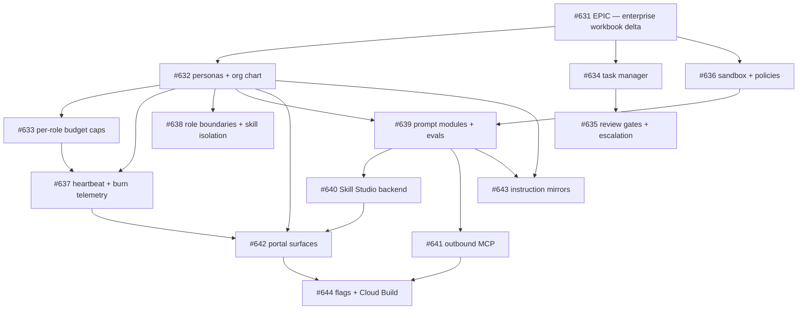

# Enterprise workbook gap analysis — Paperclip four pillars vs agent-orchestrator

**Issue:** [#614](https://github.com/kushin77/agent-orchestrator/issues/614)
("updated enterprise workbook" — the Paperclip Four Pillars brainstorm, the
Tab 1 C-suite org-chart table, and the Tab 3 Master AI Prompt Templates).
**Delta epic:** [#631](https://github.com/kushin77/agent-orchestrator/issues/631)
with children #632–#644. **Lane:** planning (docs-only + board-only).

## 1. Purpose and method

Issue #614 asks: *gap analysis what we have, and build the delta epic with full
epics, building out so all features are covered e2e in all pillars.*

This document is that gap analysis. Every workbook row is mapped against what
exists on `master` today, with file evidence, and classified:

- **EXISTS** — on master, cited by path, doing the job;
- **PARTIAL** — the primitive exists but the workbook behaviour is not closed
  end-to-end or not productized;
- **MISSING** — no measured trace on master.

Each gap becomes a child of the delta epic (one issue = one lane = one file
area). All measurements were taken on this checkout
(`git rev-parse HEAD` = the commit this PR lands), dated 2026-09-14.

## 2. Verdict summary

| Workbook pillar | Verdict | Delta children |
|---|---|---|
| 1. Agentic Task Manager | PARTIAL — ticket tooling and decomposition exist at repo-governance level; no tenant-facing task lifecycle, no task-scoped review gate | [#634](https://github.com/kushin77/agent-orchestrator/issues/634), [#635](https://github.com/kushin77/agent-orchestrator/issues/635), [#642](https://github.com/kushin77/agent-orchestrator/issues/642) |
| 2. Org Chart for Agents | MISSING as a surface — no C-suite personas, no reports-to field, budgets are per-tenant only, heartbeats are session-level | [#632](https://github.com/kushin77/agent-orchestrator/issues/632), [#633](https://github.com/kushin77/agent-orchestrator/issues/633), [#637](https://github.com/kushin77/agent-orchestrator/issues/637), [#638](https://github.com/kushin77/agent-orchestrator/issues/638), [#642](https://github.com/kushin77/agent-orchestrator/issues/642) |
| 3. Agent Employee Training | PARTIAL — packs/prompt modules are whole-set bundles with no skill-level authoring, no org-wide share semantics, no publish-gated evals | [#639](https://github.com/kushin77/agent-orchestrator/issues/639), [#640](https://github.com/kushin77/agent-orchestrator/issues/640), [#638](https://github.com/kushin77/agent-orchestrator/issues/638), [#642](https://github.com/kushin77/agent-orchestrator/issues/642) |
| 4. Agentic OS Infrastructure | PARTIAL — cross-provider runtimes and inbound MCP gateway exist; containerized runtimes are declared but OFF; outbound MCP server management absent | [#636](https://github.com/kushin77/agent-orchestrator/issues/636), [#641](https://github.com/kushin77/agent-orchestrator/issues/641), [#638](https://github.com/kushin77/agent-orchestrator/issues/638) |
| C-suite org chart (Tab 1) | MISSING — none of the five roles exists as a persona | [#632](https://github.com/kushin77/agent-orchestrator/issues/632) |
| Master AI Prompt Templates (Tab 3) | MISSING — the five templates are unpinned | [#639](https://github.com/kushin77/agent-orchestrator/issues/639), [#643](https://github.com/kushin77/agent-orchestrator/issues/643) |

## 3. Pillar 1 — Agentic Task Manager

Workbook items: **ticket-based workflows, automated decomposition, review gates.**

| Workbook row | Status | Evidence on master | Delta |
|---|---|---|---|
| Ticket-based workflows | PARTIAL (repo-governance only) | `governance/board/` (CHARTER.md, `gate.py`, boundary baseline), `governance/ticket/` (`builder.py`, `model.py`, `sources.py`), `governance/dispatch/` (claim/ledger), `governance/lifecycle/` (hygienic close) — all drive **repo** issues, none is a tenant-facing product surface | Tenant task lifecycle on `engine/core` [#634](https://github.com/kushin77/agent-orchestrator/issues/634); task-board UI [#642](https://github.com/kushin77/agent-orchestrator/issues/642) |
| Automated decomposition | PARTIAL | `engine/multiagent/planner.py` (hierarchical planner → `FanOutDispatcher`, bounded by `max_escalation_rounds`, injected decomposer), `fleet/brain.py` (goal → tickets), `registry/personas/cards/orchestrator.yaml` ("decomposes an epic into one-issue-one-lane work items") | Wire decomposition into the tenant task lifecycle [#634](https://github.com/kushin77/agent-orchestrator/issues/634) |
| Review gates | PARTIAL (PR-scoped) | `governance/merge/` (`engine.py`, `gate.py`, `reviewer.py`) implements the verdict machine — green verify named to a commit + independent SME reviewer + no-self-merge — but only over **PRs**; `docs/QA-GATE.md` records the merge gate | Review gate as a step on the task lifecycle, plus COO→CEO escalation [#635](https://github.com/kushin77/agent-orchestrator/issues/635) |

## 4. Pillar 2 — Org Chart for Agents

Workbook items: **C-suite reporting lines, role-based boundaries, budget
enforcement** — plus the Tab 1 heartbeat schedules.

| Workbook row | Status | Evidence on master | Delta |
|---|---|---|---|
| C-suite reporting lines | MISSING | No `reportsTo` concept anywhere: `registry/personas/persona-card.schema.json` has no such field and a grep for `reportsTo`/`reports_to` across `cards/` returns empty. The 26 platform cards (`registry/personas/cards/`) cover SMEs (orchestrator, pmo-sme, architecture-sme, gcp-gatekeeper-sme, security-sme, …) but **no ceo/cto/coo/cfo/cmo** | Five cards + `reportsTo` field + org-chart declaration [#632](https://github.com/kushin77/agent-orchestrator/issues/632) |
| Role-based boundaries | PARTIAL | Persona cards already bind `capabilitySet`, `constraintSet`, `toolAllowlist`, `posture` (executor/reviewer/auditor separation); `identity/rbac/` (`bindings.py`, `guard.py`, presets) enforces the tenant/team/agent role model — but no C-suite role presets | C-suite RBAC presets + org-wide skill isolation [#638](https://github.com/kushin77/agent-orchestrator/issues/638) |
| Budget enforcement | PARTIAL (per-tenant only) | `gateway/finops/budget.py` + `budgets.yaml` enforce per-**tenant** budgets (`tenant-acme` 100.00 fallback, `tenant-beta` 50.00 stop) with the stop/warn/fallback vocabulary; `telemetry/budgets/` adds quota/killswitch/chargeback/alerts. No per-role cap exists | Per-role caps (300/250/100/50/200) [#633](https://github.com/kushin77/agent-orchestrator/issues/633); per-role burn observability [#637](https://github.com/kushin77/agent-orchestrator/issues/637) |
| Heartbeat schedules | PARTIAL (session-level) | Heartbeats exist for **sessions** (`governance/reconcile/` — 15-minute TTL, orphan sweep) and the **fleet** (`fleet/cron.py` watchdog/prune/reconcile crontab lines, `fleet/health.py` signals) — there is no per-role declared schedule and no per-role staleness alert | Declared per-role schedules [#632](https://github.com/kushin77/agent-orchestrator/issues/632); per-role staleness alerts [#637](https://github.com/kushin77/agent-orchestrator/issues/637) |

## 5. Pillar 3 — Agent Employee Training

Workbook items: **Skill Studio, shared org-wide skills, regression evals.**

| Workbook row | Status | Evidence on master | Delta |
|---|---|---|---|
| Skill Studio | MISSING | Closest primitives: `registry/packs/` (signed, attestation-backed bundles of profile+personas+prompts+policy+tools with install/upgrade/drift/rollback), `registry/prompts/` (versioned modules + feedback + A/B), `control-plane/instructions/` (canonical instruction source). None is a skill-granularity author→test→publish studio | Skill-level pack artifacts + lifecycle [#640](https://github.com/kushin77/agent-orchestrator/issues/640); authoring UI [#642](https://github.com/kushin77/agent-orchestrator/issues/642) |
| Shared org-wide skills | PARTIAL | The persona library is tenant-extensible with shadowing and no cross-tenant leakage (`registry/personas/README.md`); packs install per-tenant. There is no explicit **org-wide share** semantic | Org-share + isolation semantics [#638](https://github.com/kushin77/agent-orchestrator/issues/638) |
| Regression evals | PARTIAL | `e2e/` runs the capstone golden path + negative controls over the real merged modules (gate-wired, issue #525); every lane ships a pytest suite; `registry/prompts/feedback.py` computes per-version FP/FN. Nothing gates **publishing** on evals | Per-module eval harness + publish gate [#639](https://github.com/kushin77/agent-orchestrator/issues/639); skill-level eval evidence [#640](https://github.com/kushin77/agent-orchestrator/issues/640) |

## 6. Pillar 4 — Agentic OS Infrastructure

Workbook items: **cross-provider runtimes, containerized sandboxing, multi-org
isolation, MCP server management.**

| Workbook row | Status | Evidence on master | Delta |
|---|---|---|---|
| Cross-provider runtimes | EXISTS | `gateway/providers/` + `gateway/proxy/` + `gateway/catalog/`; the e2e conformance stage proves the same governed path across DeepSeek, Ollama, paperclip, hermes, copilot (LOW), Claude/anthropic (MED) and OpenAI (`e2e/README.md` §1) | — (no gap) |
| Containerized sandboxing | PARTIAL | `guardrails/sandbox/` ships per-category security profiles (`restricted`/`standard`/`privileged`, fail-closed) with an injectable runtime; `docker.py` and `firecracker.py` are **declared but flag-gated OFF** | Enable the runtime path behind a flag, round-trip proven [#636](https://github.com/kushin77/agent-orchestrator/issues/636) |
| Multi-org isolation | PARTIAL | `identity/rbac/`, `guardrails/isolation/`, tenant-first persona resolution (a tenant card shadows only its own view; no cross-tenant leakage), session isolation in `governance/isolation/` | Org-wide shared-skill isolation [#638](https://github.com/kushin77/agent-orchestrator/issues/638) |
| MCP server management | PARTIAL (inbound only) | `gateway/mcp/` is a tenant-scoped **inbound** tool gateway — allowlist, authn/authz, rate limits, per-call audit — exposing platform tools to external agents. The platform managing MCP servers its own agents call (draw.io for the CTO row) does not exist | Outbound MCP server registry/health/authz [#641](https://github.com/kushin77/agent-orchestrator/issues/641) |

## 7. C-suite org chart → platform mapping (Tab 1)

The workbook table (role, reports-to, model tier, budget cap, heartbeat,
responsibilities) maps onto platform primitives as follows. Tier mapping uses
the closed `registry/profiles/catalog.yaml` vocabulary (LOW/MED → flash,
HIGH/MAX → pro).

| Role | Reports to | Workbook tier | Platform tier | Monthly cap | Heartbeat | Persona on master | Prompt module |
|---|---|---|---|---|---|---|---|
| CEO — Executive Strategy Director | Board / Founder | Claude / DSV4PMax (Tier 1) | HIGH | 300.00 | hourly / event | MISSING — nearest: `orchestrator` (plans, decomposes, dispatches; never executes lanes) | `ceo/primary@v1` |
| CTO — System Architect & Dev Lead | CEO | DSV4PMax / Claude (Tier 1-2) | HIGH | 250.00 | every-30m / event | MISSING — nearest: `architecture-sme` (architecture decisions, HIGH floor) | `cto/primary@v1` |
| COO — Operations & Pacing Lead | CEO | DSV4FNone (Tier 3-4) | MED | 100.00 | every-15m | MISSING — nearest: `pmo-sme` (workflow pacing, ticket state tracking, status rollup) | `coo/primary@v1` |
| CFO — Financial & Compute Controller | CEO | DSV4FNone (Tier 5) | LOW | 50.00 | daily | MISSING — nearest: `gcp-gatekeeper-sme` (cloud cost/build audit) + `auditor` posture | `cfo/primary@v1` |
| CMO — Marketing & Sales Automation | CEO | DSV4PMax / DSV4FNone (Tier 2-3) | MED | 200.00 | hourly / webhook | MISSING — no close analog on master | `cmo/primary@v1` |

The delta: [#632](https://github.com/kushin77/agent-orchestrator/issues/632)
declares the five cards plus the org-chart edges; [#633](https://github.com/kushin77/agent-orchestrator/issues/633)
enforces the caps; [#637](https://github.com/kushin77/agent-orchestrator/issues/637)
monitors the heartbeats; [#638](https://github.com/kushin77/agent-orchestrator/issues/638)
binds the boundaries.

## 8. Master AI Prompt Templates → prompt modules (Tab 3)

`registry/prompts/` already makes every runtime call resolve a **published,
frozen prompt module** — "no unversioned ad-hoc prompts" is mechanically
enforced (`registry/prompts/README.md`, governance rule). That is exactly the
substrate the workbook's five Master AI Prompt Templates need. Each template
becomes a module, and each mechanical enforcement rule becomes a named policy
(workbook-5, [#636](https://github.com/kushin77/agent-orchestrator/issues/636)):

| Template | Module | Mechanical enforcement rule | Policy id (workbook-5) |
|---|---|---|---|
| CEO | `ceo/primary@v1` | vector-memory lookup + context frontloading | `vector-memory-frontload` |
| CTO | `cto/primary@v1` | draw.io MCP diagramming + multi-repo AST index caching | `drawio-mcp-diagramming` |
| COO | `coo/primary@v1` | external-state caching + Prometheus log aggregation delta ingestion | `external-state-caching` |
| CFO | `cfo/primary@v1` | deterministic Python/Bash execution, zero-token arithmetic | `zero-token-arithmetic` |
| CMO | `cmo/primary@v1` | GoHighLevel webhook caching + NEPQ template injection | `webhook-caching-nepq` |

Provenance: template payloads are harvested from issue #614 (GR-10 record in
the module provenance fields). Delivery: [#639](https://github.com/kushin77/agent-orchestrator/issues/639)
(modules + regression evals + publish gate); mirrors per harness:
[#643](https://github.com/kushin77/agent-orchestrator/issues/643).

## 9. Delta epic structure

Epic [#631](https://github.com/kushin77/agent-orchestrator/issues/631) with
thirteen children, one per lane (file areas disjoint):

| Child | Lane | Pillar | Blocked by |
|---|---|---|---|
| [#632](https://github.com/kushin77/agent-orchestrator/issues/632) workbook-1 · C-suite persona cards + org-chart declaration | `registry/personas/**` | registry-profiling | — |
| [#633](https://github.com/kushin77/agent-orchestrator/issues/633) workbook-2 · per-role monthly budget caps | `gateway/finops/**` | model-gateway | #632 |
| [#634](https://github.com/kushin77/agent-orchestrator/issues/634) workbook-3 · tenant-facing agentic task manager | `engine/**` | state-machine | — |
| [#635](https://github.com/kushin77/agent-orchestrator/issues/635) workbook-4 · review gates + C-suite escalation | `governance/merge/**` | governance | #634 |
| [#636](https://github.com/kushin77/agent-orchestrator/issues/636) workbook-5 · sandbox runtime enablement + mechanical-rule policies | `guardrails/**` | guardrails-security | — |
| [#637](https://github.com/kushin77/agent-orchestrator/issues/637) workbook-6 · per-role heartbeat + budget burn observability | `telemetry/**` | observability-finops | #632, #633 |
| [#638](https://github.com/kushin77/agent-orchestrator/issues/638) workbook-7 · C-suite role boundaries + org-wide skill isolation | `identity/rbac/**` | identity-rbac | #632 |
| [#639](https://github.com/kushin77/agent-orchestrator/issues/639) workbook-8 · the five prompt templates as published modules + evals | `registry/prompts/**` | registry-profiling | #632, #636 |
| [#640](https://github.com/kushin77/agent-orchestrator/issues/640) workbook-9 · Skill Studio backend — skill-level pack granularity | `registry/packs/**` | registry-profiling | #639 |
| [#641](https://github.com/kushin77/agent-orchestrator/issues/641) workbook-10 · outbound MCP server management (draw.io) | `gateway/mcp/**` | model-gateway | #639 |
| [#642](https://github.com/kushin77/agent-orchestrator/issues/642) workbook-11 · org-chart / skill-studio / task-board portal surfaces | `portal/**` | control-plane | #632, #637, #640 |
| [#643](https://github.com/kushin77/agent-orchestrator/issues/643) workbook-12 · instruction-layer mirrors for the five roles | `control-plane/instructions/**` | control-plane | #632, #639 |
| [#644](https://github.com/kushin77/agent-orchestrator/issues/644) workbook-13 · feature flags + Cloud Build wiring | `infra/**` | control-plane (IaC) | #641, #642 |

Sequencing (dependencies only; parallel-ready lanes may run in any wave):

## 10. Cross-pillar coverage

Every platform pillar directory is owned by at least one child — the workbook
delta is closed **e2e across all pillars**:

| Pillar directory | Children |
|---|---|
| `registry/` | #632 (personas), #639 (prompts), #640 (packs) |
| `gateway/` | #633 (finops), #641 (mcp) |
| `engine/` | #634 |
| `guardrails/` | #636 |
| `telemetry/` | #637 |
| `identity/` | #638 |
| `control-plane/` | #643 |
| `portal/` | #642 |
| `governance/` | #635 |
| `infra/` | #644 |

## 11. Doctrine notes

- **NG4 — all needs are issues on our own board.** Every workbook row maps to
  an issue above (#632–#644); nothing requires work in a foreign repo.
- **GR-5 — new surfaces ship flag-gated OFF.** #644 owns one flag per new
  surface (org-chart view, skill studio, task board, outbound MCP, sandbox
  runtime), all defaulting OFF.
- **One issue = one lane.** The children's file areas are pairwise disjoint,
  so the whole set can run under the parallel-dispatch contract
  (`docs/EXECUTION-PLAN.md`) without two lanes sharing a file.
- **Verification.** Each child carries its own `Verify:` command plus
  `make verify`; the epic's Definition of Done is every child closed at green
  evidence.
