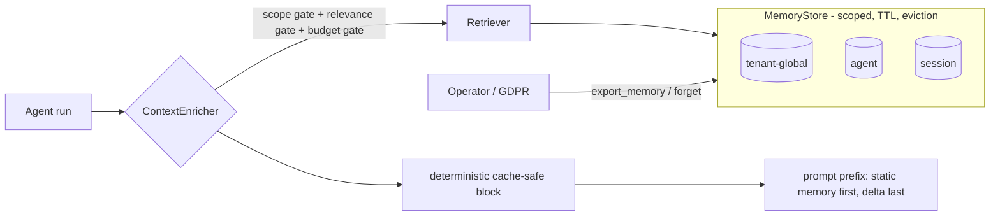

# engine/memory — scoped agent memory store (tenant/agent/session + TTL)

Owner lane: **engine** (issue `kushin77/agent-orchestrator#25`, "21 Scoped
agent memory store (tenant/agent/session + TTL)"). Pillar 3 · State-machine
execution, phase 3 · parent EPIC-00 (issue #4). Lane contract:
[`../../docs/EXECUTION-PLAN.md`](../../docs/EXECUTION-PLAN.md) (one issue =
one lane; this lane owns `engine/memory/**` only). Doctrine:
[`../../AGENTS.md`](../../AGENTS.md),
[`../../docs/GOLDEN-RULES.md`](../../docs/GOLDEN-RULES.md),
[`../../docs/CANNIBALIZATION.md`](../../docs/CANNIBALIZATION.md).

This tree is the **organizational memory** of each tenant's agent org:
semantic + episodic memory scoped to **tenant / agent / session** with strict
isolation, TTL + per-scope eviction, offline semantic retrieval, a bounded /
measured context-enrichment pipeline that stays provider-cache compatible, and
GDPR-ready forget/export. Everything runs **fully offline** (Python 3.14
stdlib; no vector DB, no network, no model calls).



## The scope model

A memory lives at exactly one of three nested scopes (mirroring the harvested
vscode-memory `MemoryType` — see Provenance):

| Store scope | vscode-memory `MemoryType` | Meaning | Container |
|---|---|---|---|
| `MemoryScope.TENANT` | `repository` | tenant-global / org memory | `tenant:<tenant_id>` |
| `MemoryScope.AGENT` | `user` | one agent's long-term memory | `agent:<tenant_id>:<agent_id>` |
| `MemoryScope.SESSION` | `session` | one run/conversation memory | `session:<tenant_id>:<agent_id>:<session_id>` |

`registry/profiles` (issue #9) froze each AgentProfile's `memoryScope` field
to `enum[]` of `user` / `session` / `repository`. This lane **consumes** that
frozen enum and never redefines it: `MemoryScope.from_profile_value` /
`from_profile_values` map profile values to the store scopes they grant read/
write over (`user → AGENT`, `repository → TENANT`, `session → SESSION`).

### Isolation contract (the non-negotiable)

Two access tiers, both enforced in `store.py`:

1. **Runtime path** (`get`, `delete`) requires *full scope cover*: reading a
   session memory demands the exact `(tenant, agent, session)`; reading an
   agent memory demands the agent; tenant-global memory is readable from
   anywhere inside the tenant. A boundary crossing raises
   `MemoryIsolationError` **and is counted** (`cross_scope_violations`) — a
   leak is loud, never quiet.
2. **Tenant-authority path** (`list_entries`, `erase`) is the GDPR data
   surface: it requires a tenant match only (the data-subject boundary is the
   tenant) and never crosses it.

Retrieval visibility: a query from `(tenant T, agent A, session S)` searches
T's tenant-global memory, A's agent memory, and exactly session S's session
memory — never another tenant's, another agent's, or another session's.
Memory ids are content-addressed hashes of `(tenant, agent, session, key)` so
cross-tenant id confusion is impossible and re-storing the same container/key
is an idempotent upsert (unbounded growth prevention).

Negative tests live in `tests/test_isolation.py` (tenant B cannot read tenant
A; session 1 cannot read session 2; agent A cannot read agent B).

## TTL + eviction per scope

`lifecycle.py` owns the policy vocabulary; the store applies it inline.

| Scope | Default TTL | Default capacity/container | Notes |
|---|---|---|---|
| `TENANT` | none | 1000 | org memory erased only by GDPR forget or capacity eviction |
| `AGENT` | 90 days | 500 | long-term but bounded |
| `SESSION` | 7 days | 200 | most ephemeral |

* TTL: every entry carries `created_at` + `ttl_seconds`; `is_expired(now)` is
  enforced on every read and by `prune_expired()` (the housekeeping sweep).
* Eviction: when a container exceeds capacity, entries are evicted from the
  head of the container's ordered index. `EvictionPolicy.LRU` (default)
  re-orders on access; `FIFO` evicts oldest-created. Evictions are counted.
* Both are fully deterministic under an injected `now` (no wall-clock sleeps
  in tests).

## Semantic retrieval (offline vector store)

`embedding.py` defines the `Embedder` seam plus the deterministic offline
default `BagOfWordsEmbedder` (signed feature-hashing term vectors, L2
normalized — a pure function of the text). A production model-backed embedder
(harvested `vscode-memory` `embedding_service`/`qdrant_client` shape) can be
injected behind the same protocol; the store and retriever depend only on the
protocol.

`retrieval.py` `Retriever.search(query, tenant_id, agent_id?, session_id?,
scopes?, kinds?, limit, min_score)` returns `Hit`s ranked by cosine
similarity over exactly the visible candidates (see isolation), counts
below-threshold and scope-excluded entries, and honors an optional scope
allowlist.

## Context enrichment pipeline

`enrich.py` `ContextEnricher.enrich(query, tenant_id, agent_id?, session_id?,
profile_scopes?, …) -> EnrichmentReport` is the injection path. Three gates,
all reported:

1. **Scope gate** — `profile_scopes` (the frozen profile `memoryScope`
   values) is mapped to store scopes; memories outside them are excluded.
2. **Relevance gate** — entries below `min_relevance` are counted
   (`below_relevance`) and dropped: only relevant memory is injected.
3. **Budget gate** — the rendered block is trimmed from the lowest score up
   until it fits `max_tokens`; `token_count` / `budget_tokens` /
   `budget_dropped` are measured and reported, plus `reason_codes`.

The report carries the deterministic `block_text` and its `cache_footprint`
(sha256), so callers can log exactly what entered the prompt and at what
token cost.

## Prompt-cache compatibility

`prompt_cache.py` implements the discipline lifted from
`.research/fleet/code-indexing/docs/prompt-cache.md`: providers cache from
token 0, so injected memory must be (a) deterministic and (b) after the
stable system spec, before the user delta.

* `render_memory_block(hits)` — byte-stable serialization: sorted by
  (scope, key), whitespace-collapsed, and emitting **only** scope/kind/key/
  text — never `created_at`/`updated_at`/`last_accessed`/container ids (the
  cache-killing tokens). Same logical set ⇒ same bytes.
* `scan_dynamic` / `validate_static_region` — reject run/session markers,
  UUIDs, and timestamps from a cacheable region (rejection is loud).
* `assemble_prefix(system, memory_block, user_delta)` — enforces
  static-first / delta-last block order (`PrefixError` on violation) so the
  static region stays byte-identical per request and the provider's prefix
  cache keeps hitting.

## Forget / export (GDPR-ready)

`gdpr.py` exposes the data-subject surface at the tenant boundary:

| Function | Behaviour |
|---|---|
| `export_memory(store, tenant_id, agent_id?, session_id?, scope?, kinds?)` | deterministic JSON-serializable snapshot + count + filter used |
| `forget(store, tenant_id, …, dry_run=False)` | erase matching memories; `dry_run` reports `matched` without deleting; `older_than` filters by creation time |

## Layout

```text
engine/memory/
├── README.md              # this contract
├── __init__.py            # public surface (import engine.memory.* from repo root)
├── model.py               # MemoryScope/Kind, MemoryEntry, ids, time, isolation error
├── embedding.py           # Embedder seam + offline BagOfWordsEmbedder + cosine
├── lifecycle.py           # EvictionPolicy, ScopePolicy, default_policies
├── store.py               # MemoryStore / InMemoryStore / FileStore (isolation+TTL+eviction)
├── retrieval.py           # Retriever + Hit (scope-aware semantic search)
├── enrich.py              # ContextEnricher / EnrichmentReport (bounded, measured)
├── prompt_cache.py        # deterministic block render + prefix discipline
├── gdpr.py                # export_memory / forget
├── cli.py                 # offline operator CLI (python -m engine.memory.cli)
└── tests/                 # 91 pytest cases (conftest + 7 files), all offline
```

## CLI

```bash
python3 -m engine.memory.cli store --tenant acme --scope agent --agent coder \
    --key deploy-style --text "canary deploys every Thursday"
python3 -m engine.memory.cli search --store /tmp/mem.json --tenant acme \
    --agent coder --session s1 --query "how do we ship"
python3 -m engine.memory.cli enrich --store /tmp/mem.json --tenant acme \
    --agent coder --session s1 --query "deploy cadence" --max-tokens 200
python3 -m engine.memory.cli export --store /tmp/mem.json --tenant acme
python3 -m engine.memory.cli forget --store /tmp/mem.json --tenant acme \
    --scope session --dry-run
python3 -m engine.memory.cli prune --store /tmp/mem.json
```

## Tests

Run from the repo root (offline, no network):

```bash
python3 -m compileall -q engine/memory
python3 -m pytest engine/memory/tests -p no:cacheprovider -q   # 91 passed
```

The suite covers the negatives (cross-tenant, cross-session, cross-agent),
TTL expiry with a pinned clock, LRU/FIFO capacity eviction, semantic ranking,
the three enrichment gates, deterministic/cache-safe rendering + prefix
discipline, GDPR forget/export, and `FileStore` persistence round-trips.

## Provenance (GR-10)

Verified local sources under `.research/` (all READ-ONLY):

| Source | What was adapted |
|---|---|
| `fleet/vscode-memory/scripts/memory_system_v2.py` (563 ln) | `MemoryType` repo/session/user scoping → tenant/agent/session; `MemoryEntry` TTL + `is_expired`; per-project LRU → per-container capacity eviction; cross-project isolation → `MemoryIsolationError`; dedup/upsert idempotence |
| `fleet/vscode-memory/src/services/semantic-memory/{semantic_search,embedding_service}.py` | embedder seam + cosine ranking + confidence threshold (min_score) pattern; Qdrant replaced by the offline `BagOfWordsEmbedder` |
| `fleet/vscode-memory/scripts/hermes-route-policy.py` + `preexec-policy-gate.py` | decision-with-reason-codes gating → enrichment `reason_codes`; policy-gate shape |
| `fleet/code-indexing/codeidx/{store,canonical}.py` + `docs/prompt-cache.md` | deterministic byte-stable serialization; dynamic-token rejection; static-first/delta-last prefix discipline → `prompt_cache.py` |
| `leaderboard/lib/leaderboard-registry.sh`, `scripts/brain/poll-monitor.sh` (PATTERN-ONLY) | history/registry lifecycle cadence concept only; no code lifted |

Deviations (recorded honestly): the source's SQLite/Qdrant/real-embedding
storage is represented by a deterministic offline seam (`FileStore` JSON,
`BagOfWordsEmbedder`) so the whole pillar is testable with zero network and
zero non-stdlib runtime dependencies; profile `memoryScope` semantics
(issue #9) are consumed, not redefined.
