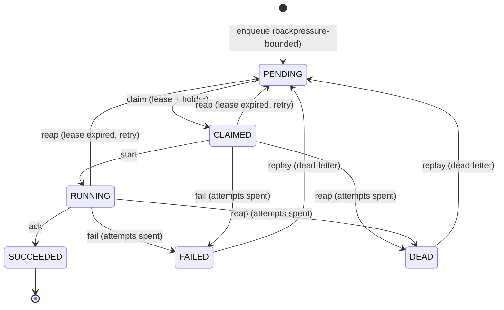

# engine/queue — Task lifecycle state machine + job queue (issue #22)

The **queue authority** for the state-machine execution pillar (phase 3,
EPIC-00 issue #4): enqueue → claim (with leases) → work → ack/fail, plus
dead-lettering, an orphan reaper for lease-expired claims, and exactly-once
*intent* — a single-writer authority with **no split-brain**.

Everything here is **offline** (Python 3.14 stdlib + PyYAML): in-memory for
tests/dev, or a flock-guarded atomic JSON file for durable single-node use.
No network, no containers, no npm/node.

---

## Lifecycle



- `PENDING` — enqueued, waiting to be claimed.
- `CLAIMED` / `RUNNING` — held by one agent under a **lease**
  (`lease_agent` + `lease_until`); `renew()` is the heartbeat.
- `SUCCEEDED` — acked by the lease holder.
- `FAILED` — worker-reported failure whose attempt budget is spent.
- `DEAD` — a claim reaped past its attempt budget (orphaned worker).
- `FAILED`/`DEAD` are the **dead-letter buckets**; `replay()` returns them to
  `PENDING` with the attempt budget reset.

The transition table lives in `state.py` (`TaskState`,
`VALID_TRANSITIONS`); `JobQueue._record` enforces it on every move.

---

## Operations (`JobQueue`, `engine/queue/queue.py`)

| Operation | Transition | Semantics |
|---|---|---|
| `enqueue(spec)` | → `PENDING` | At-least-once (see below); backpressure-bounded per tenant |
| `claim(agent)` | `PENDING` → `CLAIMED` | Best candidate: priority (HIGH>NORMAL>LOW) then age (+ rank bump after `age_bump_seconds`); returns `None` when nothing is claimable |
| `start(id, agent)` | `CLAIMED` → `RUNNING` | Only the lease holder; idempotent |
| `renew(id, agent)` | — | Heartbeat — extends `lease_until` |
| `ack(id, agent)` | → `SUCCEEDED` | Only the lease holder with a *valid* lease; idempotent on SUCCEEDED |
| `fail(id, agent, reason)` | → `PENDING` (retry) / `FAILED` | Attempts+1; dead-letter when the budget is spent |
| `reap()` | lease-expired → `PENDING`/`DEAD` | **Orphan reaper** — reclaims claims whose lease lapsed (worker died); never SUCCEEDED |
| `replay([id])` | `FAILED`/`DEAD` → `PENDING` | Dead-letter replay API; attempts reset to 0 |

Reads: `get`, `list_tasks`, `audit_log`, `depth`, `stats`.

### No double-claim / no split-brain
Only a `PENDING` task can be claimed, and every mutation runs under the
store's exclusive lock — two agents can never hold the same task, and a
stale agent whose lease lapsed **cannot** ack a task the reaper already
redelivered (`NotClaimedError` / `LeaseError`).

### At-least-once with idempotency keys
Re-enqueueing under an existing `task_id` (strong handle) *or*
`idempotency_key` returns the existing task instead of enqueueing a
duplicate — a redelivered task never runs its side effect twice at the queue
layer (see `dedup.py` + `tests/test_idempotency.py`). The `Worker` hands the
task to the handler, which is expected to key its *effect* on
`task.idempotency_key` for exactly-once effects across redeliveries
(`tests/test_falsifiability.py`).

### Backpressure + bounded per-tenant queues
`per_tenant_max_pending` caps the open tasks (PENDING+CLAIMED+RUNNING) per
tenant; further `enqueue`s raise `BackpressureError` (`backpressure.py`,
`tests/test_backpressure.py`). Terminating a task frees its budget slot.

### Audit ledger
Every state transition appends an `AuditEntry` with a strictly monotonic
`seq` (enqueue rows carry `from_state=None`). Append-only, ordered —
`audit_log()` returns the full ledger (`tests/test_audit_singlewriter.py`).

### Never a false PASS
A task whose worker died mid-execution is **never** recorded SUCCEEDED: an
exception/`SystemExit` (the Python analogue of a shell `set -e` abort) in the
handler ⇒ `fail`; a worker killed with no ack/fail at all ⇒ its lease lapses
and `reap()` requeues or dead-letters it. The `Worker` acks only on an
independently verified success (optional `verifier`). See
`tests/test_falsifiability.py` and `tests/test_worker.py`.

---

## Worker (`engine/queue/worker.py`)

```python
from engine.queue import JobQueue, Worker

q = JobQueue()                       # in-memory
w = Worker(q, agent_id="worker-1", handler=lambda task: run(task))
w.work_loop()                        # claim -> run -> ack/fail until drained
```

The loop is `claim` → `start` → `handler` → `ack` (verified) **or** `fail`
(any death). A lost lease while settling is swallowed — at-least-once
delivery means the task was already redelivered elsewhere.

---

## Persistence seams (`engine/queue/store.py`)

- `InMemoryStore` — `threading.RLock` over an in-process snapshot (tests/dev).
- `FileStore(path)` — `fcntl.flock` on `<path>.lock` + atomic JSON replace
  (tempfile → `os.replace` → fsync); two OS processes on one file serialize.

Both satisfy the `Store` protocol (`lock()` / `load()` / `save()`) and swap
into `JobQueue(store=...)` unchanged.

## Configuration (`engine/queue/queue.yaml`)

| Key | Default | Meaning |
|---|---|---|
| `lease_seconds` | 300 | Claim validity without a `renew` heartbeat |
| `max_attempts` | 5 | Deliveries before dead-lettering |
| `age_bump_seconds` | 86400 | Age after which a PENDING task gets a +1 claim-rank bump |
| `per_tenant_max_pending` | 100 | Backpressure bound per tenant |

Load with `load_config()` / `QueueConfig` (`engine/queue/config.py`).

## CLI (`python3 -m engine.queue.cli`)

Operator/“replay UI” against a file-backed queue
(`--store`, or `AO_QUEUE_STORE`, default `<cwd>/.ao-queue.json`):

```bash
python3 -m engine.queue.cli enqueue build --tenant acme --priority high \
    --payload '{"job":"build"}' --key build-42
python3 -m engine.queue.cli claim --agent worker-1
python3 -m engine.queue.cli start  build --agent worker-1
python3 -m engine.queue.cli ack    build --agent worker-1
python3 -m engine.queue.cli fail   build --agent worker-1 --reason boom
python3 -m engine.queue.cli reap
python3 -m engine.queue.cli replay --all
python3 -m engine.queue.cli stats
python3 -m engine.queue.cli list --status FAILED
python3 -m engine.queue.cli audit
```

## Layout

| Path | Purpose |
|---|---|
| `state.py` | `TaskState` lifecycle machine + legal transitions |
| `model.py` | `Task`, `TaskSpec`, `AuditEntry`, `Priority` |
| `queue.py` | `JobQueue` — the single-writer authority |
| `worker.py` | `Worker` claim→run→ack/fail loop (never a false PASS) |
| `store.py` | `InMemoryStore` / `FileStore` persistence seams |
| `config.py` + `queue.yaml` | Tuning knobs |
| `backpressure.py` | Bounded per-tenant queues (`BackpressureError`) |
| `dedup.py` | At-least-once idempotency (fingerprint helpers) |
| `cli.py` | Offline operator CLI |
| `tests/` | pytest suite (90 tests incl. negative + falsifiability) |

## Tests

```bash
python3 -m pytest engine/queue/tests -p no:cacheprovider -q
```

Run from the repo root. The suite covers the happy path, retries,
no-double-claim, wrong-agent/expired-lease rejection, lease-expiry requeue,
the orphan reaper, dead-letter + replay, idempotent redelivery, bounded
per-tenant backpressure, the audit ledger, single-writer concurrency, and the
never-a-false-PASS doctrine.

## Provenance / cannibalization

Generalized (never verbatim) from fleet sources tracked in
`docs/CANNIBALIZATION.md` and recorded in `AGENTS.md`:

- `CMR fleet/queue.sh` — claim/ack/fail/reap job queue: priority+age claim
  selection, bounded attempts → dead-letter, revive/reap of stale claims,
  single-writer mkdir lock → re-expressed as `JobQueue` + `FileStore` flock.
- `leaderboard scripts/dispatch/{agent-dispatch-enqueue,pull,ack}.sh`,
  `fanout.sh`, `post-task-verify.sh` — task-queue state machine + claims and
  the **never-a-false-PASS / independent-verification** doctrine (a task that
  died under `set -e` must still be recorded FAILED).
- `leaderboard lib/single-writer-lock.sh` — no-split-brain queue authority →
  the exclusive store lock + lease-holder checks.
- `issue-aggregator deduplication.py` — exact-fingerprint dedup idea →
  `dedup.fingerprint_payload` / `canonical_json` (semantic/trigram strategies
  there are ML/Postgres-bound and out of scope offline).
- `gmail-agent src/queue/tasks.ts` — idempotent-task pattern (source not
  present in the local harvest; pattern applied via idempotency keys).
