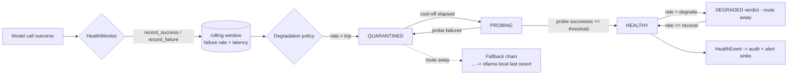

# gateway/health — model-health monitoring + auto-degradation + local fallback

Owner lane: **gateway** (issue `kushin77/agent-orchestrator#18`, "14 Model-health
monitoring + auto-degradation + local fallback"). Pillar 2 · Model Gateways,
phase 2. See [`../../docs/EXECUTION-PLAN.md`](../../docs/EXECUTION-PLAN.md) for
the lane contract (one issue = one lane; this lane owns `gateway/health/**`
only). Doctrine: [`../../AGENTS.md`](../../AGENTS.md),
[`../../docs/GOLDEN-RULES.md`](../../docs/GOLDEN-RULES.md),
[`../../docs/CANNIBALIZATION.md`](../../docs/CANNIBALIZATION.md).

This tree is the **health signal** of the Model Gateways pillar: it tracks
per-provider/model rolling failure rates and latency, auto-degrades unhealthy
models (trip → quarantine → cool-off → recovery probe → healthy), routes away
along a fallback chain whose **final rung is the local Ollama provider**, and
emits health/degradation events to audit and alert sinks (Phase-5 hook).

The gateway proxy (issue #16) and the FinOps chooser (issue #17) **consume**
this signal — the chooser already models health as an injected input
(`gateway/finops/chooser.py` `HealthSignal`); this lane is the component that
*produces* that signal from real per-call outcomes. Both sides are kept
decoupled: this lane never imports the chooser or the provider adapters — it
records whatever outcomes the gateway reports and answers health queries.

## The health-signal contract (what consumers call)

`HealthMonitor` is the single entry point:

| Method | Returns | Meaning for a caller |
|---|---|---|
| `record_success(provider, model, latency_ms=None)` | — | Report a successful model call (latency in ms). |
| `record_failure(provider, model, latency_ms=None, error=…, error_class=…)` | — | Report a failed call. `error` may be a providers-layer exception (classified by type name) or an explicit `error_class`. |
| `is_healthy(provider, model)` | `bool` | **The routing signal.** `True` = may serve production traffic; `False` = degraded/quarantined/probing — route to the fallback chain. |
| `health_status(provider, model)` | `dict` | Queryable report: state, verdict, window failure rate, latency avg/p95, per-error-class counts, probe state. |
| `statuses()` | `dict` | Every registered `provider/model` report keyed `provider/model`. |
| `may_probe(provider, model)` | `bool` | Whether a recovery probe may be sent now (quarantine cool-off elapsed). |
| `record_probe_success/failure(provider, model, …)` | — | Report a recovery-probe outcome (the only path out of quarantine). |
| `mark_healthy/mark_unhealthy(provider, model, detail)` | — | Operator overrides (e.g. an out-of-band check finds the local Ollama daemon down). |

A model with no recorded outcomes is `unknown` and is **admitted** (treated
healthy for routing — safe on boot); the chooser's own signal default
(`missing ⇒ healthy`) therefore composes directly. Wire the monitor into a
chooser as a model-id predicate:

```python
from health import HealthMonitor

monitor = HealthMonitor()               # or: config=load_config()
chooser = ModelChooser(table=table, health=lambda model_id: monitor.is_healthy(provider_for(model_id), model_id))
```

and the proxy records every real outcome after each provider call:

```python
try:
    result = registry.chat(messages, schema, options, context)
    monitor.record_success(result.provider, result.model, latency_ms=result.latency_ms)
except ProviderUnavailableError as exc:   # providers taxonomy (#15)
    monitor.record_failure(provider, model, error=exc)
```

## What this layer is (30 seconds)

A per-(provider, model) **rolling-window monitor** plus a **degradation
policy state machine** plus a **health-aware fallback-chain resolver**:



Production outcomes update the window; the state machine decides transitions;
fallback resolution reads `is_healthy`; every transition emits one
`HealthEvent`.

## Measurement (acceptance criterion 1)

- **Rolling window** — the most recent `windowSize` outcomes per
  (provider, model) are kept (fixed-size sliding window; deterministic
  offline, no time aging). Failure rate = failures / window.
- **Latency** — window average and **p95** (nearest-rank) of recorded
  latencies, reported in `health_status().window`. A p95 above
  `slowThresholdMs` (with enough samples) labels the model `slow` — advisory;
  the state machine is failure-driven.
- **Error classes** — every failure records a class from the closed
  vocabulary `timeout | rate_limit | http_5xx | auth | output_invalid |
  unavailable | unknown`. `classify_error(exc)` maps an exception to the
  vocabulary by type name (duck-typed, so providers-layer exceptions
  `ProviderTimeoutError` → `timeout`, `CircuitOpenError`/`RetryExhaustedError`
  → `unavailable`, `OutputValidationError` → `output_invalid`, … need no
  import). Counts appear in `health_status().window.error_counts` and the last
  class rides on the transition events.

## Degradation policy state machine (acceptance criterion 2)

States: `healthy`, `quarantined`, `probing`. Verdicts (reported):
`healthy | degraded | unhealthy | unknown`.

| Transition | Trigger | Event |
|---|---|---|
| healthy → **quarantined** | window failure rate **> `tripFailurePct`** (with ≥ `minSamples`) | `quarantined` (critical) |
| healthy → **degraded** (sticky verdict, state stays healthy) | window rate **> `degradeFailurePct`** | `degraded` (warning) |
| degraded → healthy | window rate **≤ `recoverFailurePct`** (earned by observed successes) | `healthy` (info) |
| quarantined → **probing** | **`coolOffSeconds`** elapsed (via `may_probe`) | `recovery_probe_started` (info) |
| probing → healthy | **`probeSuccessThreshold`** consecutive probe successes | `recovered` (info) |
| probing → quarantined | a probe failure (cool-off resets) | `quarantine_reasserted` (critical) |

Thresholds follow the cannibalized leaderboard `model-health.sh` doctrine
(degrade > 20%, auto-recover ≤ 10%, circuit-breaker stop > 50%). The degrade
and recover thresholds differ (**hysteresis**), so a failure rate oscillating
around the degrade threshold does not flap.

### No-false-green rules (acceptance criterion 5)

The health check is **falsifiable** — a dead model must actually report
unhealthy — and recovery is never granted for free:

- **Trip is a hard stop.** Past `tripFailurePct` the model is `quarantined`
  and production traffic is diverted to the fallback chain.
- **Only recovery probes change a quarantine.** Production successes recorded
  while quarantined/probing update the window but can never clear it; a probe
  success before the cool-off has elapsed is ignored; absence of observations
  never clears a quarantine (an absent log is not recovery).
- **Probing needs probes.** While `probing`, ordinary `record_success` calls
  do not count toward `probeSuccessThreshold`.
- **A dead final rung is a dead end.** When every rung of the chain — the
  local Ollama last resort included — is unhealthy, the resolver returns
  `None` (escalate) instead of silently routing to a dead model.

Each rule is negative-tested in `tests/test_falsifiability.py` and
`tests/test_policy_cycle.py`.

## Local-model fallback chain for HA (acceptance criterion 3)

`fallback.py` resolves an ordered chain of rungs (`provider/model`) for a
primary route, skipping rungs the monitor reports unhealthy:

```text
deepseek/deepseek-chat            (primary, cloud)
  → anthropic/claude-haiku-4-5    (alternate commercial rung)
  → ollama/llama3.2               (LOCAL LAST RESORT)
```

- **Ollama is a provider like any other** in the health layer: its outcomes
  are recorded on the monitor (`record_success`/`record_failure`) and it can
  be `mark_healthy`/`mark_unhealthy`d when an out-of-band check finds the
  local daemon down.
- It is the **final rung of every chain**; the resolver lands on it only when
  it is healthy, which keeps the agent producing when every commercial
  provider is down (the defragsuite / gov-ai-scout cloud → local pattern also
  mirrored by `gateway/providers` #15).
- `ChainRegistry.resolve(provider, model, health)` returns the first healthy
  rung, else `None`. Explicit chains load from `health.yaml`
  (`chains.explicit`); an unlisted route degrades to `[primary,
  localLastResort]` — every provider falls back to Ollama.

## Events → audit + alerting (acceptance criterion 4)

`events.py` defines `HealthEvent` (kind, provider, model, state, verdict,
failure-rate, window samples, p95 latency, error class, severity, detail, ts).
Every transition emits one event to the monitor's injected sinks:

- **audit sinks** receive **every** event (full-trace audit trail);
- **alert sinks** receive only `severity ≥ alertSeverity` (default `warning`) —
  `quarantined`/`quarantine_reasserted`/`operator_marked_unhealthy` are
  `critical`, `degraded` is `warning`, recovery/probe events are `info`.

Sinks implement the `HealthSink` protocol (`record(event)`); a raising sink
propagates (fail closed — a lost audit/alert record is never silent). Shipped
sinks: `ListHealthSink` (tests/offline), `JsonlHealthSink` (append-only JSONL
audit file), `NoopHealthSink` (default). The telemetry pillar (phase 5)
consumes these records for observability/alerting. Events carry no key
material by construction.

## Configuration (`health.yaml`)

| Key | Default | Meaning |
|---|---|---|
| `windowSize` | 100 | Rolling-window size (outcomes kept per provider+model). |
| `minSamples` | 10 | Outcomes required before any degrade/quarantine decision. |
| `degradeFailurePct` | 20.0 | Window failure % above which the model is degraded. |
| `tripFailurePct` | 50.0 | Window failure % above which the model is quarantined. |
| `recoverFailurePct` | 10.0 | Window failure % at/below which a degraded model recovers. |
| `coolOffSeconds` | 60.0 | Wait before a quarantined model may be probed. |
| `probeSuccessThreshold` | 2 | Consecutive probe successes that restore health. |
| `slowThresholdMs` | 30000.0 | Window p95 above which the model is flagged slow (advisory). |

`chains.explicit` lists ordered fallback chains; `chains.localLastResort`
names the local Ollama model that closes every chain. `load_config()` /
`ChainRegistry.from_yaml()` parse the file; a broken config raises (fail
closed — never silent fallback to defaults).

## Tree layout

```text
gateway/health/
├── README.md         # this file — the contract + config guide
├── __init__.py       # package public surface (import as ``health``)
├── config.py         # HealthConfig + error-class vocabulary + YAML loader
├── events.py         # HealthEvent + kinds/severity + audit/alert sinks
├── policy.py         # degradation state machine + verdict helpers
├── monitor.py        # ModelHealth rolling window + HealthMonitor facade
├── fallback.py       # fallback chains + resolver (Ollama last resort)
├── health.yaml       # shipped thresholds + chains
├── cli.py            # offline CLI (config / status / demo)
└── tests/            # offline pytest suite (rolling window, policy cycle,
                      # error classes, fallback, falsifiability, events)
```

The package is importable as `health` when `gateway/` is on `sys.path` (the
tests arrange this in `tests/conftest.py`, mirroring `gateway/limits`; the
CLI arranges it itself).

## Usage

All commands run from the repo root; the modules are self-contained Python 3
(stdlib + PyYAML; no network, no third-party installs).

```bash
# Effective configuration + fallback chains
python3 gateway/health/cli.py config

# One model's health report
python3 gateway/health/cli.py status deepseek deepseek-chat

# End-to-end offline demo (healthy -> degraded -> quarantined -> cool-off ->
# probe -> recovered -> ollama last resort) with audit/alert event streams
python3 gateway/health/cli.py demo

# Tests
python3 -m pytest gateway/health/tests -q -p no:cacheprovider
```

## Acceptance criteria (issue #18)

| Criterion | Where |
|---|---|
| Health signal per provider+model (rolling failure rate, latency, error classes) | `monitor.py` rolling window + `config.py` error-class vocabulary; `tests/test_window.py`, `tests/test_error_classes.py` |
| Degradation policy state machine (trip → quarantine → fallback → cool-off → probe → healthy) + YAML config | `policy.py`, `monitor.py`, `health.yaml`; `tests/test_policy_cycle.py`, `tests/test_config.py` |
| Local-model fallback chain for HA — Ollama as last-resort provider | `fallback.py` + `health.yaml` chains; `tests/test_fallback.py` |
| Health + degradation events to audit + alerting (Phase 5) | `events.py`; `tests/test_events.py` |
| No-false-green / falsifiable health check | quarantine/probe rules above; `tests/test_falsifiability.py` |
| Contract documentation | this README |
| Offline tests (all of the above) | `gateway/health/tests/` (59 tests) |

## Provenance

Adapted (not copied) from the sources indexed in
[`../../docs/CANNIBALIZATION.md`](../../docs/CANNIBALIZATION.md), each read
through the `.research/` read-only mirrors (GR-10):

| Source | Pattern adapted | Where it landed |
|---|---|---|
| `leaderboard` `scripts/guard/model-health.sh` + `lib/resilience.sh` + `circuit-breaker.sh` | failure-rate tier degradation (>20% degrade, ≤10% auto-recover, >50% stop), min-sample floor, "no data is not healthy", recovery earned by observed success | thresholds + hysteresis + no-false-green rules in `config.py`/`policy.py`/`monitor.py` |
| `capital-underwriting` `scripts/guard/model-health.sh` | same >20% auto-degradation doctrine (pattern confirmation) | `health.yaml` defaults |
| `ollama` `resilient_ollama_client.py` + `resilience/circuit_breaker.py` | CLOSED/OPEN/HALF_OPEN recovery semantics (recovery timeout, success threshold) | cool-off + probe-success threshold; probing state |
| `defragsuite` `pkg/defrag-ai/modal/client.go` | circuit breaker + cloud → local fallback (last-resort availability check) | `fallback.py` chain resolver + Ollama last resort |
