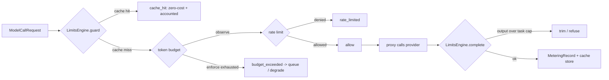

# gateway/limits — cost/capacity control layer

The **per-tenant cost/capacity controls** for the model gateway (pillar 2,
phase 2): semantic cache, token-budget limiter, rate limiter, and output
throttle, plus the backpressure decision that applies when a tenant budget is
exhausted.

Parent issue: `kushin77/agent-orchestrator#19` ("15 Semantic cache + token
budget + rate limit + output throttle"). Lane scope per
[`docs/EXECUTION-PLAN.md`](../../docs/EXECUTION-PLAN.md) (one issue = one lane):
this lane owns `gateway/limits/**` only. The gateway proxy lane (issue #16)
**consumes** the contracts documented here; the telemetry pillar (phase 5,
issues #31-#34) owns canonical usage/cost storage.

Everything here is **offline** (stdlib + PyYAML): no network, no server. The
facade (`LimitsEngine`) is what a runtime proxy embeds.

## What this layer does

| Concern | Component | Behavior |
|---|---|---|
| Semantic cache | [`cache.py`](cache.py) + [`fingerprint.py`](fingerprint.py) | Prompt-fingerprint dedup keyed by (tenant, model tier, normalized prompt, taskType) with TTL + LRU. A cache **hit is zero-cost** (provider bypassed) **and is accounted** as a metering record `outcome=cache_hit, zero_cost=True`. |
| Token budget | [`budget.py`](budget.py) | Rolling-window token cap per (tenant, agent, model tier) with an **observe→enforce** toggle. `observe` logs and never blocks; `enforce` blocks over-cap calls. Optional tenant-wide caps aggregate across agents. |
| Rate limit | [`ratelimit.py`](ratelimit.py) | Token-bucket rate limiter per scope key (burst capacity + refill). |
| Output throttle | [`throttle.py`](throttle.py) | Per-taskType output token caps (trim/refuse) that stop runaway loops. |
| Backpressure | [`backpressure.py`](backpressure.py) | When an enforce budget is exhausted: **queue or degrade**, never a silent success. |
| Facade / contract | [`limiter.py`](limiter.py) | `LimitsEngine`: the single entry point a gateway proxy calls; wires all of the above per request and emits the metering record. |

## The call-flow contract (what the proxy consumes)



- `LimitsEngine.guard(request, requested_tokens=None)` checks cache → budget →
  rate and returns a `GuardDecision` **before any provider call**.
- On `kind=allow` the proxy performs the provider call, then calls
  `LimitsEngine.complete(request, raw_response, input_tokens=…,
  output_tokens=…)` which enforces the output throttle, meters real usage, and
  stores a cacheable response.
- `LimitsEngine.execute(request, provider)` is the convenience wrapper that
  does both (used by the CLI demo and tests).

### GuardDecision kinds (closed set)

| kind | served() | meaning |
|---|---|---|
| `cache_hit` | True | Served from cache; `metering.outcome=cache_hit`, `zero_cost=True`. |
| `allow` | True | Proxy may call the provider; budget/rate decisions ride along. |
| `budget_exceeded` | **False** | Enforce budget blocked the call; `backpressure` carries the queue/degrade decision. |
| `rate_limited` | **False** | Rate limiter blocked the call; `rate` carries wait info. |

**Never-fail-open guarantee:** a blocked call has `served() == False`, a
non-null `reason` in its metering record, and never a fabricated `response`.
There is no code path that turns a block into a silent success (negative test:
`tests/test_backpressure.py`).

## Data contracts

### ModelCallRequest (`model.py`)

| Field | Type | Meaning |
|---|---|---|
| `tenant` | string | Opaque tenant id (identity/onboarding). |
| `agent` | string | Opaque agent id. |
| `model_tier` | string | Uppercase tier vocab `LOW\|MED\|HIGH\|MAX` (consumed from `registry/profiles/catalog.yaml`; normalized case-insensitively). |
| `task_type` | string? | Optional kebab-case taskType (registry/prompts vocab); drives throttle caps + cache scoping. |
| `prompt` | string | The prompt text (fingerprinted for the cache). |
| `request_id` | string | Opaque per-call id (defaults to a fresh uuid hex). |

### MeteringRecord (`model.py`)

The accounting record for **every** outcome. Cache hits are recorded as
`outcome=cache_hit, cached=True, zero_cost=True`; provider calls as
`outcome=provider` with the real token counts; blocked calls carry a
non-null `reason`. Outcomes (closed set): `cache_hit`, `provider`,
`budget_exceeded`, `rate_limited`, `queued`, `degraded`, `refused`.

### Cache key construction (`fingerprint.py`)

```
key = sha256("ao-limits-cache/v1" | tenant | TIER | prompt_fingerprint | [taskType])
prompt_fingerprint = sha256("ao-limits-fingerprint/v1" | normalized_prompt)
```

Normalization = NFKC + trim + collapse whitespace (optional lowercase /
punctuation-strip flags). Same prompt + same tenant + same tier → same key;
a different tenant or tier → a different key → isolated entries.

## Directory layout

| Path | What it holds |
|---|---|
| [`model.py`](model.py) | `ModelCallRequest`, `MeteringRecord`, outcome vocabulary. |
| [`fingerprint.py`](fingerprint.py) | Prompt normalization + sha256 fingerprint / cache-key / scope-key helpers. |
| [`cache.py`](cache.py) | `SemanticCache` (TTL, LRU, stats) over a `CacheStore` seam: `MemoryCacheStore` + `FileCacheStore`. |
| [`budget.py`](budget.py) | `BudgetPolicy`/`BudgetMode`, `TokenBudget`, `BudgetController`, `BudgetDecision`, `UsageLedger` seam (`MemoryLedger` + `JsonlLedger`). |
| [`ratelimit.py`](ratelimit.py) | `TokenBucket`, `RateLimitPolicy`, `RateLimiter`, `RateLimitDecision`. |
| [`throttle.py`](throttle.py) | `OutputThrottle` + per-taskType cap taxonomy, `ThrottleVerdict`. |
| [`backpressure.py`](backpressure.py) | `BackpressureController` (queue/degrade), `BackpressureQueue`, `BackpressureDecision`. |
| [`limiter.py`](limiter.py) | `LimitsEngine`, `GuardDecision`, `CompleteResult`, `build_engine()`. |
| [`config.py`](config.py) | Typed YAML config (`LimitsConfig`) + per-component builders. |
| [`config/limits.yaml`](config/limits.yaml) | Committed default configuration (safe-rollout: budget mode `observe`). |
| [`cli.py`](cli.py) | Offline CLI (config / fingerprint / cache / budget / rate / throttle / backpressure / demo). |
| [`tests/`](tests/) | pytest suite (87 tests) covering every acceptance criterion. |
| [`__init__.py`](__init__.py) | Public API exports (import as `limits` when `gateway/` is on `sys.path`). |

## Configuration

[`config/limits.yaml`](config/limits.yaml) is the single source of truth at
runtime. `load_config(path=…)` merges an override file with the same shape
onto defaults; `build_engine(config)` wires a fully configured
`LimitsEngine`. Highlights:

- **cache**: `enabled`, `store` (`memory`|`file` + `file_dir`), TTL, max
  entries, normalization flags.
- **budget**: `default_mode: observe` (safe rollout — flip a scope to
  `enforce` only after observing real usage), plus `scope_overrides` and
  `tenant_overrides` maps.
- **rate**: default limit/window/burst + per-scope overrides.
- **throttle**: `default_cap`, `mode` (`trim`|`refuse`), per-taskType `caps`.
- **backpressure**: `strategy` (`degrade`|`queue`) and `queue_capacity`.

Every limiter ships in a safe default; nothing is tenant-visible until a
config override deliberately enables/enforces it (flag-gated-off doctrine).

## Usage

```python
import sys
sys.path.insert(0, "gateway")          # make `limits` importable
from limits.limiter import build_engine
from limits.model import ModelCallRequest

engine = build_engine()                # wired from config/limits.yaml
req = ModelCallRequest(tenant="acme", agent="coder", model_tier="LOW",
                       task_type="summarize", prompt="Summarize this PR")
decision, result = engine.execute(req, provider)   # provider: callable or (text, usage)
if not decision.served():
    # explicit block: inspect decision.kind / decision.backpressure
    raise SystemExit(f"blocked: {decision.kind}")
```

CLI (offline, no network):

```bash
python3 gateway/limits/cli.py config
python3 gateway/limits/cli.py fingerprint "some prompt" --tenant acme --tier LOW
python3 gateway/limits/cli.py budget decide acme coder LOW 500 --mode enforce
python3 gateway/limits/cli.py rate check acme::coder::LOW
python3 gateway/limits/cli.py throttle cap summarize
python3 gateway/limits/cli.py demo      # end-to-end walk-through + negative
```

## Cannibalization & provenance

Patterns adapted from fleet sources (see
[`docs/CANNIBALIZATION.md`](../../docs/CANNIBALIZATION.md)):

| Source (repo/path) | What was adapted |
|---|---|
| `leaderboard scripts/elite/semantic-cache.sh` | TTL file cache keyed by hash, LRU eviction, hit/miss stats. |
| `leaderboard lib/semantic-cache.sh` (#708) | Prompt normalization before hashing. |
| `leaderboard lib/llm-cache.sh` (#253/#703) | Fingerprint = hash over (model + prompt); version invalidation of keys. |
| `leaderboard scripts/guard/token-budget.sh` | Rolling-window budget; **undeterminable spend must never read as zero** (fail-closed). |
| `leaderboard scripts/guard/rate-limiter.sh` | Token-bucket algorithm (capacity=burst, refill=limit/window). |
| `leaderboard scripts/dispatch/backpressure.sh` | Explicit backpressure controller (never silently drop). |
| `shared-services resource-quota-enforcer` | Soft (warn) vs hard (deny) quota levels; degrade/deny posture. |
| `ollama api/routes/usage.py` | Per-entity usage/cost accounting shape (tokens/cost fields). |
| `gov-ai-scout middleware/rateLimit.ts` | Rate-limit middleware semantics (burst window + refill). |

## Verification

```bash
python3 -m pytest gateway/limits/tests -q -p no:cacheprovider   # 87 passed
python3 gateway/limits/cli.py demo                              # offline evidence demo
make verify                                                     # repo gate stays green
```

Acceptance-criteria test map: fingerprint stability + tenant/tier separation
(`tests/test_fingerprint.py`), TTL expiry + cache-hit accounting
(`tests/test_cache.py`), budget observe vs enforce (`tests/test_budget.py`),
rate-limit burst window (`tests/test_ratelimit.py`), output-throttle cap
(`tests/test_throttle.py`), backpressure-no-fail-open negative
(`tests/test_backpressure.py`), and the integrated cache-hit metering +
observe/enforce + rate + throttle paths (`tests/test_limiter.py`).

## Governance rules

1. **A cache hit is zero-cost and is always accounted** — never silent, never
   unrecorded.
2. **Safe rollout:** budgets default to `observe`; `enforce` is an explicit,
   deliberate config choice per scope.
3. **Never fail open:** an exhausted budget or rate limit returns an explicit
   decision (`served() == False`); undeterminable spend is an error, not a
   zero.
4. **Field vocabulary is consumed, not redefined:** model tiers come from the
   agent-profile catalog (`LOW|MED|HIGH|MAX`), task types are kebab-case
   taskTypes, tenant/agent ids are opaque.
5. The canonical telemetry/usage storage contract belongs to the
   observability pillar (phase 5); this layer defines the cost-control
   metering record the gateway writes until then.
