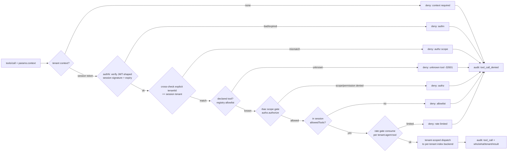

# gateway/mcp — Tenant-scoped MCP tool gateway (allowlist + audit)

The **MCP surface of the model-gateway pillar** (issue #20, work item 16,
phase 2). A tenant-scoped tool gateway that exposes the platform's declared
tools — code/KB indexing plus platform informational tools — so external AI
agents (Claude / Copilot / DeepSeek) can call in safely: every tool requires
tenant context and enforces identity, allowlists, rate limits and a full
per-call audit.

Parent: EPIC-00 (issue #4). Doctrine:
[`AGENTS.md`](../../AGENTS.md), [`docs/EXECUTION-PLAN.md`](../../docs/EXECUTION-PLAN.md).
This subtree is a **gateway** lane (`gateway/mcp/**`); the sibling
[`gateway/limits`](../limits/README.md) (issue #19) cost/capacity layer and
the [`gateway/finops`](../finops/README.md) (issue #17) chooser are consumed,
never edited.

Everything here is **offline** (stdlib + PyYAML; no network, no server, no MCP
SDK required). The gateway is an in-process JSON-RPC surface
(`MCPToolGateway.handle_message`) plus an in-memory, fake-data tenant KB so the
declared indexing tools are fully exercisable in tests and a CLI demo.

## What it does

External agents integrate via MCP. The gateway resolves each request's tenant
context and enforces a fixed pipeline before any tool acts:



**No-cross-tenant doctrine** (capital-underwriting tenant-scoped MCP pattern;
rbac issue #12; registry issue #10): the index backend handed to a tool is
bound to the session's `tenantId`; no tool argument can select a tenant; an
explicit `tenantId` that disagrees with the verified session is refused; and
an absent tenant context never means "any tenant" (fail closed).

## The tool catalog (declared capabilities with schemas)

| Tool | What it does | Schema (`inputSchema`) |
|---|---|---|
| `code.definitions` | Where a symbol is defined in this tenant's code index. | `{symbol: string (req)}, {repo?, limit?}` |
| `code.references` | Resolved call sites of a symbol. | `{symbol (req)}, {repo?, limit?}` |
| `code.search` | Substring search over symbol names. | `{q (req)}, {repo?, limit?}` |
| `kb.query` | Query the tenant code/KB graph (repo / module / full). | `{module_id?, repo?}` |
| `kb.freshness` | Read-only freshness of one tenant repo (unknown is never up-to-date). | `{repo (req)}` |
| `kb.summary` | Counts + shape of the tenant KB snapshot. | `{}` |
| `platform.whoami` | Resolved tenant context of the session (identity echo). | `{}` |

The first six re-use the compiler-accurate indexing tool *shapes*
(definitions / references / search / query / freshness) from the code-indexing
and CMR MCP catalogs; the gateway does **not** implement a real indexer — each
tenant's code/KB is a declared fake-data graph (`KbRegistry` / `TenantKb`) the
tools query. Tool output is canonical (keys sorted at every depth), so the
same request returns the same bytes on every call.

A tool is a **declared capability**: `ToolDefinition` (name, description, JSON
schema, handler) lives in a `ToolRegistry`. Unknown tool names are **rejected**
with the JSON-RPC `-32601` method-not-found error — allowlist, not denylist
(saas-rbac `frontend-api/src/proxy.ts` doctrine). The session's
`allowedTools` claim (its own closed subset of the tool ids above) is the
per-call allowlist.

## The enforcement contract

### Wire shape

The gateway speaks minimal JSON-RPC 2.0 (one message in, one response out;
`None` for notifications):

| Method | Notes |
|---|---|
| `initialize` | Advertises `protocolVersion: 2024-11-05`, `capabilities.tools`, `serverInfo`. |
| `ping` | `{}`. |
| `tools/list` | Declared schemas in sorted name order; with a valid `context.session`, narrowed to the session's `allowedTools`. |
| `tools/call` | `params = {name, arguments, context}`; `context.session` = the tenant-scoped session token; `context.tenantId` optional cross-check. |
| others / notifications | Error response, or no reply for notifications. |

Results are text content items (`{"content":[{"type":"text","text": ...}]}`
with `isError`), matching the CMR indexer MCP server.

### authN — session/JWT-shaped token (registry/service claim vocabulary)

Every `tools/call` carries `context.session`, an HS256-signed
`header.payload.signature` token whose payload uses the registry service
identity claim vocabulary (issue #10): `iss` / `sub` / `aud` / `iat` / `exp` /
`jti` + scoped `tenantId` / `agentId` / `role` / `allowedTools`. `verify_token`
checks the HMAC signature then expiry; a forged claim never verifies. Production
issuance belongs to the registry/control plane; `authn.mint_session` exists so
the gateway is exercisable offline (documented as an offline convenience).
`MCPToolGateway` takes an injected `session_verifier` so a deployment may
substitute a registry-provided verifier.

### authZ — the rbac scope gate (consumed, not redefined)

Authorization is injected as a `PermissionGuard`; the shipped
`RbacScopeGuard(store)` adapts an identity/rbac `store` (issue #12) and runs
`guard_session(store, session, "tool:call")` — the rbac middleware contract for
every tool call. That means **scope first, then permission**: a subject with a
`tool:call`-granting role in tenant A has no cross-tenant fallback when it
presents a tenant-B session (scope denial, `reason="scope"`), and a subject in
scope whose role lacks `tool:call` is denied (`reason="permission"`). Denials
carry the cause so the transport maps scope vs permission correctly.

### Rate limit — injected gate, consumes gateway/limits

`MCPToolGateway` consumes an injected `RateGate` on **every** call. The shipped
`LimitsRateGate` adapts the gateway/limits token-bucket `RateLimiter`
(`gateway/limits`, issue #19) with an isolated bucket per
`tenant:agent:tool` scope — one tenant's burst never starves another. Rate
limiting ships flag-gated: a gateway built without a `rate_gate` does not
limit (safe default OFF per fleet doctrine); wire one to enforce.

### Audit — append-only hash-chained tool-call ledger

Every call — allowed or denied — appends **exactly one** record to an injected
`AuditSink`. `HashChainAuditLog` is the default ledger; its record shape is
consumed from the registry/events append-only contract (issue #10): one JSON
object per line, monotonic `seq`, RFC 3339 `ts`, `prevHash` → `hash` sha256
chain, fixed genesis hash. Kinds are the closed pair `tool_call` /
`tool_call_denied` (status vocabulary: `ok`/`error` and `context`/`authn`/
`authz`/`allowlist`/`rate`/`unknown`). Each record answers:

- **who** — `actor` (session subject) + `agentId`
- **what** — `detail.tool` / `detail.permission` (+ `detail.arguments`)
- **tenant** — `tenantId`
- **result** — `status` + `detail.result`

The ledger is append-only by construction; a tampered, deleted or reordered
record — or a truncated tail — is a hard `AuditLogIntegrityError` on reopen /
`verify`. Schema: [`audit.schema.json`](audit.schema.json).

## Directory layout

| Path | Purpose |
|---|---|
| [`protocol.py`](protocol.py) | JSON-RPC 2.0 wire shapes + error codes. |
| [`model.py`](model.py) | `SessionIdentity`, `ToolDefinition`, permission/allowlist vocab. |
| [`errors.py`](errors.py) | One exception per enforcement layer (with protocol code). |
| [`authn.py`](authn.py) | HS256 JWT-shaped session verify/mint (registry/service claim vocab). |
| [`authz.py`](authz.py) | `PermissionGuard` seam + `RbacScopeGuard` (consumes identity/rbac). |
| [`registry.py`](registry.py) | `ToolRegistry`: declared capabilities, fail-closed lookup. |
| [`tools.py`](tools.py) | The declared tool catalog (indexing + platform tools). |
| [`kb.py`](kb.py) | Per-tenant fake code/KB index (`KbRegistry`, `TenantKb`). |
| [`audit.py`](audit.py) | `AuditSink` seam + `HashChainAuditLog` append-only ledger. |
| [`rategate.py`](rategate.py) | `RateGate` seam + `LimitsRateGate` (consumes gateway/limits). |
| [`gateway.py`](gateway.py) | `MCPToolGateway`: the enforcement core + JSON-RPC surface. |
| [`cli.py`](cli.py) | Offline CLI (`list-tools`, `demo`). |
| [`audit.schema.json`](audit.schema.json) | JSON Schema of one audit record. |
| [`tests/`](tests/) | pytest suite (45 tests incl. every negative). |

## Usage

```python
import sys
sys.path.insert(0, "gateway")     # make `mcp` (and sibling `limits`) importable
sys.path.append("identity")       # to consume the real rbac store (optional)

from mcp.authz import RbacScopeGuard
from mcp.gateway import MCPToolGateway
from mcp.tools import build_registry
from mcp.audit import HashChainAuditLog

# authz from an identity/rbac store (or inject any PermissionGuard)
gateway = MCPToolGateway(
    build_registry(),
    authz=RbacScopeGuard(rbac_store),   # scope gate, then permission
    audit=HashChainAuditLog(),          # append-only ledger
    signing_key=b"<32-byte-signing-key>",
)

# one JSON-RPC message in, one response out
response = gateway.handle_message({
    "jsonrpc": "2.0", "id": 1, "method": "tools/call",
    "params": {
        "name": "kb.summary",
        "arguments": {},
        "context": {"session": "<tenant-scoped session token>"},
    },
})
```

CLI (offline evidence, no network):

```bash
python3 gateway/mcp/cli.py list-tools
python3 gateway/mcp/cli.py demo      # end-to-end walkthrough incl. negatives
```

## Importing and running the tests

`gateway/mcp` is a self-contained package, importable as `mcp` when `gateway/`
is on `sys.path` (prepended, so this package wins over any third-party `mcp` —
the issue #19 limits-shadowing lesson). Tests that consume the real rbac scope
gate also append `identity/` (as the rbac tests do):

```bash
# from the repo root
python3 -m pytest gateway/mcp/tests -q -p no:cacheprovider   # 45 passed
python3 -m pytest gateway/limits/tests gateway/mcp/tests -q  # 132 passed (coexist)
make verify                                                  # repo gate stays green
```

## Cannibalization & provenance

Patterns adapted from the fleet sources indexed in
[`docs/CANNIBALIZATION.md`](../../docs/CANNIBALIZATION.md) (read through the
`.research/` read-only mirrors, GR-10; not copied verbatim):

| Source | Pattern adapted | Where it landed |
|---|---|---|
| `capital-underwriting` `apps/server/src/mcp/capitalMcpServer.ts` | Tenant-scoped MCP server: every tool requires a tenant context, refuses unscoped, no cross-tenant fallback | `context.session` requirement + tenant binding + cross-tenant negatives |
| `shared-services` `services/mcp-hub/server/mcp-server.ts` | JWT bearer authN + rate limit on every MCP call (401/403/429 posture) | `authn.verify_token`, `RateGate` on every call, error-code posture |
| `code-indexing` `codeidx/mcp_server.py` | Compiler-accurate indexing tool catalog (definitions/references/search), canonical sorted-key envelopes | Declared indexing tools + canonical output |
| `CMR` `catalog/indexer/mcp_server.py` | Minimal stdio JSON-RPC surface (initialize/ping/tools/list/tools/call), unknown tool `-32601` | The `handle_message` JSON-RPC surface |
| `saas-rbac` `services/frontend-api/src/proxy.ts` | Explicit allowlist (never denylist); allowlisted entries are a publication decision | `ToolRegistry` fail-closed + session `allowedTools` |

Contracts consumed (never redefined): rbac two-gate + `tool:call` permission +
session role snapshot (issue #12); `registry/events` append-only record shape +
hash chain (issue #10); registry/service session claim vocabulary (issue #10);
gateway/limits token-bucket rate limiter (issue #19); the model-tier / agent
catalog vocabularies are not touched by this surface.

## Governance rules

1. **No scope never means another tenant** — an unscoped or mismatched call is
   denied, never widened.
2. **Unknown tools fail closed** (`-32601`); only declared capabilities run.
3. **authZ is scope-first then permission** (rbac), with the cause preserved.
4. **Rate limit on every call** through the injected gate; ships flag-gated OFF
   until wired.
5. **Every call is audited** — allowed or denied, who/what/tenant/result — to
   an append-only hash-chained ledger.
6. A denial is an unconditional stop; there is no code path that turns a block
   into a silent success.

## Verification summary (issue #20)

- `python3 -m pytest gateway/mcp/tests -q -p no:cacheprovider` → **45 passed**,
  covering: tenant-context enforcement + cross-tenant negatives (data + tool +
  explicit-tenant mismatch); unknown-tool rejection; authN failure (bad
  signature / expired / malformed) denied; authZ scope-vs-permission denial via
  the real rbac guard; rate-limit-exceeded denied (real gateway/limits adapter)
  with per-scope isolation; audit records per call (who/what/tenant/result) +
  ledger tamper/truncation detection; indexing tools callable against the fake
  per-tenant KB.
- `python3 gateway/mcp/cli.py demo` → **demo: OK (all 19 assertions passed)**.
- `make verify` → green (see PR evidence).
