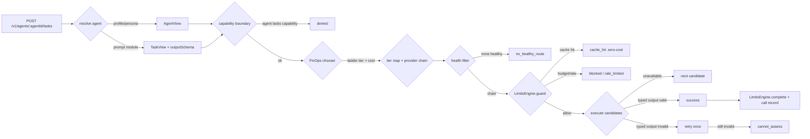

# gateway/proxy — model gateway proxy (route/dispatch/log funnel)

> Owner lane: **gateway** (issue `kushin77/agent-orchestrator#16`, "12 Model
> gateway proxy", work item 12, phase 2). Parent: EPIC-00 (issue #4).
> Doctrine: [`../../AGENTS.md`](../../AGENTS.md),
> [`../../docs/EXECUTION-PLAN.md`](../../docs/EXECUTION-PLAN.md),
> [`../../docs/ARCHITECTURE.md`](../../docs/ARCHITECTURE.md),
> [`../../docs/GOLDEN-RULES.md`](../../docs/GOLDEN-RULES.md).
> Cannibalization index: [`../../docs/CANNIBALIZATION.md`](../../docs/CANNIBALIZATION.md).

This tree is the **model gateway proxy** — the central route→dispatch→log
funnel of the Model Gateways pillar (pillar 2, phase 2). It accepts a task for
an agent, resolves **profile/persona → promptModule → provider/model**, enforces
boundaries (capability, context/token caps, budgets, rate), calls a provider,
returns **TYPED output** validated against the prompt module's output schema,
and logs **one full gateway call record** to audit + metering on every dispatch
— decoupled so a tenant can swap models/providers without disrupting the
funnel. The real HTTP REST surface (`POST /v1/agents/:agentId/tasks` +
streaming) is mounted by the phase-7 control-plane REST issue; this lane ships
the dispatch core + a thin handler + an offline CLI.

## What the proxy is (30 seconds)

```python
result = gateway.dispatch(
    "orchestrator",                      # agent id (the REST :agentId path param)
    TaskRequest(
        tenant_id="acme",                # the tenant (agent org)
        task_type="classify-route",      # a published prompt-module taskType
        input={"input": "billing outage on the api"},  # prompt render variables
    ),
)
# result.outcome        -> "success" (closed set, never silent on failure)
# result.content        -> the schema-validated typed object
# result.provider/model -> deepseek / deepseek-chat (the route actually used)
# result.record         -> the full gateway call record (audit + metering)
```

The funnel is **seam-injected**: the dispatch core depends only on duck-typed
interfaces (agent resolver, task resolver, chooser, model backend, limits
facade, health signal, audit/metering sinks), so it is deterministic,
standalone-testable, and wires to the *real* merged sibling modules
(`wiring.build_real_gateway`) without touching them. No provider socket is ever
opened by this lane — everything is offline.

## Acceptance criteria (issue #16)

| Criterion | Where |
|---|---|
| Gateway API `POST /v1/agents/{agentId}/tasks` + streaming; resolves profile→persona→promptModule→provider/model | `gateway.py` `dispatch`/`dispatch_stream`, `handler.py`, `router.py`, `wiring.py` |
| Routing policy: task-type → capability → model tier (FinOps chooser) with fallback chain (primary → fallback → local) driven by injected health | `router.py` + `config/routing.yaml`; `resolver.is_healthy` |
| Context/token caps per tenant+agent enforced at the gateway (not the model) | `gateway.py` via injected limits facade (`LimitsEngine.guard/complete`) |
| Request/response typed via promptModule output schema; invalid output → retry once then `cannot_assess` (never silent pass) | `schema.py`, `gateway._run_candidates` |
| Full gateway call record to audit + metering on every dispatch | `model.GatewayCallRecord`, `sinks.py` |
| Proxy contract doc | this `README.md` |
| Tests | `tests/` (routing, fallback, typed output, limits, call records, integration) |

## Tree layout

```text
gateway/proxy/
├── README.md                   # this file — the proxy contract
├── __init__.py                 # package public surface (import as ``proxy``)
├── contract.py                 # closed outcome vocabulary + error taxonomy
├── model.py                    # value objects (TaskRequest/TaskView/…/CallRecord)
├── schema.py                   # typed-output validation (consumes providers.schema)
├── resolver.py                 # injected seam protocols (agent/task/chooser/limits/health)
├── backend.py                  # ModelBackend seam + error taxonomy + StaticBackend
├── router.py                   # routing policy loader + Router (capability/tier/chain)
├── gateway.py                  # ModelGateway: dispatch + dispatch_stream core
├── handler.py                  # thin POST /v1/agents/{agentId}/tasks handler
├── sinks.py                    # CallRecordSink: list/JSONL/noop audit+metering sinks
├── wiring.py                   # compose the real sibling modules (offline)
├── cli.py                      # offline demo/evidence CLI
├── config/
│   └── routing.yaml            # routing policy (routes + tier map + chains)
└── tests/                      # pytest suite (offline)
```

## The REST surface (thin handler)

`handler.GatewayHandler` maps the criterion-1 REST semantic onto the dispatch
core. Transport-free (no sockets): the phase-7 control-plane REST issue mounts
it behind real HTTP.

```
POST /v1/agents/{agentId}/tasks
```

| Field | Type | Meaning |
|---|---|---|
| path `agentId` | string | The agent to dispatch for (resolved to profile/persona). |
| `tenantId` | string (req) | The tenant (agent org). Real auth supplies it; the offline handler reads it from the body. |
| `taskType` | string (req) | A **published** prompt-module taskType (issue #13) that the routing policy routes. |
| `input` | object | Render variables for the module's frozen bodies. |
| `complexity` | number? | Optional difficulty 0–100 for the FinOps escalation. |
| `tokens` | int? | Optional token estimate for budgeting. |
| `stream` | bool | Request streaming semantics. |

`handle_task(agent_id, body)` returns an HTTP-style envelope
`{status, result, record}`; `handle_task_stream(agent_id, body)` yields one
envelope per incremental `DispatchEvent`, then the terminal envelope. Outcome
→ HTTP status: `success`/`cache_hit` → **200**, `denied` → **403**, `blocked`/
`rate_limited` → **429**, `refused`/`cannot_assess` → **422**,
`no_healthy_route` → **503**, `failed` → **502**.

**Streaming** = incremental-result support in the dispatch interface:
`dispatch_stream()` yields the pipeline events (`received → agent_resolved →
task_resolved → route_selected → guard → attempt… → completed`) then the
terminal `TaskResult`. `dispatch()` returns the same events on
`result.events`, so a handler can replay or relay them.

## The dispatch funnel (step by step)



1. **Resolve the agent** — the injected agent resolver (personas + profile
   mapping in the real wiring) returns an `AgentView` (issue #9/#11 contract):
   the closed `capabilitySet`, tool/constraint sets and default tier. An
   unresolvable agent is an explicit `failed` result.
2. **Resolve the task** — the injected task resolver returns the published
   prompt module (`TaskView`: frozen bodies rendered with the request
   variables, the JSON-Schema `outputSchema`, model tier hint). An unregistered
   task type is refused (`failed`) — no ad-hoc unversioned prompts.
3. **Route** — the routing policy maps task-type → capability → FinOps task
   class (`config/routing.yaml`); the capability boundary fails closed
   (`denied`); the injected FinOps chooser (issue #17) returns the cheapest
   capable **ladder tier**; the router maps it onto the registry tier
   (`L0→LOW`, `L1→MED`, `L2→HIGH`) and builds the **provider fallback chain**
   (primary → fallback → local Ollama).
4. **Guard** — the injected limits facade (issue #19 `LimitsEngine.guard`)
   enforces context/token caps and rate **at the gateway, not the model**: a
   cache hit is a zero-cost `cache_hit`; an exhausted enforce budget is an
   explicit `blocked` (with backpressure queue/degrade detail); a rate denial
   is `rate_limited`. A block is never a silent success.
5. **Execute** — the healthy candidates are attempted in order through the
   injected model backend; the raw response is validated against the prompt
   module's `outputSchema` **at the gateway** (typed output, fail closed).
   Valid output → `LimitsEngine.complete` (output throttle + real metering +
   cache store) → `success`. Schema-invalid output is retried **once**, then
   `cannot_assess`. Unavailable candidates are skipped (graceful degradation).
6. **Log** — every terminal outcome emits one `GatewayCallRecord` to the
   injected audit + metering sinks (criterion 5).

## Routing policy (`config/routing.yaml`)

The proxy owns its routing policy declaratively (this is the route→dispatch
funnel contract). Vocabulary is **consumed**: taskType ids are published prompt
modules (issue #13), capability ids are the platform catalog (issue #9),
taskClass names are the FinOps tier table (issue #17), registry tiers are
`LOW/MED/HIGH/MAX`.

```yaml
routes:
  classify-route:      { capability: orchestrate, taskClass: classify-route }
  code-review-verdict: { capability: code-review, taskClass: code-review }
  summarize:           { capability: research,    taskClass: research }
tierMap:               # FinOps ladder tier -> registry tier
  L0: LOW
  L1: MED
  L2: HIGH
providerChains:        # primary -> fallback -> local (Ollama)
  LOW:  [deepseek, openai, ollama]
  MED:  [deepseek, anthropic, ollama]
  HIGH: [deepseek, anthropic, ollama]
```

Routing resolution is therefore: **task-type → capability → model tier
(FinOps chooser) → provider/model**, with per-task-type capability gating and a
health-driven fallback chain.

## Fallback chain + injected health

Health (issue #18) is an **injected signal**, exactly as gateway/finops does —
the proxy never depends on a `gateway/health` module. The signal is a mapping
of provider (or model) id → healthy, or a predicate; a missing key is healthy
(opt-in deny-list), `None` means everything is healthy.

- primary unhealthy → the next healthy candidate in the tier's chain serves
  (cloud fallback);
- ... → local **Ollama** (the keyless terminal hop of every chain);
- every candidate unhealthy → explicit `no_healthy_route` failure (never a
  silent pass).

Execution-time provider unavailability is additionally handled by the merged
providers layer's own graceful degradation (issue #15), so availability and
health compose without this lane redefining either.

## Boundaries (criterion 3)

- **Capability** — the routed task type's capability must be in the agent's
  closed `capabilitySet` (`denied` otherwise).
- **Context/token caps + rate** — enforced at the gateway through the injected
  `LimitsEngine` (issue #19): `guard()` before the call (token budget in
  `enforce` mode blocks → backpressure; rate limiter → `rate_limited`),
  `complete()` after the call (output throttle; real usage metered; cacheable
  response stored). Budgets default to `observe` (safe rollout) and are flipped
  to `enforce` deliberately per scope — flag-gated-off doctrine.
- **Tools/constraints** are owned by the registry/rbac layers; the proxy
  carries them on the `AgentView` for downstream enforcement but does not
  re-own them.

## Typed output — retry once, then CANNOT-ASSESS (criterion 4)

Request/response is typed via the prompt module's `outputSchema` (JSON Schema).
`schema.py` consumes the merged providers validator (issue #15,
`providers.schema`) and returns a verdict `(ok, content, error)`. The dispatch
loop makes at most **two output-producing attempts** (one initial + ONE retry):

- the retry targets the **next healthy candidate** (a fallback provider that
  may do better), or the **same candidate** when it is the last healthy hop;
- a second schema-invalid output is an explicit **`cannot_assess`** — never a
  silent pass, and the gateway call record carries the validation error;
- invalid output never reaches `LimitsEngine.complete` (only validated output
  is cached), so a cache hit is always a previously-validated typed response.

## Full gateway call record (criterion 5)

Every dispatch — whichever way it lands — emits one `GatewayCallRecord` to the
audit sink **and** the metering sink (injected). The record carries
request id/timestamp, tenant, agent, task type, capability/task class/tier,
provider, model, input/output tokens, latency, estimated USD cost, budget
action, attempts and outcome/error. `sinks.JsonlCallRecordSink` writes the
append-only one-JSON-object-per-line shape (registry/events + finops
model-call-audit conventions) that the phase-5 telemetry pillar consumes. A
sink that raises propagates (fail closed): an audit/metering record is never
silently lost.

## Injection points (what the core consumes, never redefines)

| Seam | Protocol | Real wiring |
|---|---|---|
| agent resolver | `AgentResolver.resolve(tenant, agent) → AgentView` | personas + `mapping.materialize_profile` (issue #9/#11) |
| task resolver | `TaskResolver.resolve(task_type, variables) → TaskView` | prompt library `resolve`/`render_prompt` (issue #13) |
| chooser | `Chooser.choose(task_class, tenant, agent, …) → TierChoice` | FinOps `ModelChooser` (issue #17, `tiers.yaml`) |
| model backend | `ModelBackend.execute(candidate, invocation) → BackendResult` | provider registry (issue #15) over an injected transport |
| limits facade | `LimitsEngine.guard` / `complete` | `gateway/limits` (issue #19) |
| health | mapping/predicate of id → healthy | injected (issue #18); absent = healthy |
| audit/metering | `CallRecordSink.record(GatewayCallRecord)` | phase-5 telemetry seam |

## Usage

All commands run from the repo root; everything is offline (stdlib + PyYAML +
jsonschema, the repo's declared deps).

```bash
# Routing policy + a resolved route
python3 gateway/proxy/cli.py routes
python3 gateway/proxy/cli.py route --task-type classify-route --agent orchestrator --tenant acme
python3 gateway/proxy/cli.py route --task-type code-review-verdict --agent reviewer --tenant acme

# One typed dispatch through the real modules (canned offline provider)
python3 gateway/proxy/cli.py dispatch --task-type classify-route --agent orchestrator

# End-to-end walkthrough incl. negatives + streaming; writes the JSONL audit
python3 gateway/proxy/cli.py demo --meter /tmp/ao16-call-records.jsonl

# Tests
python3 -m pytest gateway/proxy/tests -q
make verify    # repo gate stays green
```

## Verification

- `python3 -m pytest gateway/proxy/tests -q` — the offline suite: routing
  resolution; health-driven fallback (negative: all unhealthy → explicit
  failure); typed-output retry-once-then-CANNOT-ASSESS (negative); budget/rate
  block + backpressure (negative: never silent); output-throttle refuse;
  call-record emission on every outcome; cache-hit zero-cost accounting; the
  thin handler + streaming; and end-to-end dispatch against the **real**
  sibling modules (personas + prompt library + FinOps chooser + providers over
  the offline transport rig + limits facade).
- `make verify` — repo gate of record stays green.

## Provenance (cannibalized and adapted; GR-10)

Adapted from the sources indexed in
[`../../docs/CANNIBALIZATION.md`](../../docs/CANNIBALIZATION.md), each read
through the `.research/` read-only mirrors (issue spec sources):

| Source | Pattern adapted | Where it landed |
|---|---|---|
| `leaderboard lib/orchestrator.sh` | route→dispatch→log model-gateway pipeline | the funnel ordering (resolve→route→guard→dispatch→log) |
| `defragsuite pkg/defrag-ai/modal/client.go` | gateway w/ circuit breaker + cloud→local fallback | health-driven primary→fallback→local chain + explicit no-healthy-route failure |
| `CMR fleet/dispatch.sh` + `docs/MODEL-PROFILES.md` | dispatch semantics + L0/L1/L2 ladder (pattern-only) | routing policy tier map + provider chains |
| `ollama services/inference/resilient_ollama_client.py` + `services/cost/*` | resilient client + cost metering | injected-health fallback + call-record metering shape |
| `shared-services automation/govctl/*` + `cost-governance/budget_enforcer.py` | budget enforcement posture | limits-facade budget block / backpressure (never silent) |
| merged sibling contracts (issues #9/#11/#13/#15/#17/#19) | personas/prompts/providers/chooser/limits semantics | consumed as injected seams, never redefined |
