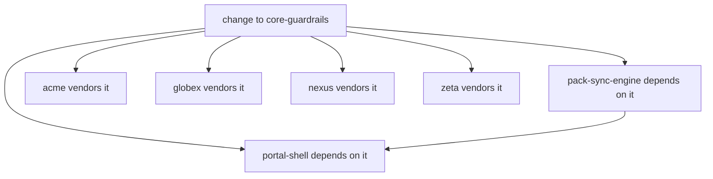

# Sync / drift engine + provenance manifests, blast-radius aware (governance/sync)

> Owner lane: **autonomous-ops / governance** (issue #44, work item 40, phase
> 8). Parent: EPIC-00 (issue #4). Doctrine:
> [`AGENTS.md`](../../AGENTS.md),
> [`docs/EXECUTION-PLAN.md`](../../docs/EXECUTION-PLAN.md),
> [`docs/GOLDEN-RULES.md`](../../docs/GOLDEN-RULES.md) (AO-GR-1/3/4/6/8/10/11),
> [`docs/CANNIBALIZATION.md`](../../docs/CANNIBALIZATION.md) (GR-10),
> [`docs/QA-GATE.md`](../../docs/QA-GATE.md).

This tree productizes the **sync/drift contract** for the control plane: keep
tenant-pack installs and consumer instruction layers in sync with the registry,
detect and reconcile drift, compute a change's **blast radius** before it is
applied, and record a **provenance manifest** for every consumed/vendored asset
(who shipped what, from where, at which commit). It is the phase-8
autonomous-ops surface (issue #44) and the reconciler that drives the
`registry/packs` install primitives (issue #40) on a schedule.

## The contract in one paragraph

A **provenance manifest** records, per consuming repo, every shared asset it
vendors with its canonical source (`source_repo` + `source_path` + `version` +
`sha` pin + local path). The **drift engine** re-hashes each vendored asset
against its recorded canonical source and returns an honest tri-state —
`clean` | `drift` | `cannot-assess`, where `cannot-assess` (an unavailable
source or an unpinned entry) is **never** clean. Before any change to a shared
asset lands, the **blast-radius engine** computes the set of consumers and
transitive dependents that change would affect (from the manifests + the
dependency catalog), so a change to a widely-consumed asset cannot silently
break a consumer. The **sync engine** turns a desired state into a declarative
plan (same `install|upgrade|rollback|noop` vocabulary as #40), **dry-runs by
default**, applies only on explicit request, and **rolls back on failure** —
consuming the real `Installer.sync_plan` seam from `registry/packs` read-only.

## Why this exists

Issue #41 shipped a consumer-repo template whose managed instruction layers
are auto-synced and drift-checked by a local `make verify`; issue #40 shipped
tenant pack install/upgrade/rollback primitives with post-install drift
detection. What was missing is the **scheduled reconciler + provenance + blast
radius**: the engine that decides *what a consumer should be at*, *whether it
has drifted*, *who a proposed shared-asset change would break*, and *how to
reconcile with rollback* — the layer a SaaS tenant consumes via the control
plane (AO-GR-12: this engine decides and plans; it never executes tenant work
outside an explicit apply with an injected executor).

## How this lane maps to the repo's doctrine + merged seams (consume, never redefine)

| Source | What it says | Where this lane consumes it |
|---|---|---|
| [`AGENTS.md`](../../AGENTS.md) / [`docs/EXECUTION-PLAN.md`](../../docs/EXECUTION-PLAN.md) | One issue = one lane = one branch; smallest focused diff; verify before done | This lane owns only `governance/sync/**`; suites are standalone + offline |
| [`GOLDEN-RULES.md`](../../docs/GOLDEN-RULES.md) AO-GR-3/4 | Verify with evidence; no-false-green — every gate can genuinely fail | Honest tri-state (`cannot-assess` never clean); CLI exit codes 0/1/2 are real; negative tests |
| AO-GR-8 | SemVer is law; consumers pin; nothing force-pushes breaking changes downstream | Manifest pins carry `version`; drift detects version mismatch vs a desired target |
| AO-GR-10 | Every cannibalized asset records its source (repo/path/license) before reuse | [`PROVENANCE.md`](PROVENANCE.md) records the sources adapted here; seeds record `source_repo` per asset |
| [`registry/packs/README.md`](../../registry/packs/README.md) + `installer.py` (issue #40) | `Installer.sync_plan` returns the declarative action list the #44 engine drives each tick; install/upgrade/rollback primitives owned there | `sync_plan.PackSyncAdapter` + `ReconcileAction` consume the real `Installer.sync_plan` (read-only import); vocabulary identical (`install|upgrade|rollback|noop`) |
| `control-plane/sdk/template/consumer-repo/` (issue #41) | Consumer sync wiring (`ao.sync-config/v1`): managed layers + sha256 MANIFEST drift + `make sync` | The assets/consumers model + manifest `content_sha256` pins mirror this drift-manifest discipline |
| [`docs/QA-GATE.md`](../../docs/QA-GATE.md) + honesty tri-state (issue #28) | CANNOT-ASSESS is never a pass; aggregate verdicts are honest | `model.DriftState` + `aggregate_states` (any drift fails; any cannot-assess keeps the verdict from clean) |

## Tree layout

```text
governance/sync/
├── README.md              # this contract doc
├── PROVENANCE.md          # provenance of every adapted/harvested pattern (GR-10)
├── model.py               # shared vocabulary: DriftState tri-state, schema identities, closed enums
├── provenance.py          # provenance manifest schema + generator (criterion 1)
├── drift.py               # drift detection vs recorded canonical source (criterion 2)
├── blast_radius.py        # blast-radius engine (criterion 3)
├── sync_plan.py           # sync plan/apply seam: dry-run default, apply, rollback (criterion 4)
├── cli.py                 # offline operator CLI (ao-sync)
├── seeds/                 # self-contained offline demo ecosystem
│   ├── catalog.json       # dependency catalog (asset -> dependencies)
│   ├── canonical/         # canonical source mirror (tiny files)
│   └── consumers/         # one provenance manifest per consumer
└── tests/                 # pytest suite (offline) — 53 tests incl. negatives
    ├── conftest.py        # sys.path bootstrap (mirrors governance/merge)
    ├── synchelpers.py     # shared ecosystem builders (not a conftest)
    ├── test_provenance.py # generation + validation; missing-pin negative
    ├── test_drift.py      # CLEAN/DRIFT/CANNOT_ASSESS negatives
    ├── test_blast_radius.py  # wide/leaf/transitive + not-in-graph negative
    ├── test_sync_plan.py  # dry-run/apply/rollback + materializer negatives
    └── test_pack_integration.py  # real registry/packs Installer.sync_plan wiring
```

## Provenance manifest (criterion 1)

Schema identity `ao.sync/provenance-manifest-v1`. Each asset entry records the
canonical source of a consumed/vendored asset; the pin is **required**:

| Field | Meaning |
|---|---|
| `source_repo` | Canonical source repo (`owner/name`) |
| `source_path` | Path of the asset in the source repo |
| `version` | Version/tag the asset was captured at (SemVer discipline, AO-GR-8) |
| `sha` | **The pin** — source commit sha (`sha_kind: commit`, 40/64-hex) or a content sha256 (`sha_kind: content`) |
| `content_sha256` | sha256 of the canonical content (offline drift comparison target) |
| `local_path` | Where the asset is materialized in the consumer |
| `kind` | Closed vocabulary: `vendored|mirrored|pack|instruction` |
| `note` | Optional provenance note (e.g. GR-10 harvest record) |

`provenance.generate_manifest` builds a manifest from a declarative asset
inventory; it **refuses to emit an unpinned asset** (no source sha and no local
file to hash → `ProvenanceError`). `provenance.validate_manifest` flags an
entry whose pin is missing (`missing-pin`) or malformed — a hand-edited derived
record that loses its pin can never silently become undrift-checkable
(negative-tested in `test_provenance.py`).

## Drift detection (criterion 2)

`drift.check_manifest` re-hashes each vendored asset and returns an honest
tri-state (`model.DriftState`):

| State | Meaning |
|---|---|
| `clean` | Local content matches the recorded canonical source (content pin or canonical mirror) and the pinned version matches the desired version |
| `drift` | Local content differs from the pinned source (tamper/stale), a vendored asset is missing, or the pinned version differs from the desired version |
| `cannot-assess` | The canonical source cannot be compared — no content pin and no canonical mirror, a deleted/unavailable canonical mirror file, or an unresolvable manifest entry. **Never clean.** |

Canonical content is resolved from an optional `canonical_root` mirror (the
authoritative live compare — a missing mirror file is `cannot-assess`) or the
recorded `content_sha256` pin (the offline compare). The aggregate verdict
mirrors the honesty stack (issue #28): any `drift` fails the verdict; any
`cannot-assess` keeps the verdict from clean; only an all-clean set reports
clean (`model.aggregate_states`). Negatives in `test_drift.py`: a changed
consumer asset is DRIFT, a deleted canonical mirror is CANNOT_ASSESS (never
clean), a missing content pin is CANNOT_ASSESS, and a local path that escapes
the consumer root is refused.

## Blast radius (criterion 3)

`blast_radius.BlastRadiusEngine` computes, for a proposed change to a shared
asset, the **transitive dependent closure** from the dependency catalog
(`asset -> dependencies`, reverse-walked) and the set of **consumers affected**
from the provenance manifests (every consumer that vendors any asset in the
closure). A widely-consumed asset reports many consumers; a leaf reports few;
a consumer whose vendored assets are outside the closure is **not** reported
(negative-tested with the `rogue` fixture). A change to an asset that is not a
shared asset in any manifest/catalog raises `BlastRadiusError` — it never
returns an empty "all clear" report.



## Sync plan / apply seam (criterion 4)

`sync_plan.ReconcileAction` uses the exact #40 vocabulary
(`install | upgrade | rollback | noop`). `SyncEngine.run(actions)`:

- **Dry-runs by default** (`apply=False`) — reports the plan, performs no side
  effects, and never calls the executor (negative-tested).
- **Applies only on explicit `apply=True`** through an injected `executor`;
  `noop` actions are never executed.
- **Rolls back on failure** — when an executor action raises, the injected
  `rollback_executor(action, error)` is invoked and the action is recorded as
  `rolled-back` with the reason; a failed action is never reported applied.
  Without a rollback executor the action is honestly reported `failed`.

`AssetMaterializer` is the offline apply/rollback executor for provenance
assets: it copies canonical content into the consumer's `local_path`
atomically, keeps a backup of the prior content, and restores it on rollback;
an unavailable canonical source raises `ContentUnavailableError` (never a
partial write). `plan_provenance_sync` computes the plan from a current
manifest vs a desired state.

**#40 wiring.** `sync_plan.PackSyncAdapter` builds the desired pack map from a
sync-target spec and consumes the real `registry/packs` `Installer.sync_plan`
action list read-only. `test_pack_integration.py` proves the wiring against
the real class: the engine drives the exact action shape (#40 emits
`install|upgrade|noop` from a tenant's install history; the `rollback` op maps
to the #40 direct `Installer.rollback` seam). This lane never edits
`registry/packs`.

## Operator CLI (offline)

```bash
python3 governance/sync/cli.py provenance validate governance/sync/seeds/consumers/acme.json
python3 governance/sync/cli.py drift     governance/sync/seeds/consumers/acme.json \
    --local-root <consumer-local-root> --canonical-root governance/sync/seeds/canonical
python3 governance/sync/cli.py blast     core-guardrails \
    --manifests governance/sync/seeds/consumers --catalog governance/sync/seeds/catalog.json
python3 governance/sync/cli.py sync plan governance/sync/seeds/consumers/acme.json --desired desired.json
```

Exit codes are honest (no-false-green): `0` all good, `1` findings (drift /
missing pin / invalid manifest), `2` usage or malformed input or
`cannot-assess` (never a pass). `sync check` is a one-shot gate combining
provenance validity + drift tri-state.

## Seeds

[`seeds/`](seeds/README.md) is a self-contained offline ecosystem: a tiny
canonical source mirror, five consumer provenance manifests (acme/globex/nexus/
zeta vendor shared assets; `rogue` vendors only an unrelated asset and is the
blast-radius negative fixture), and a dependency catalog. Content pins are
generated by the real generator, so the demo is internally consistent.

## Validation

```bash
python3 -m pytest governance/sync/tests -q -p no:cacheprovider   # 53 tests, offline
python3 governance/sync/cli.py provenance validate governance/sync/seeds/consumers/*.json
make verify      # repo gate of record (unchanged; this suite is offline + undeclared,
                 # mirroring the governance/merge #43 precedent — WARN not gate-failing)
```

The suite is **undeclared** in `scripts/pytest-suites.txt` on purpose: this
lane may not touch `scripts/**` (foundation lane), and `governance/merge`
(issue #43) set the precedent that committed-but-undeclared suites are a
`check-drift` WARN, never a gate failure. Run it in isolation (per-suite
discipline, issue #29).

## Downstream consumers (who reads what)

| Later lane | Consumes |
|---|---|
| Control-plane / portal (issue #39/#41) | provenance manifests + drift verdicts for the sync dashboard |
| Rollout pipeline (issue #45) | blast-radius reports gate a shared-asset change before it ships |
| Tenant onboarding / consumer-repo | `content_sha256` drift discipline already shipped in issue #41 |
| Telemetry (phase 5) | sync apply/rollback outcomes (applied vs rolled-back counts) |
