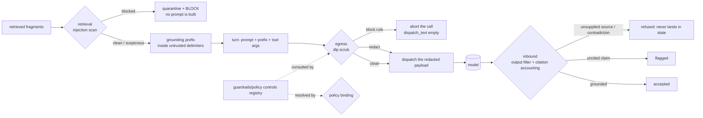

# guardrails/chat — chat-turn guardrails: DLP egress, inbound re-validation and retrieval-injection defense

> Owner lane: **guardrails** · issue `kushin77/agent-orchestrator#507` ("Chat
> guardrails: DLP egress, inbound re-validation and retrieval-injection
> defense"). Parent: EPIC #500 (enterprise chat in the SPoG). Doctrine:
> [`../../AGENTS.md`](../../AGENTS.md),
> [`../../docs/EXECUTION-PLAN.md`](../../docs/EXECUTION-PLAN.md),
> [`../../docs/ARCHITECTURE.md`](../../docs/ARCHITECTURE.md),
> [`../../docs/GOLDEN-RULES.md`](../../docs/GOLDEN-RULES.md).
> The guardrails pillar landing doc is [`../README.md`](../README.md); the two
> surfaces this lane consumes are [`../dlp/README.md`](../dlp/README.md)
> (issue #27) and [`../policy/README.md`](../policy/README.md) (issue #26).

A conversational turn is the moment untrusted material meets an authority that
can act: retrieved documents flow **in**, a prompt flows **out**, and a model's
answer flows back **in** again. This tree guards all three directions, and it
does so by **consuming** the DLP and policy lanes rather than re-implementing
them — `guardrails/dlp/**` and `guardrails/policy/**` are read-only here.

Nothing in this lane dispatches a call. The serving surface composes it (the
chat gateway lane owns dispatch), and the guards answer
``BLOCK`` / ``WARN`` / ``LOG`` before anything leaves.

## What the module does (30 seconds)

```python
import sys
sys.path.insert(0, "guardrails")     # PEP-420 namespace; import the package
from chat import ChatTurnGuard, OutboundTurn

guard = ChatTurnGuard()
turn = guard.guard_turn(
    OutboundTurn(user_prompt="Summarize the incident ticket for the handover note."),
    envelope={"fragments": [
        {"source_id": "ticket:OPS-1187", "text": "The restore job completed at 04:12 UTC.",
         "kind": "ticket"},
    ]},
)

turn.decision            # DecisionLevel.LOG — every guard ran and none objected
turn.allowed             # True
turn.dispatch_text       # the payload that may leave: grounding prefix (untrusted
                         # delimiters) + prompt, scrubbed; "" when any guard refuses
turn.to_dict()           # a log-safe record: rule ids, counts, hashes — no input text

answer = guard.validate_output(
    turn,
    {"text": "The restore finished at 04:12 UTC.",
     "claims": [{"text": "the restore finished at 04:12 UTC",
                 "source_id": "ticket:OPS-1187",
                 "quote": "restore job completed at 04:12 UTC"}]},
)
answer.accepted          # True — the claim is quoted from a source that was supplied
```

Run the same paths from the shell (what the gate drives):

```bash
cd guardrails
python3 -m chat guard-turn --turn turn.json --grounding grounding.json
python3 -m chat guard-turn --turn turn.json --enable data-egress-guard
python3 -m chat retrieval  --grounding grounding.json
python3 -m chat inbound    --output answer.json --grounding grounding.json
python3 -m chat controls
```

## The guarded turn



## The guards

| guard | consumes | decides |
|---|---|---|
| retrieval | [`../dlp/injection.py`](../dlp/injection.py) `InjectionDetector.analyze` | a fragment that trips a `blocked` verdict is **quarantined** and the turn is refused; a `suspicious` fragment is admitted only with a warning; every admitted fragment is wrapped by `wrap_untrusted` |
| egress | [`../dlp/engine.py`](../dlp/engine.py) `ScrubEngine.scrub` over [`../dlp/scrub-rules.yml`](../dlp/scrub-rules.yml) | a `block` rule **aborts the call** (nothing is assembled for dispatch); a `redact` rule lets the redacted payload proceed with a warning |
| inbound | `InjectionDetector.filter_output` | an answer that echoes its own system prompt or smuggles role lines is **quarantined** |
| inbound (citations) | the grounding envelope the turn supplied | citing a source that was never supplied, or quoting a source in a way it does not support, is **refused**; a claim that cites nothing is **flagged** |
| policy | [`../policy/controls.yaml`](../policy/controls.yaml) | resolves the controls registry; an unresolvable or incomplete binding is **undecidable** |

## Verdict model

Every guard answers the platform's enforcement tri-state — ``BLOCK`` / ``WARN``
/ ``LOG`` — which is **consumed** from [`../policy/decision.py`](../policy/decision.py)
(AO-GR-19) rather than re-declared, so there is one vocabulary and one ordering.
The turn's verdict is the strongest answer any guard gave
(`verdict.aggregate`).

Two properties keep that honest:

* **fail-closed on undecidable.** A guard that could not run sets ``ran=False``
  and its decision is promoted to ``BLOCK``: an unreadable DLP catalog, an
  unreadable controls registry, an ambiguous grounding envelope or a malformed
  model answer all refuse the turn. "We could not tell" is never "we allowed
  it".
* **no ``LOG`` on a path that never ran.** ``ran=True`` is only set by a guard
  body that completed its inspection, so ``LOG`` always means *inspected,
  nothing to report*, and every guard's evidence states how much it inspected.

**Nothing echoes the matched value.** `verdict.finding` has no parameter for
it: a finding carries the rule id, the class, the action, the match count and
the offsets — never the text. A blocked payload also publishes no hash, and a
refused turn's `dispatch_text` is empty, so neither a verdict, a finding, a log
line nor a console frame can carry a secret out.

### Verdict attachment

Verdict records (the DLP lane's `SecurityTelemetry` shape) are attached to a
turn by `ChatTurnGuard.attach_verdicts` on an **exact identifier match** only —
the rule the live telemetry feed already applies (issue #345). A record whose
identifier differs in case, padding, prefix or suffix is reported as standalone;
the guard never invents a correlation.

## Policy binding (default OFF)

Both controls live in the existing registry and ship ``enabled: false``
(AO-GR-6). A flip genuinely changes the observed verdict for a fixed input:

| control id | effect when ON |
|---|---|
| `data-egress-guard` | an outbound component whose scrub found redaction-class material is **refused** (`BLOCK`) instead of sent redacted (`WARN`) |
| `tool-use-guard` | tool-call arguments are additionally analysed for prompt injection before dispatch; a `blocked` analysis aborts the turn |

Flipping a control ON goes through the registry's own validation
(`ControlRegistry.from_mapping`), so an enabled control still has to carry its
`on_since_rationale`. A **bound control that is not registered** is undecidable
— a control-gated behaviour with no toggle to flip is a formality (AO-GR-4) —
and consulting a control this lane does not bind raises.

## The consumed citations envelope

The grounding lane (`gateway/mcp`, issue #504) hands a turn the fragments that
will become its grounding prefix. This lane codes against that **documented
shape** ([`envelope.py`](envelope.py)) and never imports that package:

```json
{
  "fragments": [
    {"source_id": "ticket:OPS-1187", "text": "...", "kind": "ticket"},
    {"source_id": "kb:runbook/restore", "text": "..."}
  ]
}
```

Reading is strict: a missing `fragments` key, a fragment without a non-empty
`source_id`, a non-string `text`, or a **duplicate** `source_id` (which would
make every citation into it ambiguous) is refused rather than smoothed over.
Unknown keys are preserved verbatim.

## Verification

```bash
python3 -m pytest guardrails/chat -q -p no:cacheprovider
bash -n scripts/check-chat-guardrails.sh
bash scripts/check-chat-guardrails.sh
```

[`../../scripts/check-chat-guardrails.sh`](../../scripts/check-chat-guardrails.sh)
drives the CLI above and provokes both required negative controls — a seeded
credential-shaped payload (assembled at runtime, never written as a literal)
that must be blocked and never echoed, and a poisoned retrieved document that
must be quarantined — each paired with the benign input that must still be
accepted, so a guard that simply refuses everything fails the gate too. It also
proves the policy flips change the verdict and that an unresolvable registry is
CANNOT-ASSESS. Exit-code contract: **0 OK / 1 NOT-OK / 2 CANNOT-ASSESS**
([`../honesty/tristate.py`](../honesty/tristate.py)); the same contract is what
`python3 -m chat` returns — 0 allowed, 1 refused, 2 undecidable.

## What this lane does not do

* It does not edit [`../dlp/**`](../dlp/README.md) or
  [`../policy/**`](../policy/README.md) — both are consumed read-only.
* It does not edit [`../policy/controls.yaml`](../policy/controls.yaml): the
  registry is the portal's write path, not a lane's.
* It does not dispatch, route or meter calls: dispatch belongs to the chat
  gateway lane, metering to the chat telemetry lane.
* It does not re-implement the grounding retriever: it consumes the envelope
  contract above.
