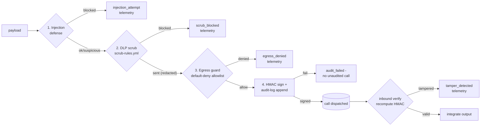

# guardrails/dlp — DLP + prompt-injection defense + egress guard (HMAC per-call)

> Owner lane: **guardrails** · issue `kushin77/agent-orchestrator#27` ("23 DLP +
> prompt-injection defense + egress guard (HMAC per-call)", work item 23,
> phase 4). Parent: EPIC-00 (issue #4). Doctrine:
> [`../../AGENTS.md`](../../AGENTS.md),
> [`../../docs/EXECUTION-PLAN.md`](../../docs/EXECUTION-PLAN.md),
> [`../../docs/ARCHITECTURE.md`](../../docs/ARCHITECTURE.md),
> [`../../docs/GOLDEN-RULES.md`](../../docs/GOLDEN-RULES.md).
> The guardrails pillar landing doc is [`../README.md`](../README.md).

This tree is the **security lane of the Model Gateways / engine boundary**: the
DLP scrub pipeline, prompt-injection defense, egress guard, and per-call HMAC
audit that govern **every outbound commercial-model call** (Claude, DeepSeek,
Copilot, Gemini, local Ollama). External models are treated as consultants under
contract — they receive only sanitized input, their output is untrusted until
re-validated, and every consult is signed and audit-logged. It ships **flag
gated OFF**: nothing here dials a provider; the gateway/engine layers call these
gates the moment a tenant enables the DLP/egress surface.

## What the module does (30 seconds)

```python
import sys
sys.path.insert(0, "guardrails")     # PEP-420 namespace; import the package
from dlp import EgressPipeline
from dlp.egress import AllowedTarget, EgressGuard

pipe = EgressPipeline(                 # requires AO_DLP_HMAC_KEY (or injected key)
    guard=EgressGuard({"acme": [AllowedTarget("openai", "api.openai.com",
                                              "/v1/chat/completions")]}),
)
outcome = pipe.guard_call(
    tenant_id="acme", agent_id="agent-1", provider="openai",
    endpoint="https://api.openai.com/v1/chat/completions",
    payload="Summarize Q3 for ada@example.com",
)
outcome.verdict   # "sent" — payload was scrubbed, injection-checked,
                  # egress-allowlisted, HMAC-signed and audit-logged
outcome.text      # redacted: "... <REDACTED_EMAIL>"
outcome.record    # signed audit record (tenant/agent/call/payload_sha256/hmac)
```

## The four mandatory gates (per outbound call)

Every commercial-model call passes four gates, in order; a call that fails any
gate **never reaches the provider** and is surfaced to the security view.



1. **Prompt-injection defense** — [`injection.py`](injection.py)
   classifies the raw payload as `benign` / `suspicious` / `blocked`
   (heuristics + untrusted-content tagging + output filtering).
2. **DLP scrub gate** — [`engine.py`](engine.py) runs the policy catalog
   [`scrub-rules.yml`](scrub-rules.yml): a `block` match aborts the call; a
   `redact` match replaces the value with a stable placeholder.
3. **Egress guard** — [`egress.py`](egress.py) allows only allowlisted
   provider/endpoint/path from the tenant context (default deny).
4. **HMAC per-call audit** — [`hmac_audit.py`](hmac_audit.py) HMAC-SHA256 signs
   a call record bound to tenant/agent/call id/provider/endpoint/SHA-256 of the
   exact dispatched payload/ts/nonce and appends it to the append-only audit
   log. **No unaudited commercial-model call** — dispatch is refused if the
   append cannot complete. Inbound, a tampered or unsigned record is rejected.

Telemetry for injection attempts, scrub blocks, egress denials, quarantined
output and tamper detections is emitted by [`telemetry.py`](telemetry.py) and
surfaced by `SecurityTelemetry.security_view()` — the security console's query.

## Detection model — DLP scrub rules

The catalog is the policy: **single source of truth** for patterns, severity and
action. [`scrub-rules.yml`](scrub-rules.yml) is adapted from
`shared-governance` `GLOBAL_STANDARDS/schemas/scrub-rules.yml` (same schema:
`id`/`class`/`severity`/`action`/`pattern`/`placeholder`) and extended with
credit-card (Luhn-validated) and US-SSN PII rules.

| class | what matches | default action | rule ids |
|---|---|---|---|
| `secret` | API keys, bearer tokens, JWTs, GitHub/Slack/OpenAI/Google tokens | **block** | `secret.*` |
| `private_key` | PEM/OpenSSH/PGP private-key blocks | **block** | `privatekey.pem_block` |
| `cloud_cred` | AWS access key ids/secrets, GCP service-account JSON | **block** | `cloud.*` |
| `secret_store` | Vault paths/addresses | block / redact | `vault.*` |
| `pii` | email, phone, credit card (Luhn), US SSN | redact | `pii.*` |
| `internal_infra` | private hostnames, RFC1918 IPs, internal URLs | redact | `infra.*` |

* **block** aborts the consult (fail closed, raises an incident);
* **redact** replaces the match with a stable placeholder so structure survives
  without the value;
* the loader ([`catalog.py`](catalog.py)) is **strict and fail closed**: an
  empty catalog, a duplicate id, an unknown class/severity/action, a regex that
  does not compile, or a `redact` rule without a placeholder is a hard error —
  the engine refuses to run rather than guess;
* optional `luhn: true` rules validate the Luhn checksum before counting a
  match (credit-card detection) so long random digit runs do not over-trigger;
* patterns are deliberately conservative: prefer over-scrubbing to a leak; never
  relax below `block` for the secret/private-key/cloud classes.

## Detection model — prompt injection ([`injection.py`](injection.py))

Signals are grouped by category with a deterministic verdict policy:

| category | severity | meaning |
|---|---|---|
| `instruction_override` | high | discard/override prior instructions, remove safety |
| `prompt_leak` | high | reveal/print/repeat the system prompt |
| `role_escalation` | high / medium | DAN/jailbreak/unrestricted persona, developer-mode |
| `exfiltration` | high | directive to emit credentials/secrets/tokens |
| `role_tag_injection` | medium | embedded `system:`/`assistant:` lines |
| `delimiter_escape` | medium | closing `<untrusted>` then instructing |
| `output_echo` | high (output side) | model repeats its own system prompt |

**Verdict policy** — `blocked` if any single high signal or two+ distinct
signals; `suspicious` if exactly one medium (human review, no hard block);
`benign` otherwise. Untrusted content MUST be wrapped with
`wrap_untrusted()` (delimiters `<untrusted>…</untrusted>`), which neutralizes an
embedded closing delimiter so content cannot escape its bounds.
`filter_output()` is the output/re-validation gate: model responses that echo
the system prompt, restate instructions, or carry role-tag lines are
quarantined.

**Negative controls are enforced by tests**: the benign corpus (30 enterprise
prompts containing near-miss words such as "instructions", "previous", "mode")
must produce **zero** false positives, and ordinary model answers must pass the
output filter.

## Egress guard ([`egress.py`](egress.py))

Default-deny, per-tenant allowlist of `(provider, host, optional path_prefix)`.
Host matching is exact, or subdomain when the allowlist entry starts with `.`;
suffix-squatting names (`api.openai.com.evil.example`) never match. An unlisted
tenant/provider/host/path is denied. `KNOWN_ENDPOINTS` is authoring convenience
only — the guard never consults it.

## HMAC per-call ([`hmac_audit.py`](hmac_audit.py))

* HMAC-SHA256 over canonical JSON (`sort_keys`, compact separators) of the call
  record, excluding the `hmac`/`error` fields;
* the signing key comes from `AO_DLP_HMAC_KEY` or is injected explicitly —
  **no embedded fallback key**, so a misconfigured deployment fails closed
  (`HmacKeyError`) instead of signing with a known key;
* `HmacAuditLog` appends each record to JSONL with its tag; `verify()` replays
  the log and reports any tampered or malformed line.

## Security view ([`telemetry.py`](telemetry.py))

`SecurityTelemetry` records structured events; `security_view()` returns the
events that need eyes — `injection_attempt`, `scrub_blocked`, `egress_denied`,
`output_quarantined`, `tamper_detected` — newest first, tenant-filterable.
Ordinary `call_sent` traffic is deliberately not security-view material.

## Acceptance criteria (issue #27)

| Criterion | Where |
|---|---|
| Scrub pipeline before every provider call — secrets/PII/keys redacted by policy (scrub-rules.yml-driven) | [`engine.py`](engine.py) `ScrubEngine` over [`scrub-rules.yml`](scrub-rules.yml); [`tests/test_engine.py`](tests/test_engine.py) (gitleaks-style synthetic negatives + benign no-false-positive) |
| Prompt-injection defenses: delimiters/tagging untrusted content, injection heuristics, output filtering | [`injection.py`](injection.py) (`wrap_untrusted`, `analyze`, `filter_output`); [`tests/test_injection.py`](tests/test_injection.py) (attack corpus + benign negative control) |
| Egress guard: only allowlisted providers/endpoints reachable from tenant context | [`egress.py`](egress.py) `EgressGuard` (default deny); [`tests/test_egress.py`](tests/test_egress.py) (tenant isolation, suffix-squat negative) |
| Every outbound call HMAC-signed + audit-logged (tamper-evident) — no unaudited call | [`hmac_audit.py`](hmac_audit.py), [`pipeline.py`](pipeline.py) (audit-failure blocks dispatch); [`tests/test_hmac_audit.py`](tests/test_hmac_audit.py), [`tests/test_pipeline.py`](tests/test_pipeline.py) (tamper negatives) |
| Injection-attempt telemetry surfaced to security view | [`telemetry.py`](telemetry.py) `security_view`; [`tests/test_telemetry.py`](tests/test_telemetry.py), pipeline wiring |
| Module contract doc + tests | this `README.md`, [`tests/`](tests/) |

## Provenance (cannibalized + adapted, never copied)

Recorded per the fleet provenance doctrine; the cross-repo index lives in
[`docs/CANNIBALIZATION.md`](../../docs/CANNIBALIZATION.md) (issue #8).

* **`shared-governance`** `GLOBAL_STANDARDS/external-llm-egress-policy.md` — the
  scrub-then-revalidate contract, block/redact classes, audit-field shape.
* **`shared-governance`** `GLOBAL_STANDARDS/schemas/scrub-rules.yml` — the rule
  catalog schema and the seed rule set this catalog adapts and extends.
* **`ollama`** `ollama/services/security/dlp_redactor.py` — the PII info-type
  set (email/phone/credit-card/SSN) informing the `pii.*` rules (this lane is
  offline regex, not the GCP DLP API).
* **`shared-services`** `automation/contract_help/audit_hmac.py` — HMAC-SHA256
  canonical-signing pattern; extended to bind per-call fields + append-only
  JSONL audit + replay verification.
* **`shared-services`** `automation/contract_help/egress-proxy-gateway.py` —
  gateway gate-ordering shape (this lane is an offline library, not a WSGI
  service).
* **`CMR`** `guardrails/gates/*` corpus fixtures + **`leaderboard`**
  `scripts/guard/*` DLP predicates + leaked-token corpus — negative-test shapes
  informing the synthetic-secret corpus (all values runtime-assembled; none are
  real credentials).

## Usage

Operator CLI (offline; sets `AO_DLP_HMAC_KEY` for signing):

```bash
python3 guardrails/dlp/cli.py selftest                       # self-test battery
python3 guardrails/dlp/cli.py catalog                        # dump rule catalog
python3 guardrails/dlp/cli.py scrub --text '...'             # scrub gate (exit 2 on block)
python3 guardrails/dlp/cli.py inspect --text '...'           # injection verdict
python3 guardrails/dlp/cli.py guard --tenant acme --provider openai \
    --endpoint https://api.openai.com/v1/chat/completions    # egress check
python3 guardrails/dlp/cli.py audit-verify --log audit.jsonl # replay + verify HMAC tags
```

Tests (pytest-compatible; all offline):

```bash
python3 -m pytest guardrails/dlp/tests -q
```
