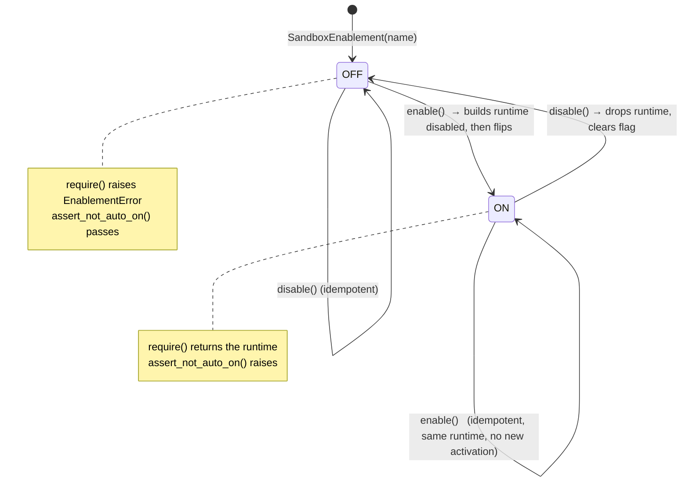

# runtime-enablement — the sandbox runtime feature flag

> Owner lane: **guardrails** (issue `kushin77/agent-orchestrator#636`, work item
> `workbook-5`; parent epic `#631`). Contract: [`README.md`](README.md).
> Implementation: [`enablement.py`](enablement.py),
> [`enablement.schema.json`](enablement.schema.json).

This document specifies how a sandbox runtime (`docker`, `firecracker`, or the
injectable `offline` fake) is **enabled**, and what is guaranteed before, during
and after that act.

## 1. The problem this flag solves

Every runtime in this package ships `enabled=False` and refuses to execute
while it is off — the correct fail-closed posture. But that leaves three
questions a deployment has to answer, and answering them in prose is how a
fail-closed default quietly rots into "it was enabled in an ad-hoc shell
one afternoon":

1. **How** is a runtime turned on — and is there exactly one way?
2. What **changes** when it is on, and is that change observable?
3. What stops it from being **on by default**, now and after the next refactor?

`SandboxEnablement` answers all three in code. It is the only switch; it cannot
start ON; and turning it on produces an observable, countable activation.

## 2. The contract

| Guarantee | How it is enforced |
|---|---|
| Exactly one flag per sandbox | `SandboxEnablement` holds `enabled`; **no environment variable is consulted** (`test_no_environment_variable_auto_enables_the_sandbox` sets the four plausible names and asserts the flag is still OFF) |
| OFF is the only automatic state | `__post_init__` raises `EnablementError` for `enabled=True` or a pre-supplied `runtime` |
| The OFF posture is testable, not just asserted | `assert_not_auto_on()` — the negative control a gate calls |
| Enabling is reversible | `enable()` / `disable()` round-trip, idempotent in both directions |
| Enabling is observable | `activations()` counts ON transitions |
| A half-enabled state is impossible | the runtime is constructed **disabled first**; only a successful construction flips the flag |
| Enabling is not sandboxing | a declared runtime still refuses with `RuntimeExecutionError` |

## 3. State machine



`activations()` increments once per OFF→ON transition. It exists so a gate can
distinguish *"nobody turned this on"* from *"someone turned it on"* — the count
is the observable trace of the operator's deliberate act.

## 4. The enable/disable round-trip

Proven on the **injectable runtime** — no docker daemon, no Firecracker, no
network:

```python
from sandbox import SandboxExecutor, SandboxEnablement, OfflineRuntime
from sandbox.model import ExecutionRequest

flag = SandboxEnablement(name="offline")        # OFF: no runtime object at all
assert flag.is_enabled is False and flag.runtime is None

# OFF -> the executor refuses (a disabled sandbox never degrades into an
# unsandboxed run).
executor = SandboxExecutor(runtime=OfflineRuntime(enabled=False))
executor.execute(ExecutionRequest(category="exec", tool="t", operation="op"))
# -> RuntimeNotEnabledError: runtime 'offline' is flag-gated OFF

flag.enable()                                   # ON: live, enabled runtime
executor = SandboxExecutor(runtime=flag.require())
executor.execute(ExecutionRequest(category="exec", tool="t", operation="op"))
# -> ExecutionResult(accepted=True, runtime="offline")

flag.disable()                                  # OFF again: refuses once more
assert flag.runtime is None and flag.is_enabled is False
```

The round-trip is also proven by
[`tests/test_enablement.py`](tests/test_enablement.py), which asserts the
*refusal* on both sides of the transition rather than only the happy path.

## 5. Declared runtimes: enabling ≠ sandboxing

`docker` and `firecracker` are **declared seams**. Enabling them constructs a
real runtime object with `enabled=True`, and it still refuses:

```python
flag = SandboxEnablement(name="docker")
runtime = flag.enable()          # enabled is now True
runtime.run(request, profile)
# -> RuntimeExecutionError: docker runtime is a declared seam: real container
#    isolation is wired by the deployment owner behind its IaC flag
```

This is the property that makes "the flag is ON" safe to observe in a
deployment that has not finished wiring the runtime: an enabled-but-unwired
sandbox **refuses**, it never fabricates a success. There is no code path that
turns *flag on* into *execution*.

## 6. The negative control

```python
from sandbox import assert_not_auto_on

assert_not_auto_on("docker")   # raises AssertionError if the flag auto-ONs
```

`assert_not_auto_on` builds a fresh flag for a declared runtime and requires it
to be OFF with no runtime and no activations. It is designed to be called
**after** a mutation has been applied to the default, so a regression that
makes the sandbox start enabled turns the probe red instead of passing
silently. `tests/test_enablement.py` proves the probe itself bites by feeding
it a deliberately ON flag via the `factory` seam.

## 7. Verification

```bash
PYTHONDONTWRITEBYTECODE=1 python3 -m pytest guardrails/sandbox -q -p no:cacheprovider
python3 guardrails/sandbox/demo.py     # offline demo self-check
```

## 8. Related

* [`README.md`](README.md) §3 — the executor and runtime seam this flag drives.
* [`../policy/workbook-mechanical-rules.md`](../policy/workbook-mechanical-rules.md)
  — the five workbook policy entries (the other half of #636).
* `#58` (the sandbox itself), `#631` (parent epic).
