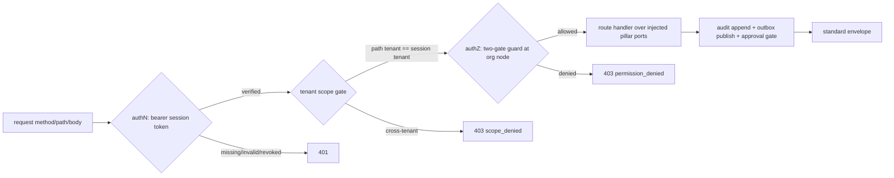

# identity/cpapi — Control-plane REST API + event/outbox bus

> Owner lane: **identity** (issue `kushin77/agent-orchestrator#38`, work item 34,
> phase 6; parent EPIC-00 issue #4). Doctrine: [`AGENTS.md`](../../AGENTS.md),
> [`docs/EXECUTION-PLAN.md`](../../docs/EXECUTION-PLAN.md),
> [`docs/ARCHITECTURE.md`](../../docs/ARCHITECTURE.md),
> [`docs/GOLDEN-RULES.md`](../../docs/GOLDEN-RULES.md),
> [`docs/CANNIBALIZATION.md`](../../docs/CANNIBALIZATION.md).

This tree is the **control-plane management surface** of the multi-tenant
AI-agent-orchestration SaaS: a REST API over every pillar entity (tenant,
agent, profile, persona, promptModule, policy, budget and the pause rail) with
RBAC, an **append-only event/outbox bus** for async effects, audit-append on
every mutation, approval-gated destructive operations, and an OpenAPI spec +
typed client. One lane: this subtree is `identity/cpapi/**` only.

Everything is **fully offline**: a transport-free HTTP-handler abstraction
(Router → handlers invoked through `ControlPlane.handle`) whose dependency
seams are fakes in tests (`fakes.py`) or thin adapters over the real merged
pillar modules (`wiring.py`). No web framework, no network, no server socket,
no npm/node — Python 3 stdlib only.

## Acceptance criteria (issue #38)

| Criterion | Where |
|---|---|
| Control-plane endpoints for every pillar entity (tenant, agent, profile, persona, promptModule, policy, budget, pause) with RBAC | `router.py` route table + `access.py` two-gate authZ per route |
| Event/outbox bus for async effects (provision, degrade, budget-exceeded, kill) with redelivery; outbox pattern to avoid dual-write | `outbox.py` (idempotent publish, poll/ack/fail, lease redelivery, dead-letter) |
| All mutations append to the audit ledger; approval-gated (govctl-style) destructive ops | `audit.py` + `control.py` mutation handlers; `approvals.py` |
| OpenAPI spec + generated clients | `openapi.yaml` + `clients/` (typed client, transport-injected) |

## Provenance (cannibalization, GR-10)

Adapted to Python, offline, from the fleet/hub read-only mirrors under
`.research/` (verified present; nothing copied verbatim — patterns only):

| Source | Pattern adapted | Where it landed |
|---|---|---|
| `hermes-agents` `src/hermes_agent/api/{capabilities,router,tiering}.py` | clean control-plane REST shape (route → handler, typed views) | `router.py`, `control.py` |
| hub `CMR` `registry/events/` (append-only lifecycle event log) + `registry/channels/` (outbox/sent/.state) + `cli/` | append-only outbox + delivery-state discipline | `outbox.py` |
| `capital-underwriting` `scripts/agent/fleet_api_server.py` | fleet control-plane API shape (PATTERN-ONLY) | route table, envelope |
| `shared-services` `automation/govctl/*` | audit sign/verify/query + approve/deny approval workflow | `audit.py`, `approvals.py` |
| `shared-services` `services/mcp-hub/server/mcp-server.ts` | bearer-credential gateway envelope | `router.py` envelope |
| `shared-temporal` `patterns/multi_tenancy.go` | provisioning workflow events (async effects) | outbox event vocabulary |
| `saas-rbac` `services/backend-api/src/*` (authn/authz split) | front-door authN vs backend authZ; two-gate 403 | `access.py` |

## Consumed contracts (field names frozen upstream — never redefined)

| Upstream | Consumed |
|---|---|
| `identity/rbac` (issue #12) | Org-as-tenant, `resource:action` permissions, `ScopeNode`, `guard`/`Decision` semantics, subject binding by id, no cross-tenant fallback |
| `identity/sso` (issue #35) | tenant-scoped session tokens (mandatory tenant claim) — real `SessionVerifier` adapter |
| `identity/onboarding` + `identity/entitlements` (issues #14/#36) | Org.id == tenant.id; `plan`/`tenantType`/`subscriptionStatus` vocabulary |
| `registry/service` + `registry/events` (issues #10) | Agent lifecycle statuses (`registered/active/paused/retired`), `AgentRegistry` facade, tenant-scoped reads |
| `registry/profiles`, `registry/personas`, `registry/prompts` (issues #9/#11/#13) | profile ids (`coder`, ...), persona cards, published prompt-module `taskType` |
| `guardrails/policy` | policy binding ids (`worker-bundle`, ...) |
| `telemetry/budgets` (issue #34) | usage/quota/kill-switch state; pause rail |
| `telemetry/ledger` (issue #31) | audit record vocabulary (`actor` = `kind:id`, `action`, `resource`) |
| `gateway/proxy` (issue #16) | `POST /v1/agents/{agentId}/tasks` dispatch shape (taskType/input) |

## The request pipeline (what `handle` does)



Every response is the envelope `{ok, status, requestId, data, error}` with a
stable machine `error.code`. GET query parameters ride in the `query` mapping,
POST bodies in `body`; endpoints never know which transport carried them.

## Tree layout

```text
identity/cpapi/
├── README.md                    # this contract doc
├── __init__.py                  # public surface (import as cpapi)
├── errors.py                    # ApiError taxonomy + status/code mapping
├── model.py                     # typed request/response models + validation
├── router.py                    # Route table + matcher + envelope
├── access.py                    # authN (session verify) + authZ (two-gate)
├── ports.py                     # injectable dependency seams (Protocols)
├── control.py                   # ControlPlane facade + endpoint handlers
├── outbox.py                    # append-only event/outbox bus
├── audit.py                     # append-only audit store (default)
├── approvals.py                 # approval-gated destructive ops (govctl-style)
├── fakes.py                     # in-memory seam fakes + build_test_app
├── wiring.py                    # thin adapters over the real merged modules
├── transport.py                 # in-process client transport (offline)
├── openapi.yaml                 # OpenAPI 3.0 spec (AC4)
├── clients/                     # typed client + transport contract (AC4)
└── tests/                       # pytest suite (offline, incl. negatives)
```

## Endpoint map (entity → permission)

| Entity | Endpoint | Permission |
|---|---|---|
| tenant | `GET /v1/tenants/{tenantId}` | `org:read` |
| tenant | `POST /v1/tenants/{tenantId}/pause` *(destructive, approval-gated)* / `resume` | `budget:manage` |
| budget | `GET /v1/tenants/{tenantId}/usage` / `quotas` | `budget:read` |
| agent | `GET /v1/agents` · `POST /v1/agents` · `GET /v1/agents/{agentId}` | `agent:read` / `agent:create` / `agent:read` |
| agent | `POST /v1/agents/{agentId}/activate` · `pause` | `agent:write` |
| agent | `POST /v1/agents/{agentId}/retire` *(destructive, approval-gated)* | `agent:delete` |
| agent | `POST /v1/agents/{agentId}/tasks` (dispatch) · `GET .../tasks/{taskId}` | `agent:run` / `agent:read` |
| profile | `GET /v1/profiles` · `GET /v1/profiles/{profileId}` | `prompt:read` |
| persona | `GET /v1/personas` · `GET /v1/personas/{personaId}` | `prompt:read` |
| promptModule | `GET /v1/prompts` · `GET /v1/prompts/{moduleId}` | `prompt:read` |
| policy | `GET /v1/policies` · `GET /v1/policies/{policyId}` | `policy:read` |
| audit | `GET /v1/audit` | `audit:read` |
| outbox | `GET /v1/outbox/events` · `POST /v1/outbox/poll` · `POST /v1/outbox/{id}/ack|fail` | `event:read` / `event:consume` |
| approvals | `GET /v1/approvals` · `POST /v1/approvals/{id}/approve|deny` | `approval:read` / `approval:approve` |

Permissions `agent:*`, `org:*`, `budget:*`, `audit:read`, `prompt:read` are the
frozen platform-pack strings (the `admin` preset holds them; `owner` holds
`*:*`). The registry-read and governance permissions for policy/outbox/
approval surfaces are documented control-plane additions a tenant grants via a
custom role or the owner preset (the RBAC catalog is open by contract).

## AuthN + AuthZ (never trust the front door)

The control plane is the **backend**: it consumes an already-verified
tenant-scoped session token and authorizes — it never lets the caller assert
its own tenant or permissions. `SessionVerifier` is injected (`wiring.py`
adapts the merged `identity/sso` / `registry/service` verifiers); `Authorizer`
is injected and delegates to the merged `identity/rbac` `guard` at the org
node (`ScopeNode(tenant_id)`), so the **scope gate** (can this subject act in
this tenant at all?) runs before the **permission gate** (does its role grant
the route's `resource:action`?). Denials map to 403 with the decision fields;
there is no cross-tenant fallback and no retry-in-another-scope.

## Outbox bus (AC2) — the outbox pattern, no dual-write

A mutation handler persists its business change through the injected port and
appends its domain event in the **same request** — the outbox is the single
source of truth for async effects (`agent.registered`, `agent.provision`,
`agent.retired`, `task.dispatched`, `control.pause`/`resume`, `approval.*`,
...). Record lifecycle: `publish (pending) → poll (dispatched, lease) →
ack (delivered)`; a `fail` returns the event to `pending` (redelivery) until
the attempt budget is spent, then `dead` (replayable); an orphaned consumer
whose lease lapses is reclaimed by `redeliver_due`. `publish` is **idempotent
by `idempotency_key`** and refuses unknown event types (closed vocabulary) —
all negative-tested in `tests/test_outbox.py`.

## Audit + approvals (AC3)

Every mutation appends an audit record (`audit.append`) before returning; the
default store is append-only (`audit.py`), and production maps the seam onto
the merged tamper-evident per-tenant ledger (`telemetry/ledger`). Destructive
actions (agent retire, tenant pause) are **approval-gated** (govctl-style):
the first attempt returns `202 approval_required` with a pending approval
request and publishes `approval.required`; an authorized approver approves via
`POST /v1/approvals/{id}/approve`; the requester's retry then executes and the
approval is consumed. Every step is audited and published.

## OpenAPI + clients (AC4)

[`openapi.yaml`](openapi.yaml) is the machine-readable OpenAPI 3.0 contract;
[`clients/`](clients/README.md) ships a typed, transport-injected client that
mirrors it exactly (verified offline against a `ControlPlane` through
`transport.py`). Richer per-language SDKs can be generated from the spec at
build time with standard toolchains.

## Importing and running the tests

`identity/` has no `__init__.py` (a later identity-phase lane owns one), so the
suite is importable as `cpapi` when `identity/` is on `sys.path` (the tests
arrange this in `tests/conftest.py`):

```bash
# from the repo root
python3 -m pytest identity/cpapi/tests -q -p no:cacheprovider
make verify   # repo gate stays green (this lane adds no files outside
              # identity/cpapi/; the drift check WARNs non-fatally that this
              # suite is not yet declared in scripts/pytest-suites.txt)
```

Per the one-issue-one-lane doctrine this lane only *adds* files under
`identity/cpapi/`, so the suite is not registered in
`scripts/pytest-suites.txt` (a foundation/QA-owned file); `make verify`/`make
gate` stay green and the suite is exercised here directly and by whoever
registers it.

## Verification summary (2026-09-08)

- `python3 -m pytest identity/cpapi/tests -q -p no:cacheprovider` → green (69+
  tests), covering: router/envelope shape; agent lifecycle + dispatch +
  tenant-scoped reads; registry/budget/pause endpoints; authN negatives (401
  missing/invalid/revoked, cross-tenant 403); authZ negatives (scope gate
  before permission gate, per-endpoint permission denials); audit append +
  query; outbox idempotency, poll/ack, fail→redelivery→dead, lease reaping,
  file round-trip; approval gate (approve executes + consumes, deny never
  executes); and real-module wiring (real `identity/rbac` guard, real
  `registry/service` facade).
- `make verify` → green (see PR evidence).
