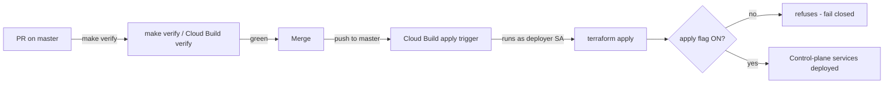

# infra — Infrastructure as Code (cross-cutting)

Owner lane: **infra** (issue #6 · IaC mandate GR-5). See
[`../docs/EXECUTION-PLAN.md`](../docs/EXECUTION-PLAN.md) and
[`../docs/ARCHITECTURE.md`](../docs/ARCHITECTURE.md).

## Purpose

Everything declared, nothing clicked. This directory is the CI/CD + IaC
foundation for the multi-tenant **AI-agent-orchestration control plane**: the
Terraform modules that declare the seven control-plane services, the
feature-flag registry that keeps every surface **OFF until promoted**, and the
Cloud Build pipelines that run the gate and perform the only apply route.

New infrastructure ships **flag-gated OFF by default** and is applied by the
**deployer service account** through the automated pipeline — never by a human
in a console.

## Layout

```
infra/
  README.md                  this file (layout + flag-gated apply path)
  feature-flags/
    registry.yaml            declarative OFF-by-default registry for every
                             service/endpoint + CI/CD trigger (single source
                             of promotion truth)
  terraform/
    README.md                how to read / plan / promote the environment
    versions.tf providers.tf variables.tf main.tf outputs.tf
    backend.tf.example       GCS remote-state template (copy at go-live)
    modules/
      control-plane-service/ one Cloud Run service, count-gated by `enabled`
      deployer-sa/           the flag-gated deployer service account
  cloudbuild/
    README.md                code-native CI/CD engine (Cloud Build)
    verify.yaml              build config: runs `make verify` as CI status
    apply.yaml               build config: flag-gated apply as deployer SA
    verify-trigger.yaml      importable PR trigger (disabled by default)
    apply-trigger.yaml       importable push trigger (disabled by default)
```

## Flag-gated OFF by default

Every `enable_*` variable in `infra/terraform/variables.tf` defaults to
`false`, and every entry in [`feature-flags/registry.yaml`](feature-flags/registry.yaml)
defaults to `off`. With all flags closed the Terraform configuration declares
but creates **nothing** — a plan shows zero resources.

`scripts/check-feature-flags.py` (wired into `make verify`) enforces this
mechanically: a service that ships ON, a missing registry entry, a terraform
flag that defaults to `true`, or a registry/terraform mismatch all **fail the
gate** (no-false-green). Promotion is one flag at a time, behind a reviewed
go-live, recorded in the registry.

## The only apply path (no console)



- The **deployer service account** (`modules/deployer-sa`) is the only identity
  that runs `terraform apply`. It is created by Terraform, flag-gated OFF, and
  granted roles only at promotion.
- The **apply pipeline** (`cloudbuild/apply.yaml`) runs as the deployer SA and
  is **fail-closed**: invoked with the apply flag OFF it fails loudly rather
  than applying or silently skipping.
- The **apply trigger** (`cloudbuild/apply-trigger.yaml`) ships `disabled: true`
  with `_ENABLE_APPLY: "false"`.
- There is **no console apply path**. A resource changes only by PR → verify →
  merge → automated flag-gated apply.

## Gate wiring

`make verify` (the gate of record) runs from `scripts/verify.sh` and includes
the IaC checks introduced here:

| Check | Script | Degrades to visible SKIP when |
|-------|--------|------------------------------|
| shell / yaml / json / docs / secrets | `../scripts/check-*.sh` + `check-yaml.py` | n/a (always-on) |
| feature-flags | `../scripts/check-feature-flags.py` | n/a (always-on) |
| cloudbuild | `../scripts/check-cloudbuild.sh` | n/a (always-on) |
| terraform fmt | `../scripts/check-terraform.sh fmt` | terraform binary absent |
| terraform validate | `../scripts/check-terraform.sh validate` | terraform binary absent, or no local provider cache (offline) |

The gate writes a verify record to `.verify/` (gitignored): `verify.log`
(full transcript) and `attestation.json` (timestamp, host, sha, per-check
results, exit code) — the attestation that the gate ran.

## Provenance

Assets in this directory were cannibalized/adapted from fleet/hub sources
(GR-10). Recorded here rather than in `docs/CANNIBALIZATION.md` because that
index is issue #8's closed artifact.

| Asset | Source (repo · path) | License |
|-------|----------------------|---------|
| Flag-gated `enabled = false` module pattern, count-gated resources | `kushin77/CMR` · `infra/terraform/github/{main,variables}.tf` | repo-internal (fleet) |
| Cloud Build trigger + validator shape (`check-cloudbuild`, disabled trigger, `_ENABLE_*` substitution) | `kushin77/CMR` · `infra/cloudbuild/{README.md,check-cloudbuild,pr-bot-triggers.yaml}` | repo-internal (fleet) |
| Terraform fmt/validate offline pattern (never `terraform init` with network) | `kushin77/CMR` · `scripts/verify.sh` (`cmd_terraform`) | repo-internal (fleet) |
| ADR-0016 autonomous infra apply (deployer identity, policy-gated apply) | `kushin77/CMR` · `docs/decision-records/ADR-0016-autonomous-infra-apply.md` | repo-internal (fleet) |
| ADR-0015 declarative verify status (code-native CI, no Actions) | `kushin77/CMR` · `docs/decision-records/ADR-0015-verify-status-declarative-check.md` | repo-internal (fleet) |
| Honest gate exit-code contract + attestation | `kushin77/leaderboard` · `scripts/qa/{qa-gatekeeper.sh,gate-attest.sh,signals.d/}` | repo-internal (fleet) |
| Provenance method (asset → source table) | `kushin77/shared-frontend` · `docs/DESIGN-TOKENS.md` | repo-internal (fleet) |
