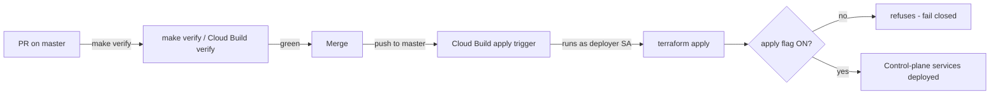

# infra — Infrastructure as Code (cross-cutting)

Owner lane: **infra** (issue #6 · IaC mandate GR-5). See
[`../docs/EXECUTION-PLAN.md`](../docs/EXECUTION-PLAN.md) and
[`../docs/ARCHITECTURE.md`](../docs/ARCHITECTURE.md).

## Purpose

Everything declared, nothing clicked. This directory is the CI/CD + IaC
foundation for the multi-tenant **AI-agent-orchestration control plane**: the
Terraform modules that declare the seven control-plane services, the
feature-flag registry that declares each surface's default and records the
named exception that keeps any surface off, and the
Cloud Build pipelines that run the gate and perform the only apply route.

New infrastructure ships **enabled by default** once merged and tested
(AO-GR-6, `policy-gr5-enabled-by-default`) and is applied by the
**deployer service account** through the automated pipeline — never by a human
in a console.

## Layout

```
infra/
  README.md                  this file (layout + flag-gated apply path)
  feature-flags/
    registry.yaml            declarative OFF-by-default registry for every
                             service/endpoint + CI/CD trigger (single source
                             of promotion truth)
  fleet/
    README.md                the fleet-cron image: what it carries, what it
                             deliberately does not, and what D2-D7 inherit
    inventory.yaml           the DEPENDENCY INVENTORY — the porting contract the
                             image and its gate are both held to, in both
                             directions (see below)
    Dockerfile               python:3.12-slim + tini + git/gh/openssh-client/cron
                             + the pinned claude release; the checkout is COPY'd
                             to /repo
    entrypoint.sh            asserts the schedule by calling `fleet/cron.py
                             install` (the ONE owner of the crontab lines), then
                             runs; with no command it starts cron in the
                             foreground
  terraform/
    README.md                how to read / plan / promote the environment
    versions.tf providers.tf variables.tf main.tf outputs.tf
    backend.tf.example       GCS remote-state template (copy at go-live)
    modules/
      control-plane-service/ one Cloud Run service, count-gated by `enabled`
      deployer-sa/           the flag-gated deployer service account
  cloudbuild/
    README.md                code-native CI/CD engine (Cloud Build)
    verify.yaml              build config: runs `make verify` as CI status
    apply.yaml               build config: flag-gated apply as deployer SA
    verify-trigger.yaml      importable PR trigger (disabled by default)
    apply-trigger.yaml       importable push trigger (disabled by default)
```

## Enabled by default (AO-GR-6)

Every `enable_*` variable in `infra/terraform/variables.tf` defaults to
`true` — 18 of the 19 declare it so; `enable_erp_module` is the one **recorded
exception** (#1955, it carries its own dedicated promotion gate) — and every
entry in [`feature-flags/registry.yaml`](feature-flags/registry.yaml)
defaults to `on` (`default_policy: on`). The 2026-09-21 owner decision
`policy-gr5-enabled-by-default` reversed the previous "ships OFF" default.

`scripts/check-feature-flags.py` (wired into `make verify`) enforces this
mechanically: the registry must carry `default_policy: on`, every declared
`services:`/`surfaces:` entry must default to ON, and a missing registry entry,
a terraform flag that defaults to `false` without a recorded exception, or a
registry/terraform mismatch all **fail the gate** (no-false-green). An entry
may stay off only as a **named exception** citing the recorded owner decision
that keeps it off; promotion is then one flag at a time, behind a reviewed
go-live, recorded in the registry.

## The only apply path (no console)



- The **deployer service account** (`modules/deployer-sa`) is the only identity
  that runs `terraform apply`. It is created by Terraform, off by a named
  exception at this layer, and
  granted roles only at promotion.
- The **apply pipeline** (`cloudbuild/apply.yaml`) runs as the deployer SA and
  is **fail-closed**: invoked with the apply flag OFF it fails loudly rather
  than applying or silently skipping.
- The **apply trigger** (`cloudbuild/apply-trigger.yaml`) ships `disabled: true`
  with `_ENABLE_APPLY: "false"`.
- There is **no console apply path**. A resource changes only by PR → verify →
  merge → automated flag-gated apply.

## Gate wiring

`make verify` (the gate of record) runs from `scripts/verify.sh` and includes
the IaC checks introduced here:

| Check | Script | Degrades to visible SKIP when |
|-------|--------|------------------------------|
| shell / yaml / json / docs / secrets | `../scripts/check-*.sh` + `check-yaml.py` | n/a (always-on) |
| feature-flags | `../scripts/check-feature-flags.py` | n/a (always-on) |
| cloudbuild | `../scripts/check-cloudbuild.sh` | n/a (always-on) |
| fleet-cron-image | `../scripts/check-fleet-cron-image.sh` | docker absent or its daemon unreachable (the static half still runs) |
| terraform fmt | `../scripts/check-terraform.sh fmt` | terraform binary absent |
| terraform validate | `../scripts/check-terraform.sh validate` | terraform binary absent, or no local provider cache (offline) |

## The fleet-cron image and its inventory

`infra/fleet/` packages the fleet's scheduled automation as one image (issue
#709, EPIC #706 D1) so it can run off the box it was written on. Its list of
needs is `fleet/inventory.yaml`, and that file is a **contract rather than a
comment**: `scripts/check-fleet-cron-image.sh` refuses a package the Dockerfile
installs that the inventory does not declare, refuses a listing the Dockerfile
does not install, re-reads the schedule markers from `fleet/cron.py` and the
rungs from `fleet/watchdog.py`, and proves that the interpreter the schedule
names (`/usr/bin/python3`, which `fleet/cron.py` writes literally) is a path the
image actually provides. Every one of those controls is provoked on each run,
and the gate builds the image and runs the issue's own
`python3 fleet/cron.py status` against it.

Like every other surface here it is **declared, not clicked**, and it adds no
Terraform resource and no service flag — it is a build artifact, so there is
nothing to ship ON. Deployment onto a scheduler is D2-D7's work, and that is
where the OFF-by-default flag belongs.

The gate writes a verify record to `.verify/` (gitignored): `verify.log`
(full transcript) and `attestation.json` (timestamp, host, sha, per-check
results, exit code) — the attestation that the gate ran.

## Provenance

Assets in this directory were cannibalized/adapted from fleet/hub sources
(GR-10). Recorded here rather than in `docs/CANNIBALIZATION.md` because that
index is issue #8's closed artifact.

| Asset | Source (repo · path) | License |
|-------|----------------------|---------|
| Flag-gated `enabled = false` module pattern, count-gated resources | `kushin77/CMR` · `infra/terraform/github/{main,variables}.tf` | repo-internal (fleet) |
| Cloud Build trigger + validator shape (`check-cloudbuild`, disabled trigger, `_ENABLE_*` substitution) | `kushin77/CMR` · `infra/cloudbuild/{README.md,check-cloudbuild,pr-bot-triggers.yaml}` | repo-internal (fleet) |
| Terraform fmt/validate offline pattern (never `terraform init` with network) | `kushin77/CMR` · `scripts/verify.sh` (`cmd_terraform`) | repo-internal (fleet) |
| ADR-0016 autonomous infra apply (deployer identity, policy-gated apply) | `kushin77/CMR` · `docs/decision-records/ADR-0016-autonomous-infra-apply.md` | repo-internal (fleet) |
| ADR-0015 declarative verify status (code-native CI, no Actions) | `kushin77/CMR` · `docs/decision-records/ADR-0015-verify-status-declarative-check.md` | repo-internal (fleet) |
| Honest gate exit-code contract + attestation | `kushin77/leaderboard` · `scripts/qa/{qa-gatekeeper.sh,gate-attest.sh,signals.d/}` | repo-internal (fleet) |
| Provenance method (asset → source table) | `kushin77/shared-frontend` · `docs/DESIGN-TOKENS.md` | repo-internal (fleet) |
