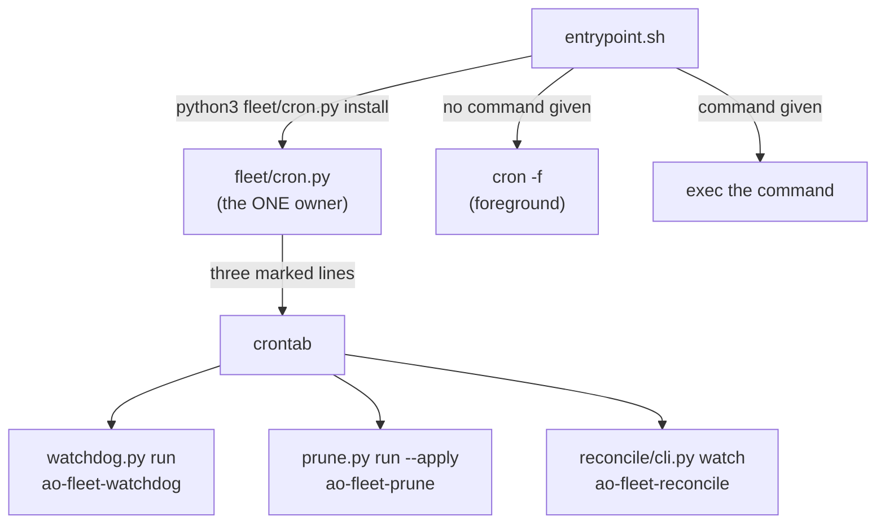

# infra/fleet — the fleet-cron container image

Owner lane: **infra** (issue #709, EPIC #706 D1). See
[`../../AGENTS.md`](../../AGENTS.md) and
[`../../docs/EXECUTION-PLAN.md`](../../docs/EXECUTION-PLAN.md).

## Purpose

One image that runs the fleet's scheduled automation off the box it was written
on: the same three crontab lines, the same three rungs, the same state roots,
the same binaries — declared instead of assumed.

The porting contract is [`inventory.yaml`](inventory.yaml), and it is enforced,
not documented: [`../../scripts/check-fleet-cron-image.sh`](../../scripts/check-fleet-cron-image.sh)
(`make verify`) compares the image against it in both directions and re-measures
the schedule, the rungs and the state roots from the modules that own them.

```
infra/fleet/
  README.md        this file
  inventory.yaml   the dependency inventory — the porting contract
  Dockerfile       python:3.12-slim + tini + git / gh / openssh-client + claude
  entrypoint.sh    asserts the schedule from fleet/cron.py, then runs
```

## Dev-first

The image builds on this box, and that is a criterion rather than a claim:

```bash
docker build -f infra/fleet/Dockerfile -t agent-fleet-cron:dev .
docker run --rm agent-fleet-cron:dev python3 fleet/cron.py status
```

Every layer that reaches the network sits **above** `COPY . /repo`, so the
dependency layers are cache-stable across a checkout edit: the first build pays
for `apt`, `gh` and the pinned CLAUDE release once, and every later build of an
edited checkout rebuilds only the copy layer.

### The one thing this host does to a cold build, measured

A COLD build on this box needs the host's name resolution borrowed
(`docker build --network=host`), and the reason is the host, not the image: a
container on the default bridge network here gets `systemd-resolved`'s
`127.0.0.53` stub in `/etc/resolv.conf`, which resolves nothing outside the host
namespace, so the `apt`/`curl` layers stall or die rather than fail cleanly.

```
$ docker run --rm python:3.12-slim python3 -c "import socket; socket.gethostbyname('deb.debian.org')"
socket.gaierror: [Errno -3] Temporary failure in name resolution
$ docker run --rm --network=host python:3.12-slim python3 -c "import socket; print(socket.gethostbyname('deb.debian.org'))"
151.101.2.132
```

Measured 2026-09-16: the cold build completed with `--network=host`, and the
issue's own command then ran **unchanged and cached** — eleven `Using cache`
layers, `rc 0`, and `cron: installed (3 line(s))`. So the image builds on this
box either way; only the first, network-touching build on a host whose
containers cannot resolve has to say so. `scripts/check-fleet-cron-image.sh`
probes exactly this and prints which of the two it used, so the environment
defect stays visible instead of being papered over — with working container DNS
the plain command builds the same image.

## The schedule has one owner, and it is not this directory

`fleet/cron.py` owns the three crontab lines — their markers, their interval,
their log paths and their interpreter path. The image holds **no second copy** of
any of it: `entrypoint.sh` calls `python3 fleet/cron.py install`, and
`.dockerignore`-style copying of a crontab into the image is refused by name in
the gate. A schedule that exists twice is a schedule where one copy is wrong and
nobody knows which.



`install_lines()` refreshes only the lines carrying the fleet's own markers and
keeps every foreign line, so asserting the schedule on each start is idempotent.
`AO_FLEET_CRON_NO_INSTALL=1` skips the assertion — the gate runs the issue's own
`status` command with and without it and requires the two to disagree, which is
what makes "the entrypoint is what installs the schedule" a measurement.

## What the image deliberately does NOT contain

`.board/` and `.fleet/` are runtime **state** — a claim ledger, a mailbox, a
heartbeat — and they are excluded from the build context on purpose. An image
that baked one host's board would hand every container the same stale claims, so
the image creates the paths empty and they are the mount points a real run fills.
The inventory records that the image *depends* on the exclusion, and the gate
checks it as a subset of `.dockerignore`: another image may exclude more, never
less.

No secret is baked in. The image carries no `.env`, no key and no token; the
gate refuses a Dockerfile that names one, and the only credential the fleet uses
at run time is `gh`'s own, mounted in.

## Flag posture (GR-5)

The image is a build artifact, not a deployed surface: `infra/fleet/` declares no
Terraform resource and no service flag, so it ships nothing ON. Deployment of the
image onto a scheduler is D2–D7's work; that is where the OFF-by-default flag
belongs, alongside the resource it gates.

## What D2–D7 inherit from here

* **The inventory is the porting contract.** A new dependency is a PR against
  `inventory.yaml` and the Dockerfile together — the gate refuses a package that
  is in one and not the other.
* **The interpreter path is load-bearing.** `fleet/cron.py` writes its lines with
  the literal `/usr/bin/python3`; this image provides that path (a symlink to the
  image's own python) rather than editing the schedule's owner. A port that drops
  the symlink gets ticks that die with a 127 nobody reads.
* **`cron`, `tini` and `openssh-client` are derived, not decorative.** Each has a
  provoked control in the gate that removes it from a one-line derived image and
  requires the result to be reported broken.

## Dev-first: the dry run (D2, issue #710)

D1 built the image. D2 starts it **here**, on the box the schedule was written
on, with every job in dry-run — because the first porting step must not be an
experiment on production: `.fleet/` is the fleet's mailbox, heartbeat and audit
rail, and `.board/` is the claim ledger every other lane reads.

```bash
docker compose -f infra/fleet/docker-compose.agent-cron.yml up -d
curl -fsS http://localhost:8790/healthz
docker compose -f infra/fleet/docker-compose.agent-cron.yml logs --no-color | grep -c 'dry-run'
docker compose -f infra/fleet/docker-compose.agent-cron.yml down
```

`-f` is on every line on purpose: this repository has no default
`docker-compose.yml` at its root, so a bare `docker compose logs` resolves a file
that does not exist. The three commands above are the ones the gate runs.

```
infra/fleet/
  env_contract.py                  the ONE declaration of the image's environment
  dev_run.py                       the dry-run dispatch: what runs in the container
  healthz.py                       the /healthz surface, answered from the decision
  docker-compose.agent-cron.yml    dev-first + D3 (state-rw profile, flag-gated OFF)
  secrets_contract.py              D3: the ONE declaration of the credential mounts
  tests/                           D3: env_contract, secrets_contract, compose coverage
  (D1, unchanged in spirit)
  Dockerfile · entrypoint.sh · inventory.yaml · README.md
```

### Four measurements, not four claims

**1. The schedule is read from its owner, and a role table that drifts fails.**
`dev_run.py` asks `fleet/cron.py` for `MARKERS` — there is no second list of the
jobs — and REFUSES (`role-table-drift`) when its own role table does not cover
them exactly, so a fourth scheduled job with no declared dry-run form fails here
instead of being silently skipped.

**2. A dispatch cannot carry `--apply`.** Every argv is checked and the token is
refused by name (`apply-in-dispatch`); the environment cannot turn it on either,
because `env_contract.py` refuses any `AO_FLEET_DRY_RUN` other than `1`
(`dry-run-required`). The watchdog is not dispatched at all, and the decision
document says so *with its reason*: `fleet/watchdog.py`'s pass spawns the rungs,
so a dry-run of it is a contradiction rather than a flag — which keeps the third
job present in the evidence instead of quietly absent.

**3. The state is checksummed before and after, and WHO is blamed is decided by
the measured mount.** Each root's flags are read from `/proc/self/mountinfo` on
every run, so "read-only" is in the evidence rather than in this sentence:

* a root mounted **read-only** cannot be written by the container at all, so a
  change under it is a **concurrent writer** — the live fleet is still running on
  this box, and its own heartbeat must never read as "the dry run applied";
* a root mounted **writable** has this container as its only writer, so a change
  at a path the dispatched roles may write **fails the run**, naming the file.

The permitted set is read from `fleet/prune.py` (`PRUNABLE_DIRS` + `LOGS`), the
module that owns the retention policy — never restated here. Its scope is stated
as what it is: it is exact for the retention rail, the role whose *scheduled*
form carries `--apply`; the reconcile rail is covered structurally, by the
read-only mount measured per root.

**4. The stop is clean, and the probe can fail.** The SIGTERM/SIGINT handler is
installed *before* the first role runs, so `docker compose down` is a handled
stop and `docker inspect` records exit code 0 — an operator can tell it apart
from a crash. `/healthz` answers **200** only for a run whose verdict is `ok`
and which left the permitted paths alone; a run that wrote answers **503** with
the file it moved, and any other path is a 404. Both are provoked in the gate: a
one-line mutant image whose prune role carries `--apply` (with the argv check
disabled, so only the state guard can catch it) must be reported broken, naming
the file, and its `/healthz` must answer 503.

### Where the state comes from

The compose file mounts the two state roots of **the checkout it lives in**,
read-only, and `create_host_path: false` means a missing root is an error rather
than a silently created, empty, root-owned directory. Point it at another
checkout when the state lives elsewhere — a lane worktree reading the shared
one, or the gate's snapshot of the live state:

```bash
AO_FLEET_HOST_REPO=/home/akushnir/agent-orchestrator \
  docker compose -f infra/fleet/docker-compose.agent-cron.yml up -d
```

`create_host_path: false` (and not the default) is the deliberate choice: with
the default, a checkout that has no `.fleet/` yet gets one created as root, empty,
and the run then "passes" against a board that is not the board.

### What D3+ inherits from here

* **The environment contract is the seam.** A new variable is a line in
  `env_contract.py` and nothing else; the entrypoint and the harness both read
  that one declaration.
* **The dry-run refusal is deliberate, not incidental.** `dry-run-required`
  refuses `AO_FLEET_DRY_RUN=0` because *this* lane is the dry-run harness. A lane
  that adds an applying mode must edit that rule — and the gate's provocation for
  it will make the edit visible instead of silent.
* **The role table is keyed by the schedule's own markers.** A new job in
  `fleet/cron.py` without a dry-run form fails this gate, by design.

## State volumes + secrets wiring (D3, issue #711), FLAG-GATED OFF

D2 mounted `.fleet/` and `.board/` read-only and used no credential at all —
the dry-run harness dispatches nothing that writes. D3 wires the posture an
applying run will eventually need, and ships it **OFF by default**:

* the dev-run service (`agent-cron`) is **unchanged** — both state roots stay
  `read_only: true`, and `docker compose up` with no flags behaves exactly as
  it did under D2;
* a second, additive service (`agent-cron-rw`) is gated behind the compose
  `profiles: [state-rw]` key. `docker compose -f infra/fleet/docker-compose.agent-cron.yml up -d`
  never starts it; only an explicit
  `docker compose -f infra/fleet/docker-compose.agent-cron.yml --profile state-rw up -d`
  does. That profile IS the flag: `AO_FLEET_STATE_RW=1` (declared in
  `env_contract.py`, default `"0"`) documents the same posture inside the
  container's own environment contract for a reader of `env-contract print`,
  but does not by itself turn anything on;
* **`AO_FLEET_DRY_RUN` is unchanged and still pinned to `"1"`.** A writable
  state mount is not permission to apply — D2's `dry-run-required` refusal is
  untouched by this lane, deliberately, so a later lane that adds a real
  applying mode must still edit that rule on purpose.

Because compose merge keys do not deep-merge, `agent-cron-rw` **re-lists every
volume it needs** rather than inheriting from its sibling: the repo bind
(`<repo>:/repo`, read-only), `.fleet` and `.board` (read-write, still
`create_host_path: false` — a missing state root is still an error, never a
silently created root-owned empty one), and a named `fleet-logs` volume at
`/var/log/fleet`.

### Secrets: mounted from outside the repo, never `env_file` (GR-6)

`infra/fleet/secrets_contract.py` is the ONE declaration of every credential
surface the fleet's rungs use — `gh`, `gcloud`, `ssh` — mirroring
`env_contract.py`'s shape. Each mount:

* sources from an env-overridable host path defaulting under `${HOME}`
  (never a path inside this checkout — `secrets_contract.validate()` refuses
  a source that resolves inside the repo, by name: `secret-source-inside-repo`);
* is bind-mounted **read-only** into the container;
* carries no value anywhere in this module, this compose file, or this
  README — only a *path* to a file that lives outside the repo.

The issue's own acceptance grep (two named credential-variable literals,
run against this directory) finds nothing, and
`infra/fleet/tests/test_secrets_contract.py` proves the credential-VALUE
scanner (`secrets_contract.scan_for_secret_values`) catches a credential-shaped
name wherever it appears, including embedded inside a longer compound
identifier — the failure mode a naive `\b...\b` regex misses.

### What D3 does NOT ship

**A Terraform-declared flag.** GR-5 asks for infrastructure to be declared,
never clicked, and flag-gated OFF; this lane delivers the OFF-by-default flag
at the layer it owns (the compose `profiles:` gate + `env_contract.py`'s
`AO_FLEET_STATE_RW`), exactly as D2's own README states for its layer:
*"the image is a build artifact, not a deployed surface... that is where the
OFF-by-default flag belongs, alongside the resource it gates."* No
`infra/terraform/*.tf` resource exists for fleet-cron yet — there is nothing
deployed for a Terraform variable to gate. Declaring one is D4+'s work, when a
scheduler surface is actually provisioned; `infra/terraform/variables.tf`'s
own convention (`enable_*`, default `false`, kept in lock-step with
`infra/feature-flags/registry.yaml` by `scripts/check-feature-flags.py`) is
the pattern that lane should follow.

### Gate coverage

`scripts/check-fleet-cron-dev-run.sh` (auto-discovered into `make verify`,
issue #698) was extended for D3: it exempts a writable state mount from the
`state-mount-writable` refusal only when the service declares a non-empty
`profiles:` list (`state-rw-not-gated` catches a service that claims the flag
without one), validates `secrets_contract.py`, and scans the compose file's
own text for a credential-shaped value. `infra/fleet/tests/` (27 tests
across `test_env_contract_state_rw.py`, `test_secrets_contract.py` and
`test_compose_state_rw.py`) is declared in `scripts/pytest-suites.txt` and
named from inside that gate script, so it is covered by
`scripts/check-gate-coverage.sh` rather than merely present.

## Provenance

The image was written for this repository against the issue's own inventory; no
file was copied from anywhere. Four *patterns* were adopted after reading the
sibling fleet's images (GR-10 — the source is recorded because the shape is not
invented here):
| Pattern | Source (repo · path) | Note |
|---------|----------------------|------|
| `tini` as PID 1 in front of an `entrypoint.sh`, and a dependency-pinning posture (`ARG <TOOL>_VERSION=<exact>`) | `kushin77/leaderboard` · `docker/worker-fleet/Dockerfile` | the sibling image runs `/usr/bin/tini -- /entrypoint.sh`; this one pins the CLAUDE release and verifies its checksum instead of pinning apt versions, because the release manifest carries one |
| the schedule as the image's job, run in the FOREGROUND | `kushin77/leaderboard` · `docker/worker-fleet/` (`cron-sidecar` role) | a daemonising main process makes the container exit and take the schedule with it |
| repo content vs. runtime state as separate concerns (state is mounted, never baked) | `kushin77/leaderboard` · `docker/worker-fleet/Dockerfile` (bind-mount over `/repo`, `immutable source tree` layers) | this image `COPY`s the checkout (the issue asks for it) and mounts only the state roots |

