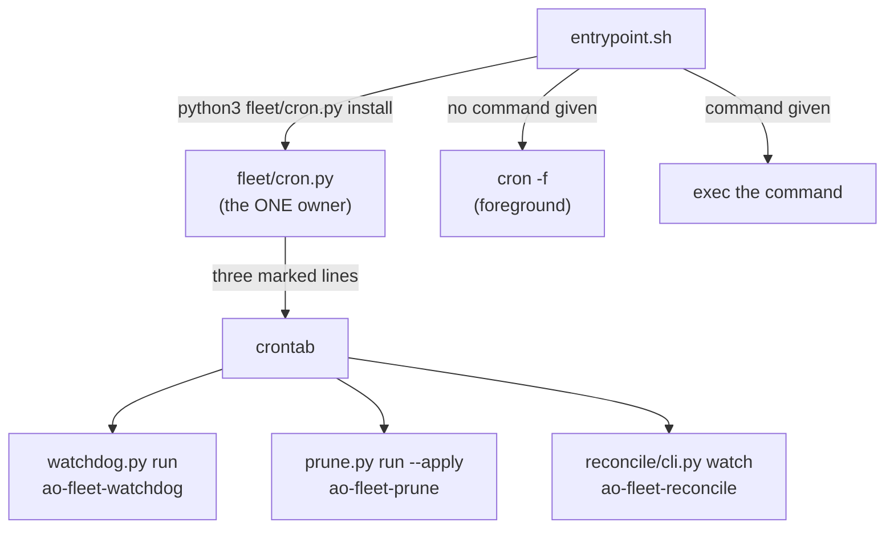

# infra/fleet — the fleet-cron container image

Owner lane: **infra** (issue #709, EPIC #706 D1). See
[`../../AGENTS.md`](../../AGENTS.md) and
[`../../docs/EXECUTION-PLAN.md`](../../docs/EXECUTION-PLAN.md).

## Purpose

One image that runs the fleet's scheduled automation off the box it was written
on: the same three crontab lines, the same three rungs, the same state roots,
the same binaries — declared instead of assumed.

The porting contract is [`inventory.yaml`](inventory.yaml), and it is enforced,
not documented: [`../../scripts/check-fleet-cron-image.sh`](../../scripts/check-fleet-cron-image.sh)
(`make verify`) compares the image against it in both directions and re-measures
the schedule, the rungs and the state roots from the modules that own them.

```
infra/fleet/
  README.md        this file
  inventory.yaml   the dependency inventory — the porting contract
  Dockerfile       python:3.12-slim + tini + git / gh / openssh-client + claude
  entrypoint.sh    asserts the schedule from fleet/cron.py, then runs
```

## Dev-first

The image builds on this box, and that is a criterion rather than a claim:

```bash
docker build -f infra/fleet/Dockerfile -t agent-fleet-cron:dev .
docker run --rm agent-fleet-cron:dev python3 fleet/cron.py status
```

Every layer that reaches the network sits **above** `COPY . /repo`, so the
dependency layers are cache-stable across a checkout edit: the first build pays
for `apt`, `gh` and the pinned CLAUDE release once, and every later build of an
edited checkout rebuilds only the copy layer.

### The one thing this host does to a cold build, measured

A COLD build on this box needs the host's name resolution borrowed
(`docker build --network=host`), and the reason is the host, not the image: a
container on the default bridge network here gets `systemd-resolved`'s
`127.0.0.53` stub in `/etc/resolv.conf`, which resolves nothing outside the host
namespace, so the `apt`/`curl` layers stall or die rather than fail cleanly.

```
$ docker run --rm python:3.12-slim python3 -c "import socket; socket.gethostbyname('deb.debian.org')"
socket.gaierror: [Errno -3] Temporary failure in name resolution
$ docker run --rm --network=host python:3.12-slim python3 -c "import socket; print(socket.gethostbyname('deb.debian.org'))"
151.101.2.132
```

Measured 2026-09-16: the cold build completed with `--network=host`, and the
issue's own command then ran **unchanged and cached** — eleven `Using cache`
layers, `rc 0`, and `cron: installed (3 line(s))`. So the image builds on this
box either way; only the first, network-touching build on a host whose
containers cannot resolve has to say so. `scripts/check-fleet-cron-image.sh`
probes exactly this and prints which of the two it used, so the environment
defect stays visible instead of being papered over — with working container DNS
the plain command builds the same image.

## The schedule has one owner, and it is not this directory

`fleet/cron.py` owns the three crontab lines — their markers, their interval,
their log paths and their interpreter path. The image holds **no second copy** of
any of it: `entrypoint.sh` calls `python3 fleet/cron.py install`, and
`.dockerignore`-style copying of a crontab into the image is refused by name in
the gate. A schedule that exists twice is a schedule where one copy is wrong and
nobody knows which.



`install_lines()` refreshes only the lines carrying the fleet's own markers and
keeps every foreign line, so asserting the schedule on each start is idempotent.
`AO_FLEET_CRON_NO_INSTALL=1` skips the assertion — the gate runs the issue's own
`status` command with and without it and requires the two to disagree, which is
what makes "the entrypoint is what installs the schedule" a measurement.

## What the image deliberately does NOT contain

`.board/` and `.fleet/` are runtime **state** — a claim ledger, a mailbox, a
heartbeat — and they are excluded from the build context on purpose. An image
that baked one host's board would hand every container the same stale claims, so
the image creates the paths empty and they are the mount points a real run fills.
The inventory records that the image *depends* on the exclusion, and the gate
checks it as a subset of `.dockerignore`: another image may exclude more, never
less.

No secret is baked in. The image carries no `.env`, no key and no token; the
gate refuses a Dockerfile that names one, and the only credential the fleet uses
at run time is `gh`'s own, mounted in.

## Flag posture (GR-5)

The image is a build artifact, not a deployed surface: `infra/fleet/` declares no
Terraform resource and no service flag, so it ships nothing ON. Deployment of the
image onto a scheduler is D2–D7's work; that is where the OFF-by-default flag
belongs, alongside the resource it gates.

## What D2–D7 inherit from here

* **The inventory is the porting contract.** A new dependency is a PR against
  `inventory.yaml` and the Dockerfile together — the gate refuses a package that
  is in one and not the other.
* **The interpreter path is load-bearing.** `fleet/cron.py` writes its lines with
  the literal `/usr/bin/python3`; this image provides that path (a symlink to the
  image's own python) rather than editing the schedule's owner. A port that drops
  the symlink gets ticks that die with a 127 nobody reads.
* **`cron`, `tini` and `openssh-client` are derived, not decorative.** Each has a
  provoked control in the gate that removes it from a one-line derived image and
  requires the result to be reported broken.

## Provenance

The image was written for this repository against the issue's own inventory; no
file was copied from anywhere. Four *patterns* were adopted after reading the
sibling fleet's images (GR-10 — the source is recorded because the shape is not
invented here):

| Pattern | Source (repo · path) | Note |
|---------|----------------------|------|
| `tini` as PID 1 in front of an `entrypoint.sh`, and a dependency-pinning posture (`ARG <TOOL>_VERSION=<exact>`) | `kushin77/leaderboard` · `docker/worker-fleet/Dockerfile` | the sibling image runs `/usr/bin/tini -- /entrypoint.sh`; this one pins the CLAUDE release and verifies its checksum instead of pinning apt versions, because the release manifest carries one |
| the schedule as the image's job, run in the FOREGROUND | `kushin77/leaderboard` · `docker/worker-fleet/` (`cron-sidecar` role) | a daemonising main process makes the container exit and take the schedule with it |
| repo content vs. runtime state as separate concerns (state is mounted, never baked) | `kushin77/leaderboard` · `docker/worker-fleet/Dockerfile` (bind-mount over `/repo`, `immutable source tree` layers) | this image `COPY`s the checkout (the issue asks for it) and mounts only the state roots |

