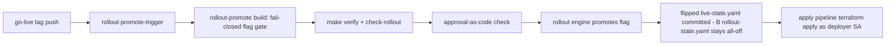

# infra/rollout — flag-gated rollout & deployment pipeline (issue #45)

**Owner lane:** `infra/rollout/**` (issue #45 · work item 41, EPIC-00 phase 8).
Consumes (read-only): `infra/feature-flags/registry.yaml` (#6), the
`infra/terraform` apply path (#6), `infra/cloudbuild/*` conventions (#6), and
the issue #43 merge-governance gate semantics (`governance/merge/`).

## Purpose

Every control-plane surface ships **behind a feature flag defaulting to OFF**
(AO-GR-6). This lane defines and runs the **rollout & deployment pipeline**
that promotes those flags:

- a **declarative stage model** — `off → canary → gradual → full` with
  percentages, conditions and promotion rules;
- a **promotion pipeline declared in IaC** (Cloud Build + the offline rollout
  engine) — promotion is only via that automated path, never a console click
  (AO-GR-5);
- a **per-phase go-live plan** mapping every Phase 0–8 surface to its flag;
- a **rollback path** — a failed canary/gradual health check auto-rolls the
  flag OFF and the IaC change is reverted; the flag never silently stays on;
- **audit** — every promotion and rollback is appended to a hash-chained
  promotion audit log that can be verified.

Rollout is **apply-autonomy, not merge-autonomy** (CMR ADR-0016): the deployer
service account applies already-reviewed configuration; the reviewed change
itself still lands as a PR → gate → merge.

## Files

| File | Purpose |
|------|---------|
| `stage-model.yaml` | Canonical stage vocabulary + promotion/rollback rules (data). |
| `go-live-plan.yaml` | Phase 0–8 surface → flag → go-live stage (declared intent). |
| `rollout-state.yaml` | Declared-default state; every flag OFF, always (GR-28) - never records a promotion. |
| `live-state.yaml` | The committed record of what is actually promoted (issue #914: flag -> stage/since/approval-or-policy/audit_record), validated separately. |
| `model.py` | Pure domain: stages, adjacency, audience, gates, rollback decision. |
| `engine.py` | Promotion/rollback engine, approvals, hash-chained audit log. |
| `cli.py` | Offline CLI the Cloud Build pipeline invokes (`python3 -m infra.rollout.cli`) - one flag, ONE adjacent stage per invocation, with `--audit-log` and `--live-state-out`. |
| `go_live.py` | The ordered, resumable, owner-gated **go-live driver** (issue #619): ONE command for the whole phase 0 -> 8 run, enforcing `strict-by-phase` and the declared 24h hold itself. |
| `audit/` | One evidence record per transition plus the hash-chained `promotion-audit.jsonl`; format and rules in [`audit/README.md`](audit/README.md). |
| `surface_guard.py` | The console surface's **rollback anchor** (issue #802): reads the surface's own readiness and withdraws it when the reading fails. |
| `projection.py` | The **projection** (issue #967): turns a promotion's live state into the served surface declaration the console reads (`surfaces.<name>.default` in `infra/feature-flags/registry.yaml`), reports an unprojected promotion **by name**, and applies the edit surgically - or refuses when it cannot locate the line. |
| `checks/check_rollout.py` | Honest offline gate (all checks can fail; `--self-test`). |
| `tests/` | Pytest suite (stage model, default-OFF, gate, gradual, rollback, audit, plan, gate). |

## Stage model

Closed vocabulary, strict forward promotion, no jumps:

| Stage | Exposure | Default | Requirements to enter |
|-------|----------|---------|-----------------------|
| `off` | none | 0% | — (birth state) |
| `canary` | targeted + 5% slice | 5% | verify-green (policy auto-approved) |
| `gradual` | percentage ramp | 10 → 25 → 50 → 100 | verify-green + canary-health-ok (policy auto-approved) |
| `full` | all tenants | 100% | verify-green + approval-code + canary-health-ok + gradual-complete |

Every transition requires **green verification evidence** (`make verify` /
merge-gate, GR-12). Low-risk hops (`off → canary`, `canary → gradual`) are
**auto-approved by policy** on green evidence (plus canary health for the
ramp) with no human approval code — the auto-approval is recorded in the
audit trail (who/when/why/which policy), never silent. The final promotion
(`gradual → full`) and the downstream apply remain **human-gated**: an
approval-as-code record from an approver distinct from the executing actor
(AO-GR-14; the issue #43 `merge_verdict` gate shape applied to rollout) is
still required. Promotions are **audit-logged**.

Audience exposure is **deterministic**: a subject is exposed only if it is
explicitly targeted or its stable hash bucket (`sha256(flag:subject) % 100`)
falls below the rollout percentage — so a canary slice is stable across
calls.

## Workbook surfaces — one flag per surface (issue #644, workbook-13)

The five surfaces workbook-11/12/5 added carry an in-module switch, a row in
`infra/feature-flags/registry.yaml` (`services.<name>`, lock-stepped with
`infra/terraform/variables.tf` by `scripts/check-feature-flags.py`) and a flag
here in `rollout-state.yaml` — all **OFF**. A flag is a promotion unit only
where the pipeline can reach it: the offline engine refuses a flag that
`rollout-state.yaml` does not carry (`unknown flag '<name>' (not declared in
rollout state)`), so a registry row without a state row would be a declaration
nobody could promote. Registered here, each flag travels the normal path
OFF → CANARY → GRADUAL → FULL with the same gates as every other flag.

| Flag | Surface it gates | In-module switch | Terraform variable | Enable criteria |
|------|------------------|------------------|--------------------|-----------------|
| `services.org_chart` | Org-chart view, `GET /api/orgchart/chart`, `GET /api/orgchart/health` (portal deployable) | `surfaces.org_chart` in `portal/config/feature-flags.yaml`, read by `portal/server/config_flags.py` | `enable_org_chart` | The workbook-1 org declaration and its bound cards are committed and render against the live role-health feed; a missing feed degrades to an explicit NO_DATA, never a fabricated chart; the portal suite is green; approval-as-code recorded for this flag and target stage. |
| `services.skill_studio` | Skill studio, `GET /api/skillstudio/skills[/<id>]`, `POST /api/skillstudio/author\|test\|publish` (portal deployable) | `surfaces.skill_studio` in `portal/config/feature-flags.yaml` | `enable_skill_studio` | The workbook-9 studio API is green on its own gates (a publish without green eval evidence is refused by the studio, not by this flag); at least one authored skill round-trips author → test → publish in evidence; approval-as-code recorded. |
| `services.task_board` | Tenant task board, `GET /api/taskboard/tickets[/<id>]` (portal deployable) | `surfaces.task_board` in `portal/config/feature-flags.yaml` | `enable_task_board` | The workbook-3 ticket runtime is green and the board is a replay of the durable log (an absent ticket is absent, not invented); per-tenant scoping is exercised in evidence; approval-as-code recorded. |
| `services.mcp_outbound` | Outbound MCP calls, `gateway/mcp/outbound.py` (gateway deployable) | `AO_MCP_OUTBOUND_ENABLED` (compiled OFF) | `enable_mcp_outbound` | Every server to be dialled is declared with `enabled: true`, an allow-listed endpoint and a reachability check; egress and DLP policy are reviewed (guardrails promoted or the policy gate in force); the caller's declared capability is enforced, not bypassed; approval-as-code recorded. |
| `services.sandbox_runtime` | Real sandbox runtime — docker / firecracker — over `guardrails/sandbox/` (guardrails deployable) | `SandboxEnablement` in `guardrails/sandbox/enablement.py` | `enable_sandbox_runtime` | The runtime's dependency is genuinely present in the target image (an unavailable runtime fails before the flag flips, never half-enabled); the enable/disable round-trip is proven; the per-category security profile is reviewed; approval-as-code recorded. |
| `services.erp_module` | ERP module portal surface — `GET /api/erp/module\|dashboard\|reports[<id>]`, the proxy of ERP-06's `/api/erp/documents/…`, and the frame at `/erp/module.html` (portal deployable) | `surfaces.erp_module` in `portal/config/feature-flags.yaml`, read by `portal/server/config_flags.py` | `enable_erp_module` | The module's own gate is green (`scripts/check-erp-portal.sh`: both flag postures, the verbatim ERP-06 refusal pass-through and the manifest mutation); the ERP-01 declaration still validates; a promoted module renders only from ERP-06's served contract (a family, a state or a field it re-derived would fail the gate's vocabulary scan); approval-as-code recorded for this flag and target stage. |

Two properties hold for all five, and both are structural rather than promises:
the flags default OFF in every declaration that carries them (registry,
terraform, rollout state), and one flag can never widen more than its own
surface — `mcp_outbound` still needs the per-server `enabled` and the caller's
capability, `sandbox_runtime` still needs a runtime that exists, and the three
portal views are independent of each other and of `enable_portal`.

## The surface rollback anchor (issue #802)

A promotion pipeline is half a contract. `surfaces.<name>` in the registry says
what is gated and this pipeline says how it is promoted, but until #802 nothing
connected a **promoted** surface to its own health: the console surface
(`surfaces.operator_terminal`) could be promoted and withheld only by hand.

`surface_guard.py` is the other half. It reads the surface's own readiness
signal (``portal/server/surface_health.py``: promoted? an engaged rollback? the
artifacts it serves, and the declarations its steer half consumes?) and acts on
it:

```bash
python3 -m infra.rollout.cli surface-health operator_terminal          # 0 healthy · 1 rolled back · 2 cannot assess
python3 -m infra.rollout.cli surface-health operator_terminal --json
python3 -m infra.rollout.cli surface-health operator_terminal --clear  # the reversible half
```

A failed reading withdraws the surface at **both** layers, because either alone
is a half-truth:

1. **the rollout layer** — the flag is rolled to the stage model's declared
   rollback target (`off`) through `RolloutEngine.observe_health`, which appends
   a hash-chained audit record (`--audit-log`, or the engine's in-memory log);
2. **the runtime layer** — the rollback overlay of
   `portal/server/surface_state.py` is engaged, so the surface's *reader*
   resolves `off` **now** while the committed registry still declares it promoted.

Three rules the anchor holds, each measurable:

* **an unreadable reading is not a failure.** `cannot-assess` rolls **nothing**
  back and exits 2 — acting on a signal nobody could read would fabricate a
  health failure — and it is never reported healthy either.
* **a healthy surface is left alone** (the model returns "no move" for a healthy
  observation), so an anchor that always rolled back would fail its gate, not a
  production surface.
* **drift is named, not hidden.** `validate_rollout_state_doc` refuses a state
  document carrying a flag that is not `off`, so the committed
  `rollout-state.yaml` **cannot record an exposure** — it records the
  *withdrawal*. The exposure itself, when real, is recorded in
  `live-state.yaml` instead (issue #914) — its own validator, not this one,
  enforces the audit trail a promoted entry there must carry. A surface that
  is served while its `rollout-state.yaml` row reads `off` is therefore
  normal, and the anchor names that disagreement in its report rather than
  pretending the row was the source of the exposure.

Without the `surfaces.operator_terminal` row in `rollout-state.yaml` the engine
refuses the flag by name (`unknown flag ... (not declared in rollout state)`), so
adding the row is what makes the surface promotable *and* withdrawable;
`check_rollout.py` keeps that row lock-stepped with the registry's own
`surfaces` section. The provoked proofs live in the console's gate of record,
`scripts/check-operator-terminal.sh` (§h): a promoted fixture is withdrawn and
the surface answers 404 while the registry still says `on`, a healthy reading is
left alone, an unreadable declaration withdraws nothing, and neutering the
overlay writer makes the acceptance probe fail by name.

## The only promotion path (no console)



- `infra/cloudbuild/rollout-promote.yaml` and `rollout-rollback.yaml` are the
  declared pipelines; both are **fail-closed** (refuse to act while
  `_ENABLE_ROLLOUT != "true"`) and run as the deployer service account.
- The importable triggers (`rollout-promote-trigger.yaml`,
  `rollout-rollback-trigger.yaml`) ship **disabled: true** with
  `_ENABLE_ROLLOUT: "false"` (flag-gated OFF). `check-rollout.py` fails the
  gate if a rollout trigger ships enabled.
- The rollback trigger fires on a `canary-health-fail` pubsub message; the
  rollback pipeline flips the flag OFF and the apply pipeline reverts the
  deployment.

## The ordered go-live run — ONE command (issue #619)

`cli.py` moves ONE flag ONE adjacent stage per invocation, which made a go-live
~62-86 manual invocations plus a hand-edited trigger, with no phase awareness,
no resume and no dry run. The driver is that run as a single, idempotent
command:

```bash
python3 infra/rollout/go_live.py --preflight          # 0/1/2 - offline, writes nothing
python3 infra/rollout/go_live.py --dry-run            # per-phase plan, writes nothing
python3 infra/rollout/go_live.py --phase 0 --canary-health-ok \
  --actor deployer-sa --approvals-dir infra/rollout/approvals
python3 infra/rollout/go_live.py --phase 1-6 --canary-health-ok --actor deployer-sa
python3 infra/rollout/go_live.py --phase 7 --canary-health-ok --actor deployer-sa
```

What it computes that nothing else did:

* **`promotion_order: strict-by-phase`** - declared in `go-live-plan.yaml` and
  read by NO code until this driver. Phase N+1 is refused while any earlier
  phase's flag is short of its declared `go_live_stage`, and the refusal names
  the blocking flag. Phases can also be driven in one pass (`--phase 0 --phase
  1-6 --phase 7`).
* **the declared 24h hold** - `stage-model.yaml` declares
  `gradual.ramp.dwell: 24h`; only `ramp.steps` used to be parsed and
  `gradual_complete` was a caller-supplied boolean. The driver DERIVES the hold
  from the recorded `since` in `live-state.yaml` and refuses `gradual -> full`
  before it elapses, so a real run cannot skip the hold: the first invocation
  reports `waiting` with the earliest resumption time, and the next one (after
  the hold) promotes and records.
* **the owner's gate** - every transition the stage model requires an
  `approval_code` for (the `full` promotion) must resolve to an approval-as-code
  record whose approver differs from the executing actor. A missing or
  self-granted approval refuses the run BEFORE anything is written.
* **evidence per transition** - a real record file under `infra/rollout/audit/`
  is written BEFORE the live-state entry that names it, and the hash-chained
  audit log is persisted (`--audit-log`), so the gate can never find a promoted
  flag with no provable trail.
* **resumability** - the current stage is read from `live-state.yaml` (never
  from the committed all-off defaults), a flag already at its target is skipped,
  and a recorded stage ABOVE its declared target is refused by name.

Exit codes are tri-state, like `surface_guard.py` and every `scripts/check-*.sh`:
**0** the requested scope is complete (or, in a dry run, lawful and ready),
**1** refused or incomplete (strict-by-phase, a non-forward move, a missing gate
input, a hold still running), **2** CANNOT-ASSESS (a declaration is unreadable,
correctness of the plan cannot be established, a live-state entry's audit record
is missing, or the audit chain does not verify).

```bash
python3 infra/rollout/checks/check_rollout.py            # exit 0 = valid
python3 infra/rollout/checks/check_rollout.py --self-test # negative probes
pytest infra/rollout/tests -p no:cacheprovider            # this suite
python3 -m infra.rollout.cli demo                         # E2E offline demo
```

## Gate (this lane)

```bash
python3 infra/rollout/checks/check_rollout.py            # exit 0 = valid
python3 infra/rollout/checks/check_rollout.py --self-test # negative probes
pytest infra/rollout/tests -p no:cacheprovider            # this suite
python3 -m infra.rollout.cli demo                         # E2E offline demo
```

The plan/state pairing is checked in **both** directions (issue #966).
`validate_go_live_plan_doc` has always asked whether every flag the plan names
resolves in `rollout-state.yaml` ("planned but not declared" - a name with no
declaration, i.e. a typo). The reverse - whether every flag the state declares
is **reached by some phase** - was unchecked, and the direction nobody checked
is the one that decides whether a surface can ever ship: the ordered driver
(`go_live.py`) computes its path from `go-live-plan.yaml`, so a declared,
drivable flag that no phase names is unreachable forever, with the only symptom
an operator noticing that a go-live run never mentions it. The same class as
#954 and #935, one level up.

`check_state_reachability` now refuses it **by name** ("declared but not
planned"), and the two wordings are deliberately distinct because the fixes
differ - a row no phase names belongs in a phase (or needs a reasoned exemption
recorded beside it), while a name with no declaration is a misspelling in the
plan. `--self-test` carries one probe per direction, each asserting its own
message, so a one-directional check cannot pass either. Measured when the rule
landed: `services.erp_module`, `services.erp_webhooks_bridge` and
`surfaces.erp_module` were all declared and named by no phase; all three are now
planned in phase 7, which is the phase the registry files each of them under.

`scripts/check-operator-terminal.sh` (part of the repo gate) imports
`check_all()` and asserts it is empty, so a violation of either direction is
caught by the gate and not only by this lane's own verification.

The check is not wired into `scripts/verify.sh` (that file and `Makefile` are
other lanes' assets); run it as part of this lane's verification and the
go-live gate. `make verify` (the repo gate) stays green because every YAML
here parses, every flag defaults OFF, and the rollout Cloud Build declarations
follow the #6 conventions.

## The projection — a promotion becomes the declaration the console serves (issue #967)

Promotion and serving are two documents on purpose. The ladder records a
**flag's** stage in [`live-state.yaml`](live-state.yaml) (the only committed
file that may record a stage above `off`); the console decides whether a
surface answers from `infra/feature-flags/registry.yaml`'s
`surfaces.<name>.default`, read fail-closed by `portal/server/fleet.py` with the
runtime rollback overlay on top (issue #802). Measured before this landed:
**nothing turned the first into the second** - no `portal/` code read the live
state, and `checks/check_rollout.py::check_registry_parity` asked only whether a
promoted flag *has* a registry row, never whether that row *reflects* the
promotion. So a completed, owner-approved go-live could leave the surface dark
until a human edited the declaration by hand: the last manual step between a
promotion and a served surface.

**The manual step is named as the projection, and it is gated.**

```bash
python3 -m infra.rollout.projection --check   # exit 0 clean / 1 unprojected / 2 CANNOT-ASSESS
python3 -m infra.rollout.projection --write    # apply it, surgically (then review + commit)
```

`--check` answers, for every promotion the live state records, which declaration
it owes and whether that declaration reflects it - reporting an unprojected one
**by name**:

```
UNPROJECTED services.org_chart -> declaration surfaces.org_chart.default is 'off' while live-state records stage 'canary'
```

`--write` applies the coupling: it rewrites that entry's own `default:` line to
`on` (and `promoted: true` when the entry declares it), leaving every comment,
comment block and unrelated row **byte-identical** - a re-emitted YAML document
would have destroyed the ~600 lines of recorded rationale this registry is made
of. It **refuses** (rc 2, CANNOT-ASSESS, nothing written) when it cannot locate
exactly one such line, because a projector that guesses is worse than a manual
step; a second `--write` is a byte-identical no-op.

**Why an ambient side effect is refused.** A deploy that silently rewrites a
reviewed IaC declaration is exactly what `apply_path` (GR-5) and
`e2e/go_live_delivery.py::project_registry` refuse - "a reviewed IaC change is
what couples them". So the projector removes the *hand editing*, not the review:
the diff it produces is reviewed and committed, and the PR is the audit record.

**What it deliberately does not write.** Only `surfaces.<name>`. A promotion's
`services.<name>` row and its `ci_cd.<name>` row must stay `off` -
`scripts/check-feature-flags.py` (in `make verify`) fails
`services.<x>.default` that is not off, and `services.<x>.promoted: true` while
it is off, so a promotion may not be recorded there at all; arming a ci_cd
trigger is the out-of-band `_ENABLE_*` step. A promotion whose flag has no
`surfaces.<name>` partner is reported too (`NO-SERVED-SURFACE` /
`EXEMPT`), **with its reason**, so the check is total rather than silently
one-directional. A surface declared `on` that no live-state entry justifies is
reported as an `OBSERVATION` (a reviewed PR promoted it outside the ladder) and
is not a finding: this gate is the promotion → declaration direction.

The gate of record is [`../../scripts/check-rollout-projection.sh`](../../scripts/check-rollout-projection.sh)
(auto-wired into `scripts/verify.sh` by `scripts/discover-checks.sh`): it drives
a **genuine sandboxed promotion** with the real ladder CLI, asserts the check
reports it by name, then asserts that after `--write` the sandbox is clean **and
the console's own reader** (`portal.server.fleet.read_surface_default`) answers
`on` from the projected declaration while the shipped one answers `off` - i.e.
the served surface reflects the promotion with **no hand edit** - plus the
surgical-write, idempotence and refusal controls, all in a scratch sandbox (the
committed declarations are byte-identical before and after).

## How to promote a real flag (go-live)

1. **Record an approval-as-code file** for the exact flag and target stage,
   granted by a distinct approver:
   ```bash
   python3 -m infra.rollout.cli grant-approval services.registry \
     --to canary --approver auditor-sme --approval-id ao-2026-09-08-registry-canary \
     --approvals-dir infra/rollout/approvals
   ```
2. **Open the promotion** as a reviewed change: import the promote trigger
   with `disabled: false`, set `_ENABLE_ROLLOUT: "true"` for the build, and
   push the go-live tag. The pipeline fails closed unless the rollout flag is
   on.
3. The pipeline runs `check_rollout.py` + `make verify`, validates the
   approval (flag, target stage, distinct approver), then the engine promotes
   the flag and persists the new stage to `live-state.yaml` (issue #914;
   `rollout-state.yaml` is never touched - its validator still refuses any
   flag above `off`), audit-logged, and the apply pipeline deploys.
4. **Observe the canary.** Record health:
   ```bash
   python3 -m infra.rollout.cli canary services.registry --health-ok true
   ```
   A failed check auto-rolls the flag OFF:
   ```bash
   python3 -m infra.rollout.cli canary services.registry --health-ok false
   ```
5. **Ramp and complete** once the canary is green, one gated step at a time
   (each with its own approval + audit record). Prefer the ordered driver
   (`go_live.py`) above: it drives the whole ladder, enforces the phase order
   and the declared hold, and writes the per-transition evidence records.
6. **Project the promotion** into the declaration the console serves, and commit
   that as a reviewed change (issue #967 - see the projection section above):
   ```bash
   python3 -m infra.rollout.projection --check   # names every promotion still unprojected
   python3 -m infra.rollout.projection --write    # the declaration line the console reads
   ```
   Skipping this is now detectable rather than assumed: the projection gate in
   `make verify` reports the promotion **by name** until its surface is served.

The offline `demo` subcommand runs the whole loop (promote → canary-fail →
auto rollback to off) against a temporary audit log and asserts the audit
chain verifies.

## Provenance (cannibalized / adapted — GR-10)

| Asset | Source (repo · path) | License |
|-------|----------------------|---------|
| Flag model shape (enabled + rollout pct + targeted users, consistent-hash rollout) | `defragsuite` · `pkg/defrag/feature_flags.go` (stub — concept adapted) | repo-internal (fleet) |
| Canary state machine (register → promote → rollback, deterministic sha256 gating, audit hook) | `leaderboard` · `scripts/deploy/canary-deploy.sh` | repo-internal (fleet) |
| Flag-gated OFF default (GR-28), no-console doctrine (GR-2), apply-autonomy vs merge-autonomy, deployer identity | `CMR` · `GOLDEN-RULES.md`, `docs/decision-records/ADR-0016-autonomous-infra-apply.md` | repo-internal (fleet) |
| Multi-tenant SaaS GCP module blueprint (reference) | `saas-rbac` · `infra/terraform/modules/*` | repo-internal (fleet) |
| Infra/apply conventions (read) | `shared-services` · `infra/` | repo-internal (fleet) |
| Gate semantics: green verify + distinct approver (`merge_verdict`) | `agent-orchestrator` · `governance/merge/model.py` (issue #43, in-repo) | repo-internal |
| Append-only hash-chained event log pattern | `agent-orchestrator` · `registry/packs/pack_events.py` (in-repo) | repo-internal |
| Read-only flag registry consumed (not redefined) | `agent-orchestrator` · `infra/feature-flags/registry.yaml` (issue #6, in-repo) | repo-internal |

The in-repo CANNIBALIZATION.md index is issue #8's closed artifact and is not
edited by this lane; provenance is recorded here instead.
