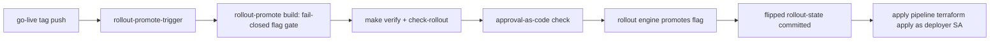

# infra/rollout — flag-gated rollout & deployment pipeline (issue #45)

**Owner lane:** `infra/rollout/**` (issue #45 · work item 41, EPIC-00 phase 8).
Consumes (read-only): `infra/feature-flags/registry.yaml` (#6), the
`infra/terraform` apply path (#6), `infra/cloudbuild/*` conventions (#6), and
the issue #43 merge-governance gate semantics (`governance/merge/`).

## Purpose

Every control-plane surface ships **behind a feature flag defaulting to OFF**
(AO-GR-6). This lane defines and runs the **rollout & deployment pipeline**
that promotes those flags:

- a **declarative stage model** — `off → canary → gradual → full` with
  percentages, conditions and promotion rules;
- a **promotion pipeline declared in IaC** (Cloud Build + the offline rollout
  engine) — promotion is only via that automated path, never a console click
  (AO-GR-5);
- a **per-phase go-live plan** mapping every Phase 0–8 surface to its flag;
- a **rollback path** — a failed canary/gradual health check auto-rolls the
  flag OFF and the IaC change is reverted; the flag never silently stays on;
- **audit** — every promotion and rollback is appended to a hash-chained
  promotion audit log that can be verified.

Rollout is **apply-autonomy, not merge-autonomy** (CMR ADR-0016): the deployer
service account applies already-reviewed configuration; the reviewed change
itself still lands as a PR → gate → merge.

## Files

| File | Purpose |
|------|---------|
| `stage-model.yaml` | Canonical stage vocabulary + promotion/rollback rules (data). |
| `go-live-plan.yaml` | Phase 0–8 surface → flag → go-live stage (declared intent). |
| `rollout-state.yaml` | Current promotion state; every flag OFF until promoted. |
| `model.py` | Pure domain: stages, adjacency, audience, gates, rollback decision. |
| `engine.py` | Promotion/rollback engine, approvals, hash-chained audit log. |
| `cli.py` | Offline CLI the Cloud Build pipeline invokes (`python3 -m infra.rollout.cli`). |
| `checks/check_rollout.py` | Honest offline gate (all checks can fail; `--self-test`). |
| `tests/` | Pytest suite (stage model, default-OFF, gate, gradual, rollback, audit, plan, gate). |

## Stage model

Closed vocabulary, strict forward promotion, no jumps:

| Stage | Exposure | Default | Requirements to enter |
|-------|----------|---------|-----------------------|
| `off` | none | 0% | — (birth state) |
| `canary` | targeted + 5% slice | 5% | verify-green (policy auto-approved) |
| `gradual` | percentage ramp | 10 → 25 → 50 → 100 | verify-green + canary-health-ok (policy auto-approved) |
| `full` | all tenants | 100% | verify-green + approval-code + canary-health-ok + gradual-complete |

Every transition requires **green verification evidence** (`make verify` /
merge-gate, GR-12). Low-risk hops (`off → canary`, `canary → gradual`) are
**auto-approved by policy** on green evidence (plus canary health for the
ramp) with no human approval code — the auto-approval is recorded in the
audit trail (who/when/why/which policy), never silent. The final promotion
(`gradual → full`) and the downstream apply remain **human-gated**: an
approval-as-code record from an approver distinct from the executing actor
(AO-GR-14; the issue #43 `merge_verdict` gate shape applied to rollout) is
still required. Promotions are **audit-logged**.

Audience exposure is **deterministic**: a subject is exposed only if it is
explicitly targeted or its stable hash bucket (`sha256(flag:subject) % 100`)
falls below the rollout percentage — so a canary slice is stable across
calls.

## Workbook surfaces — one flag per surface (issue #644, workbook-13)

The five surfaces workbook-11/12/5 added carry an in-module switch, a row in
`infra/feature-flags/registry.yaml` (`services.<name>`, lock-stepped with
`infra/terraform/variables.tf` by `scripts/check-feature-flags.py`) and a flag
here in `rollout-state.yaml` — all **OFF**. A flag is a promotion unit only
where the pipeline can reach it: the offline engine refuses a flag that
`rollout-state.yaml` does not carry (`unknown flag '<name>' (not declared in
rollout state)`), so a registry row without a state row would be a declaration
nobody could promote. Registered here, each flag travels the normal path
OFF → CANARY → GRADUAL → FULL with the same gates as every other flag.

| Flag | Surface it gates | In-module switch | Terraform variable | Enable criteria |
|------|------------------|------------------|--------------------|-----------------|
| `services.org_chart` | Org-chart view, `GET /api/orgchart/chart`, `GET /api/orgchart/health` (portal deployable) | `surfaces.org_chart` in `portal/config/feature-flags.yaml`, read by `portal/server/config_flags.py` | `enable_org_chart` | The workbook-1 org declaration and its bound cards are committed and render against the live role-health feed; a missing feed degrades to an explicit NO_DATA, never a fabricated chart; the portal suite is green; approval-as-code recorded for this flag and target stage. |
| `services.skill_studio` | Skill studio, `GET /api/skillstudio/skills[/<id>]`, `POST /api/skillstudio/author\|test\|publish` (portal deployable) | `surfaces.skill_studio` in `portal/config/feature-flags.yaml` | `enable_skill_studio` | The workbook-9 studio API is green on its own gates (a publish without green eval evidence is refused by the studio, not by this flag); at least one authored skill round-trips author → test → publish in evidence; approval-as-code recorded. |
| `services.task_board` | Tenant task board, `GET /api/taskboard/tickets[/<id>]` (portal deployable) | `surfaces.task_board` in `portal/config/feature-flags.yaml` | `enable_task_board` | The workbook-3 ticket runtime is green and the board is a replay of the durable log (an absent ticket is absent, not invented); per-tenant scoping is exercised in evidence; approval-as-code recorded. |
| `services.mcp_outbound` | Outbound MCP calls, `gateway/mcp/outbound.py` (gateway deployable) | `AO_MCP_OUTBOUND_ENABLED` (compiled OFF) | `enable_mcp_outbound` | Every server to be dialled is declared with `enabled: true`, an allow-listed endpoint and a reachability check; egress and DLP policy are reviewed (guardrails promoted or the policy gate in force); the caller's declared capability is enforced, not bypassed; approval-as-code recorded. |
| `services.sandbox_runtime` | Real sandbox runtime — docker / firecracker — over `guardrails/sandbox/` (guardrails deployable) | `SandboxEnablement` in `guardrails/sandbox/enablement.py` | `enable_sandbox_runtime` | The runtime's dependency is genuinely present in the target image (an unavailable runtime fails before the flag flips, never half-enabled); the enable/disable round-trip is proven; the per-category security profile is reviewed; approval-as-code recorded. |

Two properties hold for all five, and both are structural rather than promises:
the flags default OFF in every declaration that carries them (registry,
terraform, rollout state), and one flag can never widen more than its own
surface — `mcp_outbound` still needs the per-server `enabled` and the caller's
capability, `sandbox_runtime` still needs a runtime that exists, and the three
portal views are independent of each other and of `enable_portal`.

## The only promotion path (no console)



- `infra/cloudbuild/rollout-promote.yaml` and `rollout-rollback.yaml` are the
  declared pipelines; both are **fail-closed** (refuse to act while
  `_ENABLE_ROLLOUT != "true"`) and run as the deployer service account.
- The importable triggers (`rollout-promote-trigger.yaml`,
  `rollout-rollback-trigger.yaml`) ship **disabled: true** with
  `_ENABLE_ROLLOUT: "false"` (flag-gated OFF). `check-rollout.py` fails the
  gate if a rollout trigger ships enabled.
- The rollback trigger fires on a `canary-health-fail` pubsub message; the
  rollback pipeline flips the flag OFF and the apply pipeline reverts the
  deployment.

## Gate (this lane)

```bash
python3 infra/rollout/checks/check_rollout.py            # exit 0 = valid
python3 infra/rollout/checks/check_rollout.py --self-test # negative probes
pytest infra/rollout/tests -p no:cacheprovider            # this suite
python3 -m infra.rollout.cli demo                         # E2E offline demo
```

The check is not wired into `scripts/verify.sh` (that file and `Makefile` are
other lanes' assets); run it as part of this lane's verification and the
go-live gate. `make verify` (the repo gate) stays green because every YAML
here parses, every flag defaults OFF, and the rollout Cloud Build declarations
follow the #6 conventions.

## How to promote a real flag (go-live)

1. **Record an approval-as-code file** for the exact flag and target stage,
   granted by a distinct approver:
   ```bash
   python3 -m infra.rollout.cli grant-approval services.registry \
     --to canary --approver auditor-sme --approval-id ao-2026-09-08-registry-canary \
     --approvals-dir infra/rollout/approvals
   ```
2. **Open the promotion** as a reviewed change: import the promote trigger
   with `disabled: false`, set `_ENABLE_ROLLOUT: "true"` for the build, and
   push the go-live tag. The pipeline fails closed unless the rollout flag is
   on.
3. The pipeline runs `check_rollout.py` + `make verify`, validates the
   approval (flag, target stage, distinct approver), then the engine promotes
   the flag in `rollout-state.yaml` (audit-logged) and the apply pipeline
   deploys.
4. **Observe the canary.** Record health:
   ```bash
   python3 -m infra.rollout.cli canary services.registry --health-ok true
   ```
   A failed check auto-rolls the flag OFF:
   ```bash
   python3 -m infra.rollout.cli canary services.registry --health-ok false
   ```
5. **Ramp and complete** once the canary is green, one gated step at a time
   (each with its own approval + audit record).

The offline `demo` subcommand runs the whole loop (promote → canary-fail →
auto rollback to off) against a temporary audit log and asserts the audit
chain verifies.

## Provenance (cannibalized / adapted — GR-10)

| Asset | Source (repo · path) | License |
|-------|----------------------|---------|
| Flag model shape (enabled + rollout pct + targeted users, consistent-hash rollout) | `defragsuite` · `pkg/defrag/feature_flags.go` (stub — concept adapted) | repo-internal (fleet) |
| Canary state machine (register → promote → rollback, deterministic sha256 gating, audit hook) | `leaderboard` · `scripts/deploy/canary-deploy.sh` | repo-internal (fleet) |
| Flag-gated OFF default (GR-28), no-console doctrine (GR-2), apply-autonomy vs merge-autonomy, deployer identity | `CMR` · `GOLDEN-RULES.md`, `docs/decision-records/ADR-0016-autonomous-infra-apply.md` | repo-internal (fleet) |
| Multi-tenant SaaS GCP module blueprint (reference) | `saas-rbac` · `infra/terraform/modules/*` | repo-internal (fleet) |
| Infra/apply conventions (read) | `shared-services` · `infra/` | repo-internal (fleet) |
| Gate semantics: green verify + distinct approver (`merge_verdict`) | `agent-orchestrator` · `governance/merge/model.py` (issue #43, in-repo) | repo-internal |
| Append-only hash-chained event log pattern | `agent-orchestrator` · `registry/packs/pack_events.py` (in-repo) | repo-internal |
| Read-only flag registry consumed (not redefined) | `agent-orchestrator` · `infra/feature-flags/registry.yaml` (issue #6, in-repo) | repo-internal |

The in-repo CANNIBALIZATION.md index is issue #8's closed artifact and is not
edited by this lane; provenance is recorded here instead.
