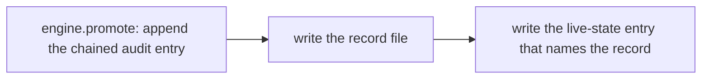

# `infra/rollout/audit/` — the promotion evidence directory (issue #619)

Every promotion writes a record HERE, before it writes the live-state entry that
names it. The directory has exactly two kinds of artefact:

| Artefact | Written by | What it is |
|---|---|---|
| `<flag>-<from>-<to>-s<seq>-<stamp>.md` | `infra/rollout/cli.py promote --live-state-out` and `infra/rollout/go_live.py` | ONE transition's evidence: the command that produced it and what the engine reported. |
| `promotion-audit.jsonl` | the same two paths, via `--audit-log` | The append-only, sha-256 hash-chained log; one JSON object per transition, each chaining to its predecessor. |

## The rule: a record is EVIDENCE, not a claim

A record carries the *command* and the *result*, because those are the two
things a reader can independently re-check:

* the **command** — the exact invocation (`python3 infra/rollout/go_live.py …`,
  or the `cli.py promote …` line the Cloud Build pipeline runs), so the
  transition can be reproduced;
* the **result** — the audit-log line (`seq` and `hash`) it produced. That
  line is machine-checkable: `AuditLog.verify` recomputes the whole chain and
  returns False on any edit, reorder or truncation.

A record that says "promoted" without a verifiable line is a claim, and the
gate treats the absence of a record as a failure rather than a formality:
`infra/rollout/checks/check_rollout.py` (`check_live_state`) resolves every
live-state entry's `audit_record` to a real file on disk, so a promoted flag
with no trail reddens `make verify`.

## Who writes what, and in what order



The order is load-bearing. `check_live_state` requires the referenced file to
EXIST, so writing live-state first would leave a window in which the committed
evidence is a dangling reference. Both writers (`cli.py promote`, `go_live.py`)
therefore fix the record path before the transition runs, write the file
immediately after the transition, and only then persist live-state.

## Naming, and why the sequence number is in it

`<flag>-<from>-<to>-s<seq>-<stamp>.md`, e.g.
`services-registry-off-canary-s0007-20260916T171500Z.md`.

The audit-log sequence number is part of the name so a name is unique per
appended record — two transitions in the same second still get distinct files,
and a flag that is rolled back and later re-promoted does not overwrite the
first attempt's evidence.

## Never delete a record

Records are append-only in exactly the sense `promotion-audit.jsonl` is. A
deleted record is a broken chain at best and a dangling live-state reference at
worst — `rollback` simply stops naming the flag (its live-state row is omitted),
so the historical records of a withdrawn promotion stay on disk as the record
of what was live and when.

## Verifying, offline

```bash
python3 infra/rollout/checks/check_rollout.py            # every live-state entry resolves
python3 infra/rollout/go_live.py --preflight             # the same, plus the run's own readiness
python3 -c "from infra.rollout.engine import AuditLog; \
  print(AuditLog('infra/rollout/audit/promotion-audit.jsonl').verify())"
```

The last one prints `True` for an intact chain. It is the check a reader
should run before trusting any `.md` record in this directory.
