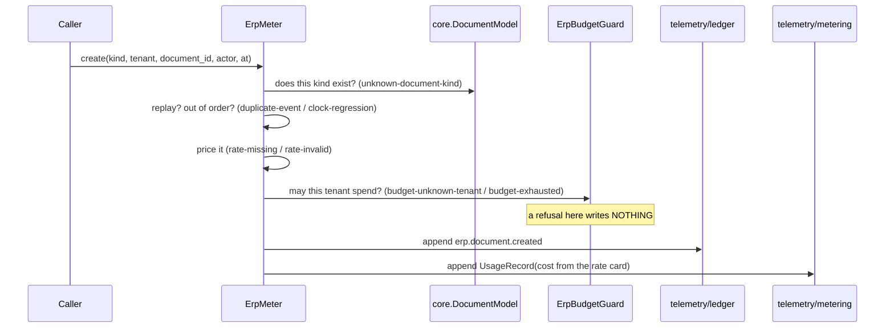

# `integrations/erp/finops/` — FinOps metering and usage telemetry for ERP

The ERP module's **FinOps/observability lane** (issue
[#654](https://github.com/kushin77/agent-orchestrator/issues/654), EPIC
[#645](https://github.com/kushin77/agent-orchestrator/issues/645)): the module is
**billable, not free**. Every document creation and every state transition an ERP
tenant performs is metered onto the platform's audit chain and usage feed, rolled
up per tenant with a cost, and **stopped** — by name, before anything is written —
when the tenant reaches its budget.

## The three acceptance criteria, and where each one lives

| Criterion | What it means here | Where |
|---|---|---|
| **1.** Every document create/transition emits a ledger record | One path writes: `ErpMeter.create` / `ErpMeter.transition`, through `telemetry/ledger`'s public API | [`meter.py`](meter.py), [`ledger.py`](ledger.py) |
| **2.** A per-tenant usage + cost roll-up, and a deterministic hard stop | `ErpRollup` publishes the figures; `ErpBudgetGuard` refuses `budget-exhausted` *before* either sink is written | [`rollup.py`](rollup.py), [`budget.py`](budget.py) |
| **3.** No telemetry file is edited | The pillars are consumed through their public APIs only; the check hashes every tracked file under `telemetry/` before and after a full metered run | [`usage.py`](usage.py), [`cli.py`](cli.py) |

## What is metered, and how

An ERP operation is metered as a **platform usage record**
(`telemetry.metering.model.UsageRecord`) with `provider="erp"`, `model=<document
kind>` and `route=<create|transition>`, priced from this lane's rate card. An ERP
document operation consumes no model tokens, so `input_tokens`/`output_tokens` are
zero — which is the honest figure, not a missing one.

Choosing the platform's vocabulary over a table of this lane's own is what makes
ERP spend visible to everything the platform already does: the per-tenant /
per-model attribution, the chargeback report (`telemetry.budgets.chargeback`) and
the budget enforcer all read ERP usage with **no change to those lanes**. This
lane publishes no second cost model.



The order is the point. The budget guard runs **before** the audit append and
before the usage append, so a stopped operation leaves no ledger record, no usage
record and no cost — a stop, not a flag. `cli.py check` measures exactly that: it
counts both sinks after a refused operation and requires the count to equal the
number of operations that were allowed.

## The rate card is a declaration, and coverage is measured

[`catalog/rate-card.json`](catalog/rate-card.json) prices every operation this
lane meters. Two rules make it more than a table:

* **there is no wildcard.** Every document kind the *live* core model
  (`integrations/erp/core`, ERP-02) declares must have an explicit `create`
  entry, and every kind that declares a lifecycle must have a `transition` entry.
  `RateCard.coverage` reports the gaps and `cli.py check` runs it against the
  live model — so a document kind added upstream is a **measured** gap here, not
  an unpriced operation discovered on a bill. A `transition` rate for a master
  document (which has no lifecycle) is a finding in the other direction.
* **"unpriced" is a declaration, not an omission.** An entry may say
  `priced: false`, meaning *this operation is metered and this lane publishes no
  price for it*. It is then recorded with `metered: false` and `cost_usd: null`
  (never `0`), and `ErpRollup.bill` **refuses** to produce a cost for that
  tenant-month. An entry that is simply **absent** is a different fact and is
  refused outright (`rate-missing`). Silence is not a price.

## The budget ladder is the platform's, and the stop is this lane's

`ErpBudgetGuard` constructs the platform's own
`telemetry.budgets.budget.TenantBudgetPolicy` objects from
[`catalog/budgets.json`](catalog/budgets.json) and asks the platform's
`BudgetEnforcer` for a decision over a `MeteringReporterLedger` pointed at *this
lane's* usage feed — so the figure the budget is checked against and the figure
the roll-up publishes cannot drift. The ladder (`allow / warn / would_warn /
would_block / block`) and the soft-vs-hard cap distinction are the platform's,
not a re-implementation.

One thing is added, and it is a policy decision rather than a mechanism: the
platform treats a tenant with **no** policy as unlimited, which is right for a
model gateway. ERP operations are billable by definition, so an undeclared tenant
is refused (`budget-unknown-tenant`) rather than metered for free. The policy is
the declaration that a tenant *may* spend.

## The No-Data rule

A tenant with no ERP records gets **no row**, not a row of zeros.
`ErpRollup.for_tenant` returns `None`, and `bill` refuses rather than presenting
an unmeasured `0.00`. This is the platform's own NO_DATA discipline
(`SpendLedger.has_data`, issue #341): a ledger that has never seen a record cannot
distinguish "no spend" from "not metered".

## Running it

```bash
python3 -m pytest integrations/erp/finops/tests -q      # the suite
bash scripts/check-erp-finops.sh                        # the gate (suite + check + tripwire)
python3 -m integrations.erp.finops.cli check            # the lane's own tri-state check
python3 -m integrations.erp.finops.cli demo             # a golden-path transcript, as JSON
python3 -m integrations.erp.finops.cli rollup           # the per-tenant usage/cost roll-up
python3 -m integrations.erp.finops.cli rates            # the validated rate card
python3 -m integrations.erp.finops.cli budgets          # the validated budget policies
python3 -m integrations.erp.finops.cli provenance       # the validated harvest record
python3 -m integrations.erp.finops.negative_control     # provoke every refusal
```

The CLI follows the repository's tri-state contract: `0` OK, `1` NOT-OK,
`2` CANNOT-ASSESS (a declaration that will not load is never a pass).

## Every refusal is provoked, and the proof is proved

[`negative_control.py`](negative_control.py) provokes **all 23** codes of the
closed refusal vocabulary and fails when the provoked set and the vocabulary
diverge — so a refusal added without a control fails the driver, and through
`cli.py check` the gate, instead of shipping unproven. Each provocation also
declares the substring its refusal must contain, so "something was refused" is not
accepted in place of "the tenant was refused, by name, for reaching its budget".

`scripts/check-erp-finops.sh` then requires the driver to go **red** against a
copied tree whose hard stop has been removed — and requires the *unmutated* copy
to be green first, so a red mutant is the mutation rather than a broken copy. A
driver that cannot fail proves nothing about the controls it reports.

## Lane boundary (why this package is self-contained)

This package **consumes** three lanes and owns none of their files:

* `integrations/erp/core` (ERP-02, #647) — the document model. The meter refuses
  a kind the model does not declare (`unknown-document-kind`) and resolves a
  transition through the model's own `next_state`, so legality is owned by the
  lane that owns the state machine.
* `telemetry/ledger` (#31) and `telemetry/metering` (#33) — the sinks, through
  their public APIs (`open_ledger`, `LedgerStore.append`, `verify_ledger`;
  `UsageStore.append`, `UsageRecord`, `UsageReporter`). Never through their
  files: acceptance criterion 3 of the issue.
* `telemetry/budgets` (#34) — the enforcement ladder and the decision object.

The one shape this lane declares for itself is the **price list**, and it is
declared locally under [`catalog/`](catalog) rather than added to the module
manifest: a rate is this lane's fact about the module, not a fact *of* the module.
Hand-offs are therefore named rather than assumed — the REST surface is ERP-06
(#651), the portal mount is ERP-07 (#652), and the transactional spine is
ERP-03 (#648); this lane ships metering, not a live surface, and serves nothing
itself.

## Harvest provenance (GR-10)

ERPNext is **GPL-3.0** and is a **pattern source only**; two sibling modules in
this repository are credited with the same record. No upstream code is copied,
vendored or translated. The harvested shapes, and what was built instead, are
recorded in [`PROVENANCE.md`](PROVENANCE.md) and enforced mechanically in
[`catalog/provenance.json`](catalog/provenance.json) — `provenance.load` refuses a
record that claims copied code (`provenance-code-copied`) and refuses an empty
record too (`provenance-empty`), so a lane cannot harvest by recording nothing.

## Layout

| Path | Role |
|---|---|
| [`model.py`](model.py) | the closed vocabulary: operations, event names, refusal codes, `MeteredEvent` |
| [`schema.py`](schema.py) | the stdlib JSON-Schema subset validator and its keyword freeze |
| [`rates.py`](rates.py) | the price list, its lookups, and the coverage rule |
| [`ledger.py`](ledger.py) | the audit sink over `telemetry/ledger` |
| [`usage.py`](usage.py) | the usage sink over `telemetry/metering`, and the emitted-event shape guard |
| [`budget.py`](budget.py) | the pre-operation budget hook over `telemetry/budgets` |
| [`rollup.py`](rollup.py) | per-tenant ERP usage and cost, the NO-DATA rule, and chain certification |
| [`provenance.py`](provenance.py) | the GR-10 harvest record and its enforcement |
| [`meter.py`](meter.py) | the one path by which an ERP document operation is metered |
| [`harness.py`](harness.py) | the deterministic offline workspace and the surface enumeration |
| [`cli.py`](cli.py) | `check` / `demo` / `rollup` / `rates` / `budgets` / `provenance`, tri-state |
| [`negative_control.py`](negative_control.py) | one provocation per refusal, coverage computed |
| [`schema/`](schema) | the frozen JSON Schemas (rate card, budget policy, harvest record, metered event) |
| [`catalog/`](catalog) | the shipped rate card, budget policies and harvest record |
| [`tests/`](tests) | the suite, including the tripwire's in-process twin |
