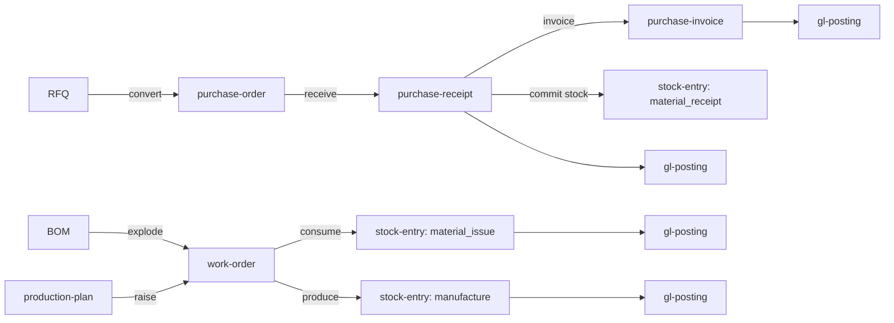

# `integrations/erp/ops/` — procurement and manufacturing

The ERP module's **procurement + manufacturing** lane (issue
[#649](https://github.com/kushin77/agent-orchestrator/issues/649), EPIC
[#645](https://github.com/kushin77/agent-orchestrator/issues/645)): the
supplier-side buying cycle and the production cycle, over the core document
model ERP-02 landed. The feature-by-feature contract this lane builds against is
[`docs/ERP-MODULE-GAP-ANALYSIS.md`](../../../docs/ERP-MODULE-GAP-ANALYSIS.md)
(rows 2, 5 and 6).

## The surface

Six families this lane declares, and six it consumes from ERP-02:

| Family | Kind | Source | The machine it runs |
|---|---|---|---|
| Buying | `rfq` | **this lane** | `draft → submitted → completed`, or `→ cancelled` |
| Buying | `purchase-order` | ERP-02 (`../core`) | `draft → submitted → completed`, or `→ cancelled` |
| Buying | `purchase-receipt` | ERP-02 (`../core`) | `draft → submitted → completed`, or `→ cancelled` |
| Buying | `purchase-invoice` | **this lane** | `draft → submitted → completed` (Paid), or `→ cancelled` |
| Buying | `subcontracting-note` | **this lane** | `draft → submitted → completed` (Returned), or `→ cancelled` |
| Production | `bom` | **this lane** | `draft → submitted` (Active) `→ cancelled` (Withdrawn) |
| Production | `work-order` | **this lane** | `draft → submitted → completed`, or `→ cancelled` |
| Production | `production-plan` | **this lane** | `draft → submitted → completed` (Raised), or `→ cancelled` |
| Stock | `stock-entry` | ERP-02 (`../core`) | posted by this lane, validated by ERP-02 |
| Accounting | `gl-posting` | ERP-02 (`../core`) | posted by this lane, validated by ERP-02 |
| Master | `item`, `party` | ERP-02 (`../core`) | the masters every line and every party links to |



## The flows

| Flow | What it does | What it refuses, by name |
|---|---|---|
| `raise_rfq` → `convert_rfq` | An invitation to quote becomes a purchase order at the quoted rates; the RFQ closes on the same call | `already-converted`, `rfq-not-submitted`, `missing-field` (an unpriced line), `unknown-supplier`, `unknown-item` |
| `receive_order` | Goods arrive: the receipt commits stock and posts the ledger row | `receipt-without-order`, `purchase-order-not-submitted`, `over-receipt`, `insufficient-stock` |
| `invoice_order` | The bill is raised against the receipt it settles and posts the payable | `receipt-without-order` (an invoice that cites no receipt of that order) |
| `define_bom` / `activate_bom` | A bill of materials is written, then put into force | `unknown-item`, `bom-not-submitted` |
| `explode` | The leaf components a quantity needs — a pure walk, expanding sub-assemblies | `bom-cycle`, `bom-not-submitted`, `invalid-value` |
| `plan_production` / `run_plan` | A decided plan is raised, one work order per entry | `unknown-bom` (no active bill for an entry) |
| `complete_work_order` | Components leave, output arrives, two ledger rows post — **once** | `work-order-already-completed`, `work-order-not-submitted`, `bom-item-mismatch`, `insufficient-stock`, `unknown-work-order` |

Reads are pure and writes are audited: `explode` and `run_plan`'s planning half
change nothing, so a board can be rendered without touching a warehouse; the
completion is the explicit write that moves stock and posts to the ledger.

## The four properties the lane is built on

1. **It consumes ERP-02 rather than re-declaring it.** The families the buying
   cycle moves are validated by `../core`'s own model, and the shared field
   definitions this lane's schemas compose from are `$ref`'d out of
   `../core/schemas/document.schema.json`. `integrations/erp/core` landed before
   this lane, so there is no local copy of it to drift.
2. **The stock effect of a purpose is data.** `catalog/ops-catalog.json` says
   which warehouse each purpose moves and which way, and which warehouses it
   must *name* — two tables, because a manufacture adds only the produced item
   yet core's stock-entry schema still requires its source warehouse.
   `ledger.apply_stock` walks the first table, `build_stock_entry` emits the
   second, and neither has a special case per purpose.
3. **The ledger is ERP-02's verdict, not this lane's opinion.**
   `ledger.build_gl_posting` renders the catalogue's account lines and hands the
   result to the core model, whose declared family rule refuses a posting whose
   debits do not equal its credits. The golden path additionally ties out to zero
   across every account, which `cli.py check` measures rather than asserts.
4. **Every refusal is provoked.** [`negative_control.py`](negative_control.py)
   provokes all of the closed vocabulary and reports when the provoked set and
   the vocabulary diverge. `scripts/check-erp-ops.sh` then requires the driver to
   go **non-zero, naming the removed rule**, against a mutant with the
   receipt-without-order check disabled — a driver that cannot fail proves
   nothing about the controls it reports.

## Lane boundary

This lane owns `integrations/erp/ops/**` and `scripts/check-erp-ops.sh`, and
nothing else. Two hand-offs are named rather than silently assumed:

* **The REST surface** is ERP-06 (#651), **the portal mount** is ERP-07 (#652),
  **metering** is ERP-09 (#654) and **the module skeleton and catalogue** are
  ERP-01 (#646). This lane ships documents, flows and postings, and declares the
  flag it belongs to — `erp-module`, declared OFF in
  [`module.yaml`](../module.yaml) — and serves nothing itself.
* **The declaration set is local, and its seam is named.** `catalog/ops-catalog.json`
  is this lane's own store of its posting rules and vocabularies, reachable only
  through `catalog.load`. The indexer-fed catalogue of EPIC #645 replaces it as a
  change of *source*, not of code.

## Harvest provenance (GR-10)

Upstream `frappe/erpnext` is **GPL-3.0** and is a **pattern source only**. No
upstream code is copied, vendored or translated. The harvested shapes are
recorded in [`PROVENANCE.md`](PROVENANCE.md) and enforced mechanically in
[`provenance.json`](provenance.json) (per schema, read by ERP-02's own asset
gate as well as this lane's) — `provenance.enforce_harvest` refuses a record that
is empty or names no upstream doctype, and `provenance.enforce_catalogue` refuses
one that claims copied code.

## Running it

```bash
python3 -m pytest integrations/erp/ops/tests -q     # the suite
bash scripts/check-erp-ops.sh                       # the gate (suite + check + mutant)
python3 -m integrations.erp.ops.cli check           # declarations, postings, golden path, controls
python3 -m integrations.erp.ops.cli demo            # the golden-path transcript, as JSON
python3 -m integrations.erp.ops.cli definitions     # the validated declaration set
python3 -m integrations.erp.ops.negative_control    # provoke every refusal
```

The CLI follows the repository's tri-state contract: `0` OK, `1` NOT-OK,
`2` CANNOT-ASSESS (a declaration or harvest record that will not load is never a
pass).

## Layout

| Path | Role |
|---|---|
| [`model.py`](model.py) | the composite model: ERP-02's families plus this lane's, and the closed vocabularies |
| [`catalog.py`](catalog.py) | the declaration set, its frozen schema and its keyword freeze |
| [`documents.py`](documents.py) | envelope parsing: the checks that name *which* field is wrong |
| [`workflow.py`](workflow.py) | ERP-02's state machine, this lane's audit rail |
| [`audit.py`](audit.py) | the append-only, hash-chained rail |
| [`ledger.py`](ledger.py) | stock effects by purpose, and the ledger rows a family posts |
| [`procurement.py`](procurement.py) | RFQ → order → receipt → invoice |
| [`manufacturing.py`](manufacturing.py) | BOM explosion, work orders, production plans |
| [`workspace.py`](workspace.py) | the store, the stock ledger and the rail |
| [`flows.py`](flows.py) | the deterministic clock, the golden path and the transcript |
| [`cli.py`](cli.py) | `check` / `demo` / `definitions`, tri-state |
| [`negative_control.py`](negative_control.py) | one provocation per refusal, coverage computed |
| [`schemas/`](schemas) | the six declared families, `$ref`-ing ERP-02's shared definitions |
| [`workflows/`](workflows) | each declared lifecycle, as data |
| [`catalog/`](catalog) | the local declaration set and the harvest record |
| [`tests/`](tests) | the suite, with a refusal asserted by code rather than by prose |
