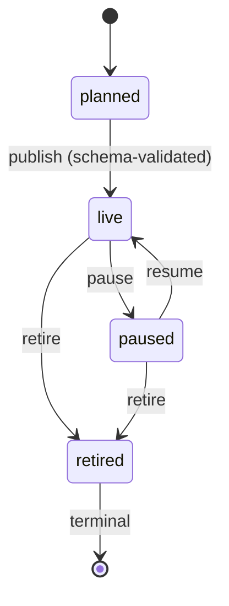
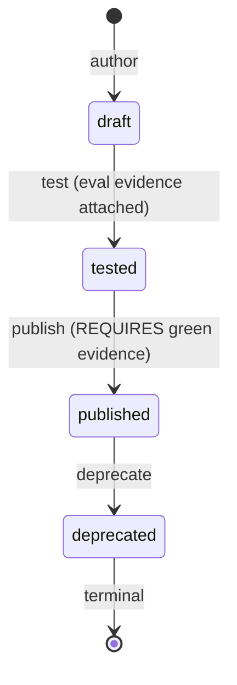

# AgentPack registry + catalog — signed, versioned capability bundles (registry/packs)

> Owner lane: **registry** (issue #40, work item 38, phase 7). Parent: EPIC-00
> (issue #4). Doctrine: [`AGENTS.md`](../../AGENTS.md),
> [`docs/EXECUTION-PLAN.md`](../../docs/EXECUTION-PLAN.md),
> [`docs/ARCHITECTURE.md`](../../docs/ARCHITECTURE.md),
> [`docs/GOLDEN-RULES.md`](../../docs/GOLDEN-RULES.md).

This tree is the **module registry for agent capabilities**: versioned,
**attestation-signed** packs that bundle registry artifacts
(profile + personas + prompts + policy + tool manifests) into one installable
unit, with a registry lifecycle (`planned -> live -> paused -> retired`),
schema-validated publish, append-only events, a searchable catalog with
crossref + consumption tracking, and a tenant install/upgrade path with drift
detection + rollback. It is the Phase-7 pack surface that the Phase-8 sync
engine (issue #44) will drive on a schedule (seam below).

## The contract at a glance

A pack is one immutable, schema-validated, publisher-attested document
(`agent-pack/schema v1`). Field vocabulary is **consumed**, never redefined:
profile/persona/prompt ids come from the sibling lanes
([`../profiles/README.md`](../profiles/README.md),
[`../personas/README.md`](../personas/README.md),
[`../prompts/README.md`](../prompts/README.md)); policy + tool ids come from
[`../../guardrails/policy/README.md`](../../guardrails/policy/README.md) and
[`../../identity/rbac/README.md`](../../identity/rbac/README.md). The closed
pack-level vocabulary (categories, artifact types, lifecycle states) lives in
[`pack-catalog.yaml`](pack-catalog.yaml) and is mirrored in
[`agent-pack.schema.json`](agent-pack.schema.json) definitions enums —
[`validate.py`](validate.py) runs a schema<->catalog parity gate so the two
can never drift.

| Field | Type | Meaning |
|---|---|---|
| `schema` | const `agent-pack/v1` | Pack schema version identity (evolves by new identity, never silently). |
| `id` | string | Stable kebab-case pack id, `^[a-z][a-z0-9-]*$` (e.g. `worker-platform`). |
| `version` | string | SemVer `X.Y.Z` of this snapshot. A published `(id, version)` is immutable (sha256-locked ledger). |
| `name` | string | Catalog display name. |
| `category` | closed enum | Catalog grouping (coding/data/orchestration/review/research/security/integration). |
| `upstream` | URI | Source repository (provenance). |
| `publisher` | `namespace/team` | Accountable publisher (profile `owner` semantic). |
| `lifecycle` | `planned|live|paused|retired` | State of this pack snapshot in the registry. |
| `description`, `tags` | string, string[] | Catalog search surface. |
| `dependencies` | `[{id, version}]` | Pack-to-pack pins (catalog crossref source). |
| `contents` | object | Contents manifest: bundled artifacts grouped by closed artifact type (`profile`/`persona`/`prompt`/`policy`/`tool`/`skill`); each entry is `{ref, data, sha256}` — self-contained base64 `data` with a pinned `sha256` so install + drift detection are mechanical and offline. A `skill` entry carries its own identity + `evalEvidence` (see below). |
| `attestation` | object | Publisher signature (`kid`, `alg: PS256`, `signedAt`, `signature`) over the pack's canonical JSON (every field except `signature`). |

## Tree layout

```text
registry/packs/
├── README.md                  # this file — the contract doc
├── agent-pack.schema.json     # AgentPack JSON Schema (draft-07), closed vocab
├── pack-catalog.yaml          # closed pack vocabulary (categories/artifact types)
├── pack-event.schema.json     # one pack registry event record (the log shape)
├── publisher-key.pem          # PUBLIC signing key (kid ao-pack-publisher-v1)
├── attestation.py             # PS256 sign/verify; fail-closed without cryptography
├── pack_events.py             # append-only hash-chained pack event log
├── registry.py                # PackRegistry: publish + lifecycle + catalog + consumption
├── skills.py                  # Skill Studio: skill artifacts, eval-gated publish, skill-level ops (#640)
├── installer.py               # tenant install/upgrade: signature + drift + rollback (#44 seam)
├── validate.py                # offline gate: releases + ledger + parity + attestation + self-test
├── releases/                  # published immutable pack snapshots (signed)
│   ├── PROVENANCE.md          # provenance table for every release + harvested vocab
│   └── <id>.<version>.yaml    # e.g. worker-platform.1.0.0.yaml
├── versions/
│   └── manifest.yaml          # published-version ledger (sha256-locked, immutable)
└── tests/
    ├── packhelpers.py         # shared builders (not a conftest)
    ├── fixtures/              # deliberately broken packs (self-test must reject each)
    ├── test_attestation.py    # signing/verification + fail-closed negatives
    ├── test_registry.py       # publish + lifecycle + catalog/crossref + consumption
    ├── test_installer.py      # install/upgrade/drift/rollback negatives + sync seam
    ├── test_skills.py         # Skill Studio: eval-gated publish + skill-level rollback (#640)
    └── test_validate.py       # coverage + ledger tamper negatives + self-test
```

## Lifecycle + append-only events

Registry lifecycle states are `planned -> live -> paused -> retired`:



`PackRegistry.publish` **schema-validates the pack first — an invalid pack
fails publish** (negative-tested). `pause`/`resume`/`retire` refuse illegal or
terminal transitions. Only `live` packs are installable.

Every mutating call appends to the append-only, hash-chained event log
(`pack_events.py`, shape in [`pack-event.schema.json`](pack-event.schema.json);
pattern consumed from the repo's agent audit log
[`../events/README.md`](../events/README.md)):

| event | conventional `status` | meaning |
|---|---|---|
| `plan` | `planned` | pack version entered the registry |
| `publish` | `live` | planned -> live transition |
| `pause` | `paused` | live -> paused |
| `resume` | `live` | paused -> live |
| `retire` | `retired` | -> retired (terminal) |
| `install` | `installed` / `failed` | tenant installed a version |
| `upgrade` | `upgraded` / `failed` | tenant moved to a newer version |
| `rollback` | `rolled_back` | upgrade failure / drift restored the previous version |
| `drift` | `detected` | installed content drifted from the manifest |
| `consume` | `consumed` | catalog consumption recorded |

The log is tamper-evident by construction (hash chain + append-only), exactly
like the issue-#10 agent audit log: a malformed line or broken chain raises
`PackEventIntegrityError` on load, and trailing truncation is detected by
re-verifying against a captured `state()`.

## Signed attestation (consumer trust)

Each release snapshot is signed by the publisher (`attestation.py`, RSA-PSS /
SHA-256, `alg: PS256`). The **public** key is committed at
[`publisher-key.pem`](publisher-key.pem); the private key is injected at
publish time and never committed (GR-6). Verification points:

- `validate.py` refuses a release whose attestation does not verify against
  the public key.
- `installer.py` refuses to install a pack whose signature is **missing or
  does not verify** (`PackSignatureError`; negative-tested).
- If the `cryptography` library is unavailable, signing and verification
  **fail closed** — a pack is never trusted because a verifier went missing
  (no-false-green).

## Catalog: search, crossref, consumption

`PackRegistry` provides the catalog surface:

- `search(category=…, text=…, upstream=…)` / `live_packs()` — catalog rows for
  live packs (paused/retired packs are excluded from search).
- `crossref(pack_id)` — dependencies a pack declares and dependents that pin
  it (CMR catalog crossref model).
- Consumption tracking — `record_install(tenant_id, pack, version)` records
  who installed which pack/version; `consumption(pack_id)`,
  `consumption_by_tenant(tenant_id)`, `active_version`, `previous_version`
  back the drift/rollback logic and answer "who installed what".

## Tenant install/upgrade path with drift detection + rollback

[`installer.py`](installer.py) is the offline install engine:

1. **Signature gate** — attestation verifies (consumer trust) or install
   fails.
2. **Lifecycle gate** — only `live` packs install.
3. **Materialize + verify** — every contents-manifest artifact is written
   under `<root>/<pack>/<version>/<type>/<ref>` and re-hashed against the
   manifest sha256. A missing file or hash mismatch is content drift and fails
   the install.
4. **Post-install drift** — `verify_installed` re-hashes the tree later; a
   tampered artifact is detected (`ContentDriftError`, negative-tested).
5. **Upgrade + rollback** — `upgrade` installs the new version; on ANY failure
   (signature, drift, registry, io) the previous version is restored and stays
   active, a `rollback` event is appended, and `UpgradeRollbackError` (with
   the reason) is raised. `rollback` is also exposed directly
   (negative-tested).

### Phase-8 sync-engine seam (#44)

The sync engine is the scheduled reconciler that keeps each tenant at a
desired pack set (phase 8, issue #44). This tree owns the primitives;
`Installer.sync_plan(tenant_id, desired)` returns the declarative action list
(`install` / `upgrade` / `rollback` / `noop` + target version + detail) the
#44 engine consumes on each reconcile tick. The engine itself (scheduling,
reconciliation policy, drift re-check cadence) is out of scope here and will
land with issue #44, driving this contract.

## Skill Studio: skill-level pack granularity (#640, workbook-9)

A pack bundles a *set* of artifacts. A **skill** is the narrower unit: one
authored capability with its own identity, its own SemVer and its own
lifecycle, which a tenant installs, upgrades and rolls back **on its own**
without disturbing the pack's other artifacts.

[`skills.py`](skills.py) owns that dimension (`SkillStudio`). A skill is a
first-class pack artifact type — it has its own slot in `contents` and its own
closed category vocabulary in [`pack-catalog.yaml`](pack-catalog.yaml)
(`skillCategories`), which is what makes the catalog searchable by skill.

### The skill artifact

A `contents.skill` entry carries its own metadata on top of the shared
`{ref, data, sha256}` shape:

| Field | Meaning |
|---|---|
| `skillId` | Stable kebab-case skill id, independent of the owning pack. |
| `skillVersion` | SemVer of this skill revision. Skill-level ops key on `(skillId, skillVersion)`. |
| `skillCategory` | Closed Skill Studio category (the catalog's skill search facet). |
| `skillLifecycle` | `draft` -> `tested` -> `published` -> `deprecated`. |
| `evalEvidence` | **Mandatory** regression-eval evidence (see below). |

### Author -> test -> publish, and why publish cannot be faked



`publish` **requires eval evidence**, and the evidence is not trusted on its
word: the verdict is the workbook-8 harness's own. The gate refuses publish
when the skill

- has **no evidence** (never tested),
- has evidence with **zero cases** (UNEVALUATED — an unevaluated skill is
  never publishable), or
- has evidence with **any failing case**,

and it then re-derives the verdict through
[`../prompts/evals.py`](../prompts/evals.py)::`require_ok` over the skill's own
eval id, so a hand-written "green" block that no harness produced is still
refused. The eval harness is **consumed, never reimplemented** — a skill's
cases live in a cases file shaped exactly like the workbook-8 one, and the
harness's own `EvalCase.prompt_id` is the join key. The gate **fails closed**:
if the harness cannot be imported, publish is refused rather than allowed with
the gate silently absent.

`validate.py` enforces the same evidence rule **code-natively** over every
`contents.skill` entry in a release, so an unevaluated or failing skill cannot
ship inside a pack even if it never went through `SkillStudio`. The parity gate
extends to the skill vocabulary (`skillCategories`, `skillLifecycleStates`), so
schema and catalog cannot drift.

### Skill-level install / upgrade / rollback + search

- `search_skills(category=…, text=…, published_only=…)` — the catalog browsed
  **by skill**; `catalog_by_skill()` projects a pack's bundled skills into
  skill rows, and `skill_categories()` exposes the closed facet.
- `install(tenant, skillId, version)` — only a `published` skill installs, and
  only when a signed pack bundles it: the signature, content-rehash, drift and
  rollback engine is the pack [`Installer`](installer.py)'s, never a parallel
  implementation. The skill materializes into its **own**
  `skills/<skillId>/<skillVersion>/` tree, so a skill-level upgrade never
  touches the pack's sibling artifacts.
- `upgrade(...)` / `rollback(tenant, skillId)` — rollback restores the
  previous skill version (content re-materialized from that revision's pinned
  sha256, active pointer repointed, `rollback` event appended).
- `verify_installed(tenant, skillId)` — post-install drift detection for the
  skill's own tree.

```bash
python3 -m pytest registry/packs/tests -q     # includes the Skill Studio suite
```

## Validation

```bash
python3 registry/packs/validate.py                    # releases + ledger + parity + attestation -> exit 0
python3 registry/packs/validate.py --self-test        # above + every tests/fixtures/* must FAIL -> exit 0
python3 registry/packs/validate.py releases/worker-platform.1.0.0.yaml  # one release
python3 -m pytest registry/packs/tests -q             # pytest suite (offline)
```

Exit codes: `0` all good; `1` invalid (pack, fixture accepted, parity drift,
ledger inconsistency, or a release attestation that does not verify); `2`
usage error. `make verify` stays the repo gate of record; this validator is
its own honest, offline check with real exit codes.

## Published release seeds

| Release | Category | Bundles |
|---|---|---|
| `worker-platform` 1.0.0 | coding | coder profile + persona, routing prompt, worker-bundle policy, coder tool manifest |
| `data-ops` 1.0.0 | data | data-agent profile + persona, summarize prompt, worker-bundle policy, data tool manifest |
| `orchestrator-ops` 1.0.0 | orchestration | orchestrator profile + persona, routing prompt, worker-bundle policy, orchestrator tool manifest |

Each release file is immutable (sha256-locked in
[`versions/manifest.yaml`](versions/manifest.yaml)); provenance is recorded in
[`releases/PROVENANCE.md`](releases/PROVENANCE.md).

## Downstream consumers (who reads what)

| Later lane | Consumes |
|---|---|
| Control-plane / portal (issue #39/#41) | catalog rows (`search`/`live_packs`) for the pack marketplace |
| Sync engine (issue #44, phase 8) | `Installer.sync_plan` + `install`/`upgrade`/`rollback` primitives |
| Tenant onboarding | signed release snapshots + public key for consumer-trust install |
| Telemetry (phase 5) | consumption records (`who installed which pack/version`) |
